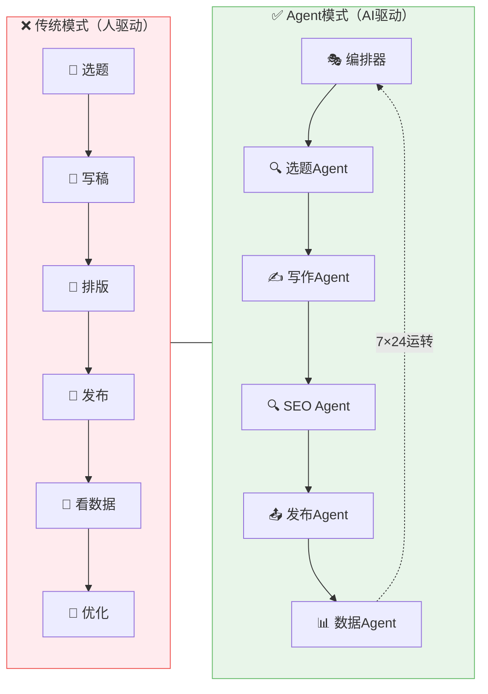
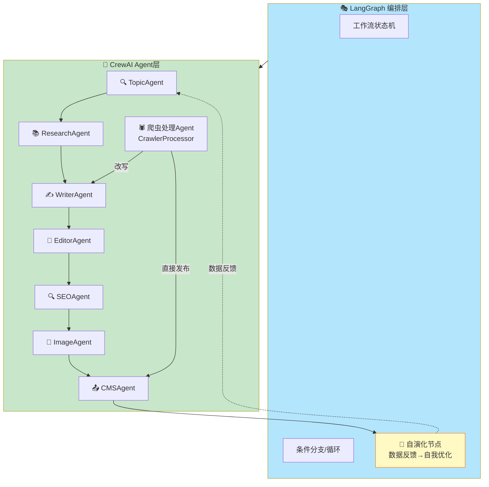
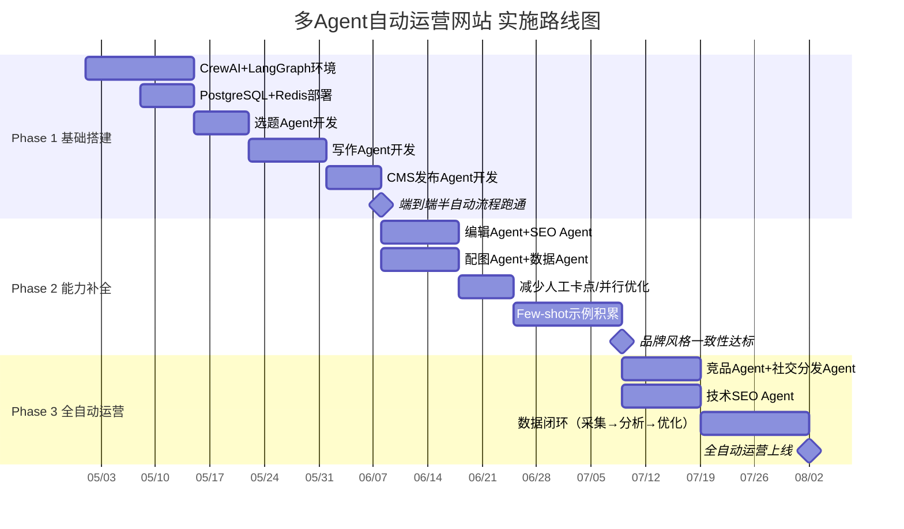
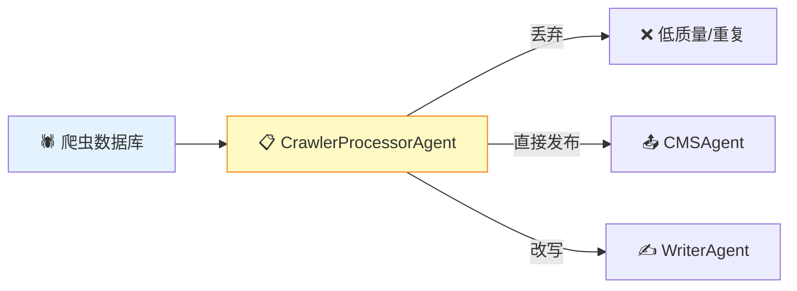

# 多Agent自动运营网站方案概述

> **编制日期：** 2026-04-30
> **文档版本：** v1.4
> **状态：** 初稿，待讨论

## 一、背景与愿景

### 1.1 为什么要用多Agent自动运营网站

传统网站运营模式是**人驱动**的：运营人员选题→写稿→排版→发布→看数据→优化，每个环节都需要人力介入。随着大模型能力提升，我们可以让**多个AI Agent各司其职**，组成一个"虚拟运营团队"，实现网站从内容生产到数据分析的全链路自动化。

### 1.2 设计原则

| 原则 | 说明 |
|------|------|
| **AI自主执行，参数驱动** | Agent全自主运营，人类仅通过配置文件设置风格参数（品牌指南/质量阈值） |
| **每个Agent职责单一** | 一个Agent只做一件事，做到专业 |
| **可编排可组合** | Agent通过消息协作，流程可灵活调整 |
| **可观测可追溯** | 每个Agent的输出有日志，人可审计 |
| **持续自演化** | Agent根据数据反馈持续自我优化，无需人工介入每个环节 |

## 二、技术选型

### 2.1 推荐框架组合

**推荐采用 CrewAI + LangGraph 混合架构：**

- **CrewAI**：定义各Agent的角色、工具和协作关系（定义"谁做什么"）
- **LangGraph**：编排整体工作流，处理分支、循环、自演化反馈等复杂逻辑（定义"怎么做"）

### 2.2 技术栈总览

| 层级 | 技术选型 | 说明 |
|------|---------|------|
| **语言** | Python 3.11+ | AI生态最成熟 |
| **Agent框架** | CrewAI + LangGraph | 角色化+状态图 |
| **LLM** | GPT-4o（主力）/ DeepSeek（备选） | 写作用GPT-4o，日常用DeepSeek降本 |
| **调度** | APScheduler / Celery | 定时任务+异步队列 |
| **数据库** | PostgreSQL | 文章、任务、配置数据 |
| **向量数据库** | Pinecone / Weaviate | 文章语义检索、内链推荐 |
| **缓存** | Redis | 任务队列、热点缓存 |
| **对象存储** | AWS S3 / 阿里云OSS | 图片、文件存储 |
| **CMS** | 自研CMS（自定义API对接） | 内容发布 |
| **监控** | LangSmith / LangFuse | Agent执行追踪 |
| **部署** | Docker + K8s | 容器化部署 |

## 三、实施路线图

## 四、成本估算

| 项目 | 月费用（估算） | 说明 |
|------|-------------|------|
| LLM API | ¥3,000-8,000 | GPT-4o约$2.5/1M tokens，日均10篇约1M tokens |
| 关键词API | ¥1,000-3,000 | Ahrefs/Semrush订阅 |
| 图片API | ¥500-1,000 | DALL-E 3约$0.04/张 |
| 服务器 | ¥1,000-2,000 | 4C8G云服务器 |
| 向量数据库 | ¥500-1,500 | Pinecone托管 |
| 监控 | ¥0-500 | LangSmith免费版/自建LangFuse |
| **合计** | **¥6,000-16,000/月** | 根据文章产量和API用量浮动 |

## 五、爬虫内容集成

系统新增 **CrawlerProcessorAgent（爬虫处理Agent）**，从爬虫数据库读取待处理内容，评估后三路分发：

| 决策 | 条件 | 下游Agent |
|------|------|----------|
| **丢弃** | 质量低、重复、字数不符 | 无（记录原因） |
| **直接发布** | 质量≥0.8、相关、无重复、无版权风险 | CMSAgent |
| **改写** | 质量中等、相关、无重复 | WriterAgent → EditorAgent → SEOAgent → CMSAgent |

详见：[[agents/crawler_processor_agent/]]

## 六、相关文档

- [[多Agent自动运营网站方案]] - 主方案文档（完整内容）
- [[01-Agent架构图]] - Agent角色设计和总体架构
- [[02-技术实现规范]] - 各Agent技术实现细节
- [[03-工作流编排]] - CrewAI + LangGraph 编排逻辑
- [[04-定时任务方案]] - 定时任务调度方案
- [[agents/]] - 各Agent实现代码目录
- [[workflows/]] - 工作流定义目录
- [[scheduler/]] - 定时任务调度器目录

---

*文档版本：v1.3*
