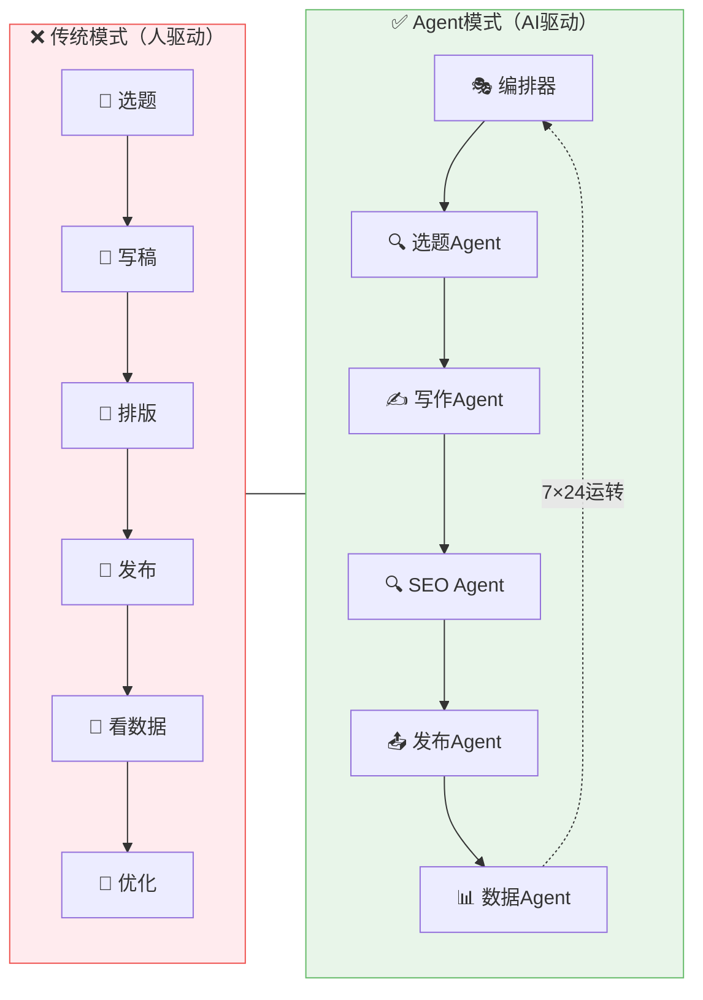
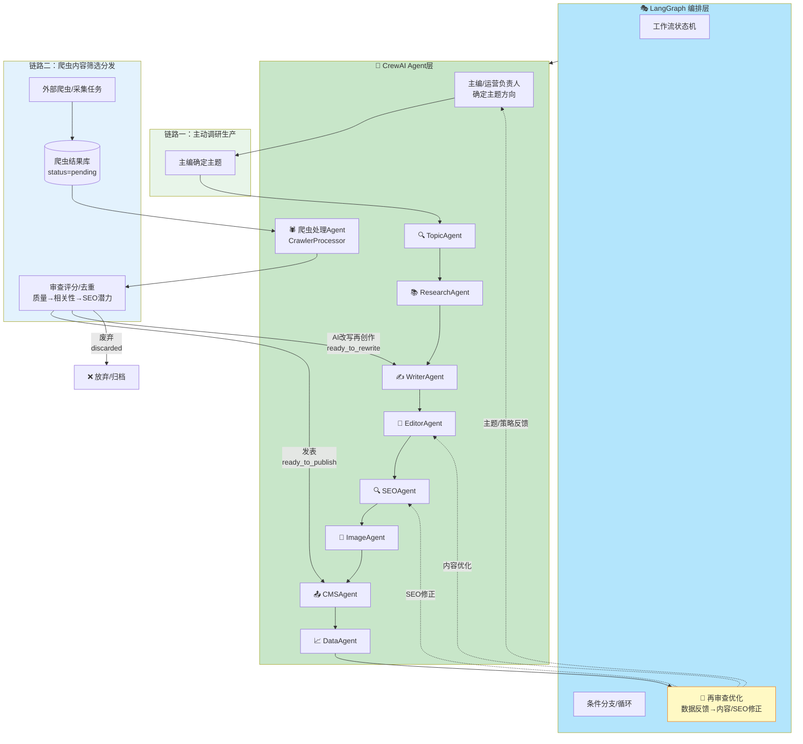
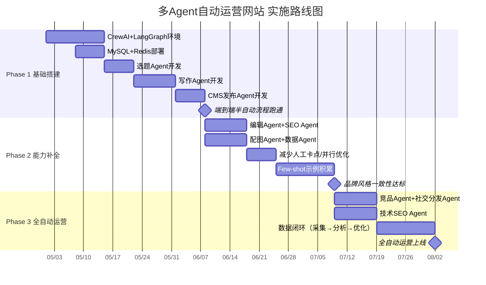
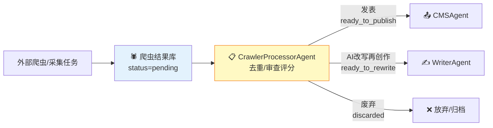

# 多Agent自动运营网站方案概述

> **编制日期：** 2026-04-30
> **文档版本：** v1.4
> **状态：** 初稿，待讨论

## 一、背景与愿景

### 1.1 为什么要用多Agent自动运营网站

传统网站运营模式是**人驱动**的：运营人员选题→写稿→排版→发布→看数据→优化，每个环节都需要人力介入。随着大模型能力提升，我们可以让**多个AI Agent各司其职**，组成一个"虚拟运营团队"，实现网站从内容生产到数据分析的全链路自动化。

### 1.2 设计原则

| 原则                     | 说明                                                                 |
| ------------------------ | -------------------------------------------------------------------- |
| **AI自主执行，参数驱动** | Agent全自主运营，人类仅通过配置文件设置风格参数（品牌指南/质量阈值） |
| **每个Agent职责单一**    | 一个Agent只做一件事，做到专业                                        |
| **可编排可组合**         | Agent通过消息协作，流程可灵活调整                                    |
| **可观测可追溯**         | 每个Agent的输出有日志，人可审计                                      |
| **持续自演化**           | Agent根据数据反馈持续自我优化，无需人工介入每个环节                  |

## 二、技术选型

### 2.1 推荐框架组合

**推荐采用 CrewAI + LangGraph 混合架构：**

- **CrewAI**：定义各Agent的角色、工具和协作关系（定义"谁做什么"）
- **LangGraph**：编排整体工作流，处理分支、循环、自演化反馈等复杂逻辑（定义"怎么做"）

### 2.2 技术栈总览

| 层级          | 技术选型                         | 说明                                       |
| ------------- | -------------------------------- | ------------------------------------------ |
| **语言**      | Python 3.11+                     | AI生态最成熟                               |
| **Agent框架** | CrewAI + LangGraph               | 角色化+状态图                              |
| **LLM**       | GPT-4o（主力）/ DeepSeek（备选） | 写作用GPT-4o，日常用DeepSeek降本           |
| **调度**      | APScheduler / Celery             | 定时任务+异步队列                          |
| **数据库**    | MySQL                            | 文章、爬虫结果、任务、评分、日志、配置数据 |
| **语义检索**  | 暂不接入独立向量数据库           | 后续如需内链推荐/RAG，再作为可选扩展       |
| **缓存**      | Redis                            | 任务队列、热点缓存                         |
| **对象存储**  | 华为云 OBS                       | 图片、附件、生成资源存储                   |
| **CMS**       | 自研CMS（自定义API对接）         | 内容发布                                   |
| **监控**      | LangSmith / LangFuse             | Agent执行追踪                              |
| **部署**      | Docker + K8s                     | 容器化部署                                 |

## 三、实施路线图

## 四、成本估算

| 项目      | 月费用（估算）       | 说明                                        |
| --------- | -------------------- | ------------------------------------------- |
| LLM API   | ¥3,000-8,000         | GPT-4o约$2.5/1M tokens，日均10篇约1M tokens |
| 关键词API | ¥1,000-3,000         | Ahrefs/Semrush订阅                          |
| 图片API   | ¥500-1,000           | DALL-E 3约$0.04/张                          |
| 服务器    | ¥1,000-2,000         | 4C8G云服务器                                |
| 监控      | ¥0-500               | LangSmith免费版/自建LangFuse                |
| **合计**  | **¥5,500-14,500/月** | 根据文章产量和API用量浮动                   |

## 五、爬虫内容集成

系统新增 **CrawlerProcessorAgent（爬虫处理Agent）**，从爬虫结果库读取 `status=pending` 的待处理内容，完成去重、审查评分后分为三路：

| 决策             | 状态               | 条件                                     | 下游                                            |
| ---------------- | ------------------ | ---------------------------------------- | ----------------------------------------------- |
| **发表**         | `ready_to_publish` | 高质量、相关、无重复、无版权风险         | CMSAgent 发布或入草稿                           |
| **AI改写再创作** | `ready_to_rewrite` | 有价值但结构/表达/SEO不适合原样发布      | WriterAgent → EditorAgent → SEOAgent → CMSAgent |
| **废弃**         | `discarded`        | 低质量、重复、不相关、字数不符或版权风险 | 归档并记录评分与原因                            |

详见：[[agents/crawler_processor_agent/]]

## 六、相关文档

- [[多Agent自动运营网站方案]] - 主方案文档（完整内容）
- [[01-Agent架构图]] - Agent角色设计和总体架构
- [[02-技术实现规范]] - 各Agent技术实现细节
- [[03-工作流编排]] - CrewAI + LangGraph 编排逻辑
- [[04-定时任务方案]] - 定时任务调度方案
- [[06-文章评分Agent说明]] - crawler文章评分规则与数据库写回
- [[07-ResearchAgent说明]] - 75-90分文章调研、大纲与writer_prompt落库
- [[agents/]] - 各Agent实现代码目录
- [[workflows/]] - 工作流定义目录
- [[scheduler/]] - 定时任务调度器目录

---

_文档版本：v1.3_
