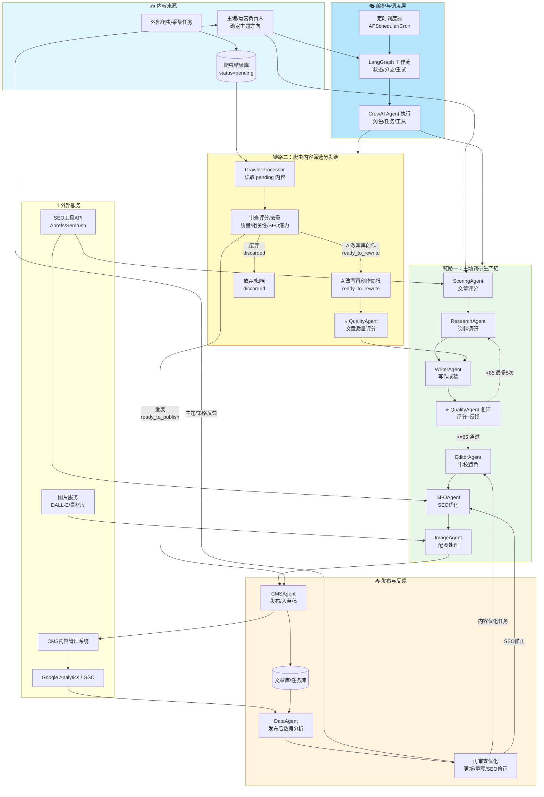
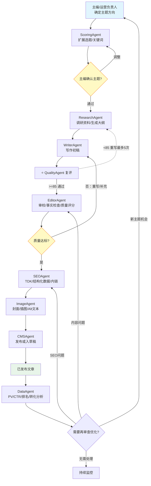
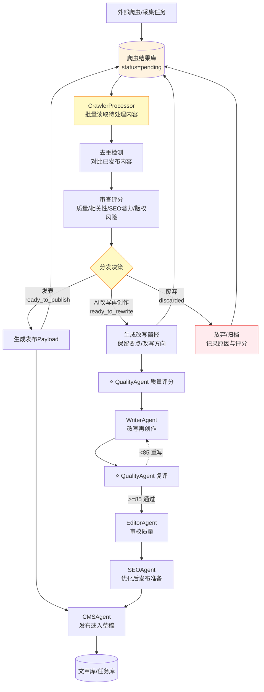
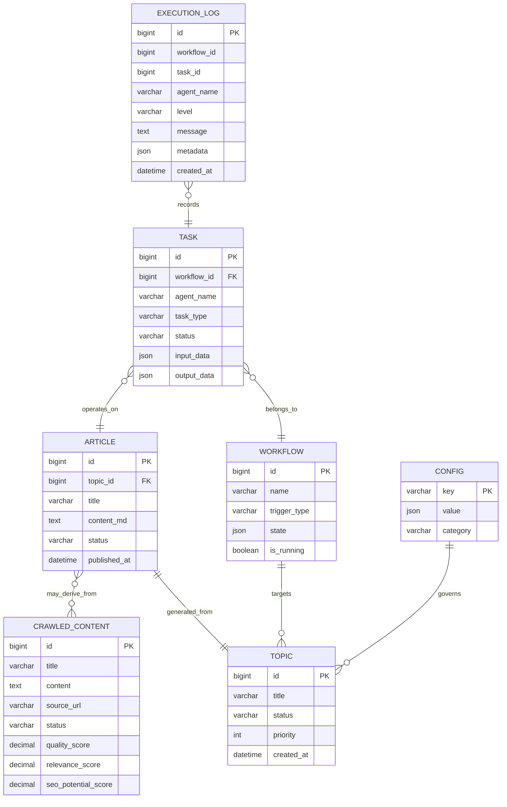
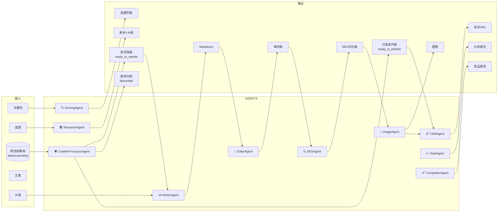
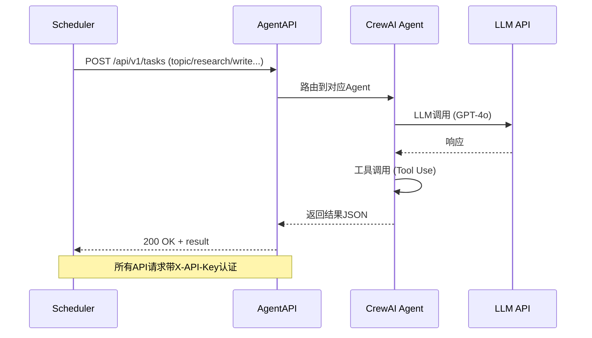
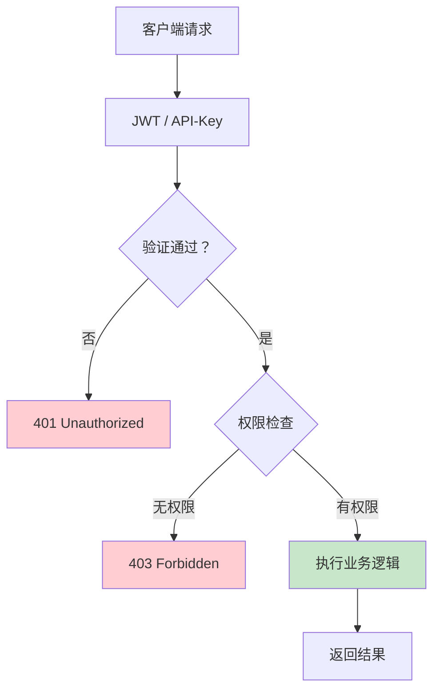

# 技术实现规范

**版本**: v1.0
**编制日期**: 2026-05-13
**状态**: 初稿

---

## 目录

1. [系统架构图](#1-系统架构图)
2. [数据存储设计](#2-数据存储设计)
3. [各Agent技术规范](#3-各agent技术规范)
4. [API接口规范](#4-api接口规范)
5. [工具链规格](#5-工具链规格)
6. [数据模型与Schema](#6-数据模型与schema)
7. [安全与权限](#7-安全与权限)

---

## 1. 系统架构图

### 1.1 整体架构：两条内容来源链路



### 1.2 主动调研生产链



### 1.3 爬虫内容筛选分发链



### 1.4 技术栈总览

| 层级          | 技术选型                    | 版本    | 说明                   |
| ----------- | ----------------------- | ----- | -------------------- |
| **语言**      | Python                  | 3.11+ | AI生态最成熟              |
| **Agent框架** | CrewAI                  | 0.28+ | Agent定义+协作           |
| **编排框架**    | LangGraph               | 0.2+  | 状态机+自演化反馈            |
| **LLM**     | GPT-4o / DeepSeek       | 最新    | 分级使用降本               |
| **调度**      | APScheduler             | 3.10+ | 定时任务                 |
| **业务数据库**   | MySQL                   | 8.0+  | 文章、爬虫结果、任务、评分、日志、配置  |
| **缓存/队列**   | Redis                   | 7+    | 热点缓存/任务队列            |
| **语义检索**    | 暂不接入独立向量数据库             | -     | 后续如需内链推荐/RAG，再作为可选扩展 |
| **对象存储**    | 华为云 OBS                  | -     | 图片、附件、生成资源          |
| **监控**      | LangFuse / LangSmith    | -     | Agent追踪              |
| **日志**      | 结构化日志(JSON)             | -     | ELK兼容                |
| **部署**      | Docker + Docker Compose | 24+   | 容器化                  |

---

## 2. 数据存储设计

### 2.1 MySQL核心表



### 2.2 核心表结构

#### topics 选题表

```sql
CREATE TABLE topics (
    id              BIGINT UNSIGNED PRIMARY KEY AUTO_INCREMENT,
    title           VARCHAR(500) NOT NULL,
    target_keywords JSON,            -- 目标关键词数组
    search_volume   INT,             -- 月搜索量估算
    difficulty      INT,             -- 竞争难度 1-100
    intent_type     VARCHAR(20),     -- informational/navigational/transactional
    content_type    VARCHAR(30),     -- 指南/对比/列表/新闻
    outline         JSON,            -- 文章大纲 JSON
    priority        INT DEFAULT 3,    -- 优先级 1-5
    status          VARCHAR(20) DEFAULT 'pending',
    source          VARCHAR(50),     -- 来源: keyword_research/trend/competitor
    created_at      DATETIME DEFAULT CURRENT_TIMESTAMP,
    approved_at     DATETIME NULL,
    approved_by     VARCHAR(100),
    INDEX idx_topics_status (status),
    INDEX idx_topics_priority (priority)
) ENGINE=InnoDB DEFAULT CHARSET=utf8mb4;
```

#### articles 文章表

```sql
CREATE TABLE articles (
    id              BIGINT UNSIGNED PRIMARY KEY AUTO_INCREMENT,
    topic_id        BIGINT UNSIGNED NULL,
    crawled_content_id BIGINT UNSIGNED NULL,
    title           VARCHAR(500) NOT NULL,
    slug            VARCHAR(300) UNIQUE,
    content_md      TEXT,            -- Markdown正文
    content_html    LONGTEXT,        -- 渲染后HTML
    word_count      INT,
    quality_score   DECIMAL(5,2),   -- QualityAgent 0-100质量评分
    seo_score       DECIMAL(5,2),    -- SEO评分
    target_keyword  VARCHAR(200),
    meta_title      VARCHAR(200),
    meta_desc       VARCHAR(500),
    schema_json     JSON,            -- Schema.org JSON-LD
    status          VARCHAR(20) DEFAULT 'draft',
    published_at    DATETIME NULL,
    published_url   VARCHAR(500),
    cms_post_id     VARCHAR(100),
    created_at      DATETIME DEFAULT CURRENT_TIMESTAMP,
    updated_at      DATETIME DEFAULT CURRENT_TIMESTAMP ON UPDATE CURRENT_TIMESTAMP,
    INDEX idx_articles_status (status),
    INDEX idx_articles_published (published_at),
    INDEX idx_articles_keyword (target_keyword),
    CONSTRAINT fk_articles_topic FOREIGN KEY (topic_id) REFERENCES topics(id)
) ENGINE=InnoDB DEFAULT CHARSET=utf8mb4;
```

#### crawled_content 爬虫结果表

```sql
CREATE TABLE crawled_content (
    id                  BIGINT UNSIGNED PRIMARY KEY AUTO_INCREMENT,
    title               VARCHAR(500) NOT NULL,
    content             LONGTEXT NOT NULL,
    source_url          VARCHAR(1000),
    published_at        DATETIME NULL,
    author              VARCHAR(200),
    category            VARCHAR(100),
    spider_name         VARCHAR(100),
    status              VARCHAR(30) DEFAULT 'pending',
    quality_score       DECIMAL(5,4),
    relevance_score     DECIMAL(5,4),
    seo_potential_score DECIMAL(5,4),
    duplicate_score     DECIMAL(5,4),
    decision_reason     TEXT,
    reason_codes        JSON,
    next_payload        JSON,
    raw_data            JSON,
    error_message       TEXT,
    created_at          DATETIME DEFAULT CURRENT_TIMESTAMP,
    updated_at          DATETIME DEFAULT CURRENT_TIMESTAMP ON UPDATE CURRENT_TIMESTAMP,
    INDEX idx_crawled_status (status),
    INDEX idx_crawled_source_url (source_url(255)),
    INDEX idx_crawled_spider (spider_name)
) ENGINE=InnoDB DEFAULT CHARSET=utf8mb4;
```

#### tasks 任务表

```sql
CREATE TABLE tasks (
    id              BIGINT UNSIGNED PRIMARY KEY AUTO_INCREMENT,
    workflow_id     BIGINT UNSIGNED NULL,
    agent_name      VARCHAR(50) NOT NULL,
    task_type       VARCHAR(30),     -- topic/research/write/edit/seo/publish/crawler_review
    input_data      JSON,
    output_data     JSON,
    status          VARCHAR(20) DEFAULT 'pending',
    error_message   TEXT,
    retry_count     INT DEFAULT 0,
    started_at      DATETIME NULL,
    completed_at    DATETIME NULL,
    created_at      DATETIME DEFAULT CURRENT_TIMESTAMP,
    INDEX idx_tasks_status (status),
    INDEX idx_tasks_agent (agent_name)
) ENGINE=InnoDB DEFAULT CHARSET=utf8mb4;
```

#### workflows 工作流表

```sql
CREATE TABLE workflows (
    id              BIGINT UNSIGNED PRIMARY KEY AUTO_INCREMENT,
    name            VARCHAR(100),
    trigger_type    VARCHAR(30),     -- scheduled/manual/api
    trigger_config  JSON,            -- cron表达式或API配置
    state           JSON,            -- LangGraph工作流状态快照
    current_stage   VARCHAR(50),
    is_running      BOOLEAN DEFAULT FALSE,
    started_at      DATETIME NULL,
    completed_at    DATETIME NULL,
    created_at      DATETIME DEFAULT CURRENT_TIMESTAMP
) ENGINE=InnoDB DEFAULT CHARSET=utf8mb4;
```

#### execution_logs 执行日志表

```sql
CREATE TABLE execution_logs (
    id              BIGINT UNSIGNED PRIMARY KEY AUTO_INCREMENT,
    workflow_id     BIGINT UNSIGNED NULL,
    task_id         BIGINT UNSIGNED NULL,
    agent_name      VARCHAR(50),
    level           VARCHAR(20) NOT NULL,
    message         TEXT NOT NULL,
    metadata        JSON,
    created_at      DATETIME DEFAULT CURRENT_TIMESTAMP,
    INDEX idx_execution_logs_workflow (workflow_id),
    INDEX idx_execution_logs_agent (agent_name),
    INDEX idx_execution_logs_created (created_at)
) ENGINE=InnoDB DEFAULT CHARSET=utf8mb4;
```

### 2.3 Redis数据结构

| Key模式 | 类型 | 用途 | TTL |
|---------|------|------|-----|
| `task:lock:{task_id}` | String | 任务分布式锁 | 30min |
| `workflow:state:{workflow_id}` | Hash | 工作流运行时状态 | 24h |
| `keyword:cache:{keyword}` | Hash | 关键词搜索量缓存 | 7d |
| `rate:llm:{date}` | String | LLM调用计数（限流） | 24h |
| `queue:pending` | List | 待执行任务队列 | - |

---

## 3. 各Agent技术规范

### 3.1 Agent技术规格总表



| 链路 | Agent | 核心输入 | 分析/处理重点 | 输出与去向 |
|------|-------|----------|----------------|------------|
| 主动调研生产 | ScoringAgent | 关键词、运营方向 | 热点、搜索意图、竞争度、站内缺口 | 选题列表 → ResearchAgent |
| 主动调研生产 | ResearchAgent | 选题 | 来源可信度、素材完整度、观点结构 | 素材包/大纲 → WriterAgent |
| 主动调研生产 | WriterAgent | 大纲、素材、品牌指南 | 原创表达、结构完整、品牌语气 | Markdown草稿 → EditorAgent |
| 主动调研生产 | EditorAgent | Markdown草稿 | 事实、逻辑、语言、可读性 | 审校稿 → SEOAgent |
| 主动调研生产 | SEOAgent | 审校稿、目标关键词 | TDK、关键词布局、Schema、内链建议 | SEO稿 → ImageAgent/CMSAgent |
| 主动调研生产 | ImageAgent | 文章内容、配图需求 | 头图/插图生成、Alt文本 | 图片资源 → 华为云 OBS/CMSAgent |
| 发布与反馈 | CMSAgent | SEO稿、图片、TDK | 字段映射、幂等发布、状态回写 | 草稿/发布URL → DataAgent |
| 发布与反馈 | DataAgent | 发布URL、统计数据 | PV/UV、停留、跳出、搜索表现 | 优化建议 → EditorAgent/SEOAgent |
| 爬虫筛选分发 | CrawlerProcessorAgent | MySQL爬虫结果库 `status=pending` | 去重、质量评分、相关性、SEO潜力、版权/搬运风险 | `ready_to_publish` → CMSAgent；`ready_to_rewrite` → WriterAgent；`discarded` → 归档 |

### 3.2 ScoringAgent 文章评分

| 项目 | 规格 |
|------|------|
| **核心工具** | `keyword_research` / `trend_detection` / `serp_analysis` |
| **输入** | seed_keywords (List[str]) |
| **输出** | `TopicProposal` 对象：title, keywords, search_volume, difficulty, intent, outline, priority |
| **LLM模型** | GPT-4o-mini（选题质量足够，响应快） |
| **每次产出** | 5-10个候选选题，按优先级排序 |
| **Prompt重点** | 行业知识注入、品牌调性约束 |

### 3.3 ResearchAgent 调研分析

| 项目 | 规格 |
|------|------|
| **核心工具** | `data_collector` / `citation_formatter` |
| **输入** | topic (TopicProposal) |
| **输出** | `ResearchBundle` 对象：sources, citations, outline |
| **数据源** | 官方文档、学术论文、权威媒体、专家观点 |
| **引用格式** | GB/T 7714-2015（默认）、APA、MLA |
| **LLM模型** | GPT-4o（深度调研需要强推理） |

### 3.4 WriterAgent 内容写作

| 项目 | 规格 |
|------|------|
| **核心工具** | `readability_checker` |
| **输入** | outline + research_bundle + brand_guide |
| **输出** | Markdown文章（1500-3000字） |
| **可读性目标** | 中文：Flesch 60-70；英文：Flesch 60-80 |
| **风格控制** | 品牌指南中定义的语气、词汇、举例风格 |
| **LLM模型** | GPT-4o（写作质量最重要） |

### 3.5 EditorAgent 审校编辑

| 项目 | 规格 |
|------|------|
| **核心工具** | `grammar_checker` / `quality_scorer` |
| **输入** | Markdown文章 |
| **输出** | 审校后文章 + QualityReport(score, issues[], suggestions[]) |
| **质量维度** | 内容(30%) + 结构(20%) + 逻辑(20%) + 语言(20%) + SEO(10%) |
| **通过阈值** | 综合分≥70分；单维度≥50分 |
| **LLM模型** | GPT-4o-mini |

### 3.6 SEOAgent SEO优化

| 项目 | 规格 |
|------|------|
| **核心工具** | `keyword_analyzer` / `meta_generator` / `schema_generator` |
| **输入** | 审校后文章 + target_keyword |
| **输出** | SEO优化稿 + TDK(Title/Description/Keywords) + Schema JSON-LD |
| **关键词密度** | 主关键词2%-4%，LSI关键词自然分布 |
| **Meta长度** | Title 50-60字，Description 150-160字 |
| **Schema类型** | Article（默认）、FAQPage、HowTo、BreadcrumbList |
| **LLM模型** | GPT-4o-mini |

### 3.7 ImageAgent 配图生成

| 项目 | 规格 |
|------|------|
| **核心工具** | `image_generator` / `alt_text_generator` |
| **输入** | article_content + alt_text_prompt |
| **输出** | 图片URL/Base64 + Alt文本 |
| **图片尺寸** | 1200×630（头图）、800×600（文中插图） |
| **风格** | 品牌指南定义的主视觉风格 |
| **Alt文本** | 25-125字符，描述性+含关键词 |
| **API** | DALL-E 3（主力）或 Midjourney（备选） |

### 3.8 CMSAgent 内容发布

| 项目 | 规格 |
|------|------|
| **核心工具** | `cms_client` / `media_uploader` |
| **输入** | SEO优化稿 + TDK + 图片URL |
| **输出** | published_url + cms_post_id |
| **发布状态** | draft（草稿）或 publish（直接发布） |
| **字段映射** | Markdown→HTML渲染，图片→华为云 OBS 资源URL替换 |
| **幂等性** | 同一topic_id重复发布时更新而非新建 |

### 3.9 DataAgent 数据分析

| 项目 | 规格 |
|------|------|
| **核心工具** | `analytics_collector` / `report_generator` |
| **数据源** | GA4、百度统计、GSC |
| **报告类型** | 日报 / 周报 / 月报 |
| **输出格式** | Markdown / HTML / JSON |
| **关键指标** | PV/UV、会话时长、跳出率、关键词排名、搜索展示量 |
| **LLM模型** | GPT-4o-mini（报告生成） |

### 3.10 CompetitorAgent 竞品监控

| 项目 | 规格 |
|------|------|
| **核心工具** | `rss_monitor` / `gap_analyzer` |
| **监控方式** | RSS订阅、网页爬取（限robots.txt允许） |
| **分析维度** | 关键词覆盖、内容主题、内容深度、内容形式 |
| **输出** | 竞品动态报告 + 内容机会列表 + 内容计划建议 |
| **LLM模型** | GPT-4o-mini |

### 3.11 CrawlerProcessorAgent 爬虫内容审查评分

| 项目 | 规格 |
|------|------|
| **核心工具** | `crawler_db_reader` / `content_evaluator` / `dedup_checker` |
| **输入** | MySQL 爬虫结果库中 `status=pending` 的记录 |
| **核心分析** | 标题/正文完整度、段落结构、重复内容、关键词覆盖、信息密度、来源可信度、版权/搬运风险 |
| **评分维度** | quality_score、relevance_score、seo_potential_score、dedup_score、risk_score |
| **决策规则** | 高质量且风险低 → `ready_to_publish`；有价值但需重写 → `ready_to_rewrite`；低质/重复/不相关/风险高 → `discarded` |
| **输出** | 评分明细、决策原因、下游路由、改写简报或发布Payload |
| **下游** | CMSAgent、WriterAgent、归档记录 |
| **LLM模型** | 规则评分优先；仅在需要生成改写简报/复杂判断时调用 GPT-4o-mini |

---

## 4. API接口规范

### 4.1 内部API（RPA→Agent通信）



### 4.2 核心API端点

#### 任务触发

```
POST /api/v1/tasks
Content-Type: application/json
X-API-Key: {api_key}

{
  "agent": "topic" | "research" | "write" | "edit" | "seo" | "image" | "publish",
  "input": {
    "keywords": ["EMBA", "商学院"],
    "topic_id": "uuid"   // research/write/edit/seo时必填
  },
  "options": {
    "auto_approve": true  // 自主运营，无需人工审批
  }
}

Response:
{
  "task_id": "uuid",
  "status": "pending",
  "status_url": "/api/v1/tasks/{task_id}"
}
```

#### 工作流执行

```
POST /api/v1/workflows
{
  "workflow_type": "daily_content" | "seo_optimize" | "competitor_scan",
  "params": {}
}

Response:
{
  "workflow_id": "uuid",
  "status_url": "/api/v1/workflows/{workflow_id}"
}
```

#### 自主优化回调

```
POST /api/v1/workflows/{workflow_id}/approve
{
  "stage": "topic" | "outline" | "article",
  "decision": "approve" | "reject",
  "feedback": "请补充更多数据支撑"
}
```

### 4.3 外部API集成

| 服务 | 接口 | 用途 |
|------|------|------|
| **CMS** | POST /api/posts | 创建/更新文章 |
| **CMS** | POST /api/media | 上传图片 |
| **GA4** | Data API v1 | 流量数据 |
| **GSC** | Search Analytics API | 搜索排名数据 |
| **DALL-E** | Images.generations | 图片生成 |
| **语义检索服务** | 暂不接入 | 如后续需要内链推荐/RAG，再另行设计 |

---

## 5. 工具链规格

### 5.1 工具分类

| 类别 | 工具 | 归属Agent |
|------|------|-----------|
| **数据采集** | keyword_research, serp_analysis, trend_detection, data_collector | ScoringAgent, ResearchAgent |
| **内容生成** | readability_checker, grammar_checker, quality_scorer | WriterAgent, EditorAgent |
| **SEO优化** | keyword_analyzer, meta_generator, schema_generator | SEOAgent |
| **视觉生成** | image_generator, alt_text_generator | ImageAgent |
| **发布管理** | cms_client, media_uploader | CMSAgent |
| **分析监控** | analytics_collector, report_generator, rss_monitor, gap_analyzer | DataAgent, CompetitorAgent |

### 5.2 工具接口规范

所有工具遵循以下签名规范：

```python
from typing import TypedDict, Any
from crewai.tools import tool

class BaseToolResult(TypedDict):
    """所有工具的返回类型"""
    success: bool
    data: Any | None
    error: str | None
    metadata: dict

@tool("tool_name")
def example_tool(param1: str, param2: int = 10) -> str:
    """
    工具简短描述（1行）.

    Args:
        param1: 参数1描述
        param2: 参数2描述，默认10

    Returns:
        JSON字符串格式的结果
    """
    result: BaseToolResult = {...}
    return json.dumps(result, ensure_ascii=False)
```

---

## 6. 数据模型与Schema

### 6.1 核心数据模型（Python TypedDict）

```python
from typing import TypedDict, Literal, Optional, List
from datetime import datetime
from uuid import UUID

class TopicProposal(TypedDict):
    """选题提案"""
    title: str
    keywords: List[str]
    search_volume: Optional[int]
    difficulty: int  # 1-100
    intent: Literal["informational", "navigational", "transactional"]
    content_type: Literal["guide", "comparison", "listicle", "news"]
    outline: List[OutlineSection]
    priority: int  # 1-5
    reason: str
    source: str

class OutlineSection(TypedDict):
    """大纲章节"""
    heading: str
    subheadings: List[str]
    word_count_target: int
    key_points: List[str]

class ResearchBundle(TypedDict):
    """调研素材包"""
    sources: List[Source]
    citations: List[Citation]
    outline: OutlineSection
    key_facts: List[str]
    data_points: List[DataPoint]

class Source(TypedDict):
    url: str
    title: str
    source_type: Literal["official", "academic", "news", "expert"]
    reliability: int  # 1-5
    key_insights: List[str]

class Citation(TypedDict):
    format: Literal["gbt7714", "apa", "mla", "chicago", "harvard"]
    text: str

class ArticleDraft(TypedDict):
    """文章草稿"""
    topic_id: UUID
    title: str
    content_md: str
    word_count: int
    readability_score: float
    sections: List[SectionContent]

class SectionContent(TypedDict):
    heading: str
    content: str
    word_count: int

class QualityReport(TypedDict):
    """质量报告"""
    overall_score: float  # 0-100
    dimensions: Dict[str, float]
    issues: List[Issue]
    suggestions: List[str]
    passed: bool

class Issue(TypedDict):
    severity: Literal["critical", "major", "minor"]
    location: str
    description: str
    suggestion: str

class SEOResult(TypedDict):
    """SEO优化结果"""
    optimized_content: str
    meta_title: str
    meta_description: str
    keywords: KeywordAnalysis
    schema_json: str
    internal_links: List[str]
    seo_score: float

class KeywordAnalysis(TypedDict):
    primary: str
    density: float
    lsi_keywords: List[str]
    distribution: Dict[str, List[int]]  # keyword -> [positions]
```

---

## 7. 安全与权限

### 7.1 认证与授权



### 7.2 安全规范

| 类别 | 规范 |
|------|------|
| **LLM API** | Key存储于环境变量或密钥管理服务，不硬编码 |
| **CMS API** | Bearer Token认证，Token定期轮换 |
| **数据脱敏** | 用户数据访问需脱敏，日志不记录敏感信息 |
| **SQL注入** | 使用ORM或参数化查询 |
| **SSRF防护** | 禁止Agent访问内网IP，配置DNS Rebinding防护 |
| **速率限制** | LLM API调用按分钟/天双重限流 |
| **审计日志** | 所有敏感操作记录操作日志（who/when/what） |
| **内容审核** | 发布前进行敏感词过滤 |

### 7.3 成本控制

| 措施 | 说明 |
|------|------|
| **模型分级** | 选题/编辑/SEO用GPT-4o-mini；写作/调研用GPT-4o |
| **缓存复用** | 相同关键词的搜索量数据缓存7天 |
| **限流** | 单Agent每分钟最多N次LLM调用 |
| **预算告警** | 日/月API消费超阈值时发送告警 |
| **结果复用** | 中间产物（大纲、审校稿）持久化，失败重跑复用已通过步骤 |

---

*相关文档：[[00-方案概述]] | [[01-Agent架构图]] | [[03-工作流编排]] | [[04-定时任务方案]] | [[05-部署方案]]*
