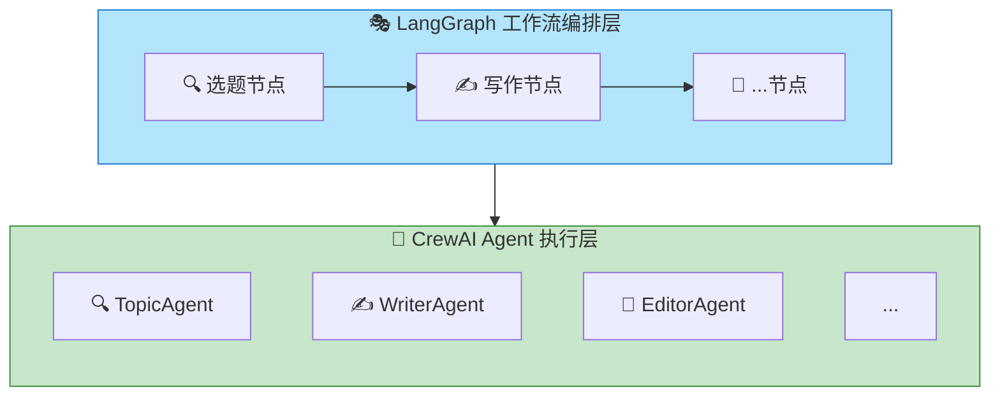
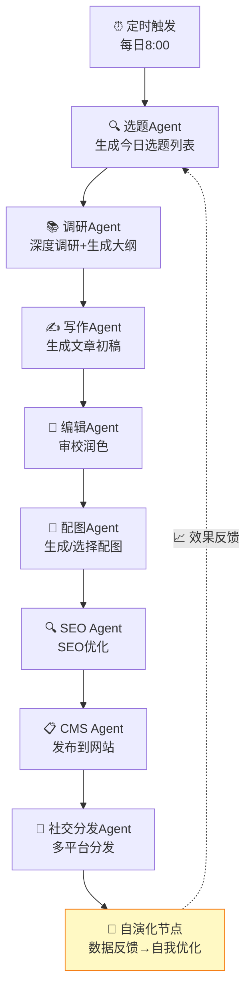
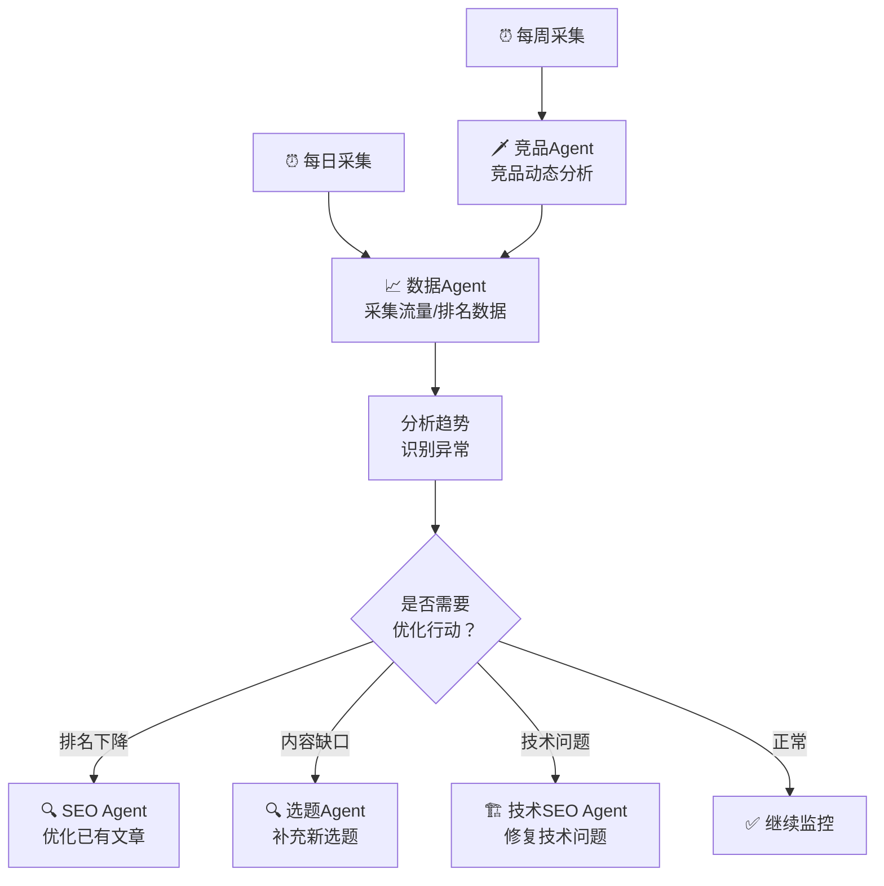

# 工作流编排

## 3.0 编排框架选型：为什么是 CrewAI + LangGraph

在多Agent系统开发中，编排框架的选择至关重要。我们调研了以下几种主流方案：

### 3.0.1 候选方案对比

| 维度 | CrewAI | LangGraph | AutoGen | LangChain Agents | 自研框架 |
|------|--------|-----------|---------|------------------|----------|
| **定位** | 多Agent协作 | 工作流状态机 | 多Agent对话 | Agent工具链 | 定制开发 |
| **学习曲线** | ⭐ 低 | ⭐⭐ 中 | ⭐⭐⭐ 高 | ⭐⭐ 中 | ⭐⭐⭐⭐ 很高 |
| **状态管理** | 基础 | ⭐⭐⭐ 强大 | 基础 | 中等 | 完全自控 |
| **人工卡点** | ❌ 不支持 | ✅ 原生支持 | ⚠️ 需扩展 | ⚠️ 需扩展 | ✅ 完全自控 |
| **调试体验** | ⭐⭐ 中 | ⭐⭐⭐ 好 | ⭐⭐ 中 | ⭐⭐ 中 | ⭐⭐⭐⭐ 完全可控 |
| **社区活跃度** | ⭐⭐⭐⭐ 活跃 | ⭐⭐⭐⭐ 活跃 | ⭐⭐⭐⭐ 活跃 | ⭐⭐⭐⭐⭐ 最大 | N/A |
| **维护成本** | 低 | 中 | 中 | 中 | 非常高 |

### 3.0.2 CrewAI 的核心优势

**为什么选择 CrewAI：**

1. **概念直观** - Agent、Task、Crew、Process 的抽象非常符合人类的团队协作思维
2. **开箱即用** - 内置角色定义、工具绑定、上下文传递，5分钟能跑通一个多Agent流程
3. **团队协作模式** - 内置 `Process.sequential`（顺序）和 `Process.hierarchical`（层级）执行模式
4. **LangChain 生态** - 可以复用 LangChain 的 Tool 生态（9000+工具）
5. **配置化** - 角色定义、工具绑定都可通过配置文件管理，便于维护

```python
# CrewAI 的核心价值：5分钟跑通多Agent协作
crew = Crew(
    agents=[writer, editor, seo_expert],
    tasks=[write_task, edit_task, seo_task],
    process=Process.sequential
)
result = crew.kickoff()
```

**CrewAI 不擅长什么：**
- 本身不内置自演化反馈（需要配合 LangGraph）
- 状态管理较弱，不适合复杂的条件分支
- 长时间运行的任务状态追踪不够细致

### 3.0.3 LangGraph 的核心优势

**为什么选择 LangGraph：**

1. **强大的状态管理** - 基于 TypedDict 的状态定义，每个节点都可以读写状态
2. **原生支持自演化反馈** - 可以基于性能数据自动调整工作流方向，形成反馈循环
3. **图灵完备的执行模型** - 支持循环、条件分支、子图，可表达任意复杂流程
4. **可视化调试** - 状态流转清晰可见，便于排查问题
5. **与 LangChain 无缝集成** - 可以复用所有 LangChain 的组件

```python
# LangGraph 的核心价值：精准控制工作流状态
workflow = StateGraph(WorkflowState)
workflow.add_node("evolve", evolve_node)  # 自演化反馈节点
workflow.add_conditional_edges("approve", lambda s: "next" if s["approved"] else "retry")
```

### 3.0.4 组合使用策略

**CrewAI + LangGraph 不是二选一，而是各司其职：**

| 层次 | 技术选型 | 职责 |
|------|---------|------|
| **Agent执行层** | CrewAI | 定义每个Agent的角色、工具、Prompt，执行具体的"干活"逻辑 |
| **工作流编排层** | LangGraph | 定义整体流程骨架、处理人工卡点、条件分支、状态流转 |

**协作模式：**



**具体分工：**

1. **LangGraph** 负责：
   - 控制整体流程走向（顺序/分支/循环）
   - 管理自演化反馈节点
   - 维护工作流状态
   - 处理异常和重试逻辑

2. **CrewAI** 负责：
   - 定义每个Agent的角色定义
   - 绑定Agent使用的工具
   - 管理Agent间的上下文传递
   - 执行具体的LLM调用

### 3.0.5 为什么不选其他方案

| 方案 | 放弃原因 |
|------|---------|
| **纯 AutoGen** | 学习曲线陡峭，人工卡点支持弱，调试困难 |
| **纯 LangChain Agents** | 更偏向工具调用，缺乏多Agent协作的原生支持 |
| **完全自研** | 开发维护成本过高，不值得为已有的成熟方案重复造轮子 |

**结论：** CrewAI + LangGraph 的组合能在开发效率（CrewAI）和流程控制（LangGraph）之间取得最佳平衡。

## 3.1 日常内容生产流（主流程）



## 3.2 数据驱动优化流



## 3.3 渐进自动化策略

| 阶段 | 自动化程度 | 说明 |
|------|-----------|------|
| **Phase 1** | 参数配置期 | 人类配置品牌指南/质量阈值，Agent跑通全流程 |
| **Phase 2** | 自主运营期 | Agent自主选题→写稿→审校→发布，人类仅监控不看周报 |
| **Phase 3** | 持续演进期 | Agent根据数据反馈持续自我优化，运营效果逐步提升 |

## 3.4 CrewAI 完整编排示例

> 详见: [[workflows/crewai_workflow.py]]

```python
from crewai import Agent, Task, Crew, Process
from langchain_openai import ChatOpenAI

# === 定义所有Agent ===
topic_agent = Agent(role="选题策划师", goal="发现高价值选题", ...)
research_agent = Agent(role="调研分析师", goal="深度调研生成大纲", ...)
writer_agent = Agent(role="高级撰稿人", goal="撰写高质量原创文章", ...)
editor_agent = Agent(role="审校编辑", goal="审校润色文章", ...)
seo_agent = Agent(role="SEO优化专家", goal="优化搜索引擎可见性", ...)
image_agent = Agent(role="视觉设计师", goal="生成或选择配图", ...)
cms_agent = Agent(role="CMS发布员", goal="准确发布到网站", ...)

# === 定义任务链 ===
topic_task = Task(
    description="基于行业关键词进行选题研究",
    agent=topic_agent,
    expected_output="选题列表"
)

research_task = Task(
    description="根据选定选题进行深度调研",
    agent=research_agent,
    expected_output="调研素材+文章大纲",
    context=[topic_task]  # 依赖选题任务结果
)

writing_task = Task(
    description="根据大纲撰写文章",
    agent=writer_agent,
    expected_output="Markdown格式文章",
    context=[research_task]
)

editing_task = Task(
    description="审校文章",
    agent=editor_agent,
    expected_output="审校后文章+质量评分",
    context=[writing_task]
)

seo_task = Task(
    description="SEO优化",
    agent=seo_agent,
    expected_output="优化后文章+TDK+Schema",
    context=[editing_task]
)

image_task = Task(
    description="生成配图",
    agent=image_agent,
    expected_output="文章配图",
    context=[editing_task]  # 和SEO并行
)

publish_task = Task(
    description="发布到CMS",
    agent=cms_agent,
    expected_output="文章URL",
    context=[seo_task, image_task]
)

# === 组建团队并执行 ===
content_crew = Crew(
    agents=[topic_agent, research_agent, writer_agent, 
            editor_agent, seo_agent, image_agent, cms_agent],
    tasks=[topic_task, research_task, writing_task,
           editing_task, seo_task, image_task, publish_task],
    process=Process.sequential,  # 顺序执行
    verbose=True
)

# 执行
result = content_crew.kickoff(inputs={"keywords": "EMBA 商学院 高管教育"})
```

## 3.5 LangGraph 自主编排

> 详见: [[workflows/langgraph_workflow.py]]

CrewAI负责Agent执行层，LangGraph负责编排和自演化反馈循环，人类仅通过参数配置参与：

```python
from langgraph.graph import StateGraph, END
from typing import TypedDict, Optional

class WorkflowState(TypedDict):
    keywords: str
    brand_config: dict            # 品牌风格参数（人类配置）
    quality_threshold: float      # 质量阈值（人类配置）
    topics: list                  # 选题列表
    outline: dict                 # 文章大纲
    article: str                  # 文章内容
    seo_article: str              # SEO优化后内容
    published_url: str            # 发布的URL
    performance_data: dict        # 性能数据（来自DataAgent）
    evolved_keywords: list        # 演化后的关键词（反馈回路）

def topic_node(state):
    """选题Agent执行 — 使用演化后的关键词优化选题方向"""
    keywords = state.get("evolved_keywords") or state["keywords"]
    topics = topic_agent.execute(keywords, state["brand_config"])
    return {"topics": topics}

def research_node(state):
    """调研Agent执行 — 基于选定选题深度调研"""
    outline = research_agent.execute(state["topics"][0], state["brand_config"])
    return {"outline": outline}

def write_node(state):
    """写作Agent执行 — 按大纲生成文章"""
    article = writer_agent.execute(state["outline"], state["brand_config"])
    return {"article": article}

def edit_seo_node(state):
    """编辑+SEO Agent并行执行"""
    edited = editor_agent.execute(state["article"], state["quality_threshold"])
    seo_result = seo_agent.execute(edited, state["brand_config"])
    return {"seo_article": seo_result}

def publish_node(state):
    """CMS发布"""
    url = cms_agent.execute(state["seo_article"])
    return {"published_url": url}

def evolve_node(state):
    """自演化节点 — 根据发布后的性能数据，生成下一轮优化建议"""
    perf = state.get("performance_data", {})
    evolved = data_agent.evolve_keywords(
        current_keywords=state.get("keywords", []),
        performance=perf
    )
    return {"evolved_keywords": evolved}

# 构建工作流图（顺序执行 + 反馈循环）
workflow = StateGraph(WorkflowState)

workflow.add_node("topic", topic_node)
workflow.add_node("research", research_node)
workflow.add_node("write", write_node)
workflow.add_node("edit_seo", edit_seo_node)
workflow.add_node("publish", publish_node)
workflow.add_node("evolve", evolve_node)        # 自演化反馈节点

workflow.add_edge("topic", "research")
workflow.add_edge("research", "write")
workflow.add_edge("write", "edit_seo")
workflow.add_edge("edit_seo", "publish")
workflow.add_edge("publish", "evolve")
workflow.add_edge("evolve", "topic")            # 反馈循环：回到选题
workflow.add_edge("publish", END)

workflow.set_entry_point("topic")
app = workflow.compile()
```

---

*相关文档：[[00-方案概述]] | [[01-Agent架构图]] | [[04-定时任务方案]] | [[workflows/]]*
