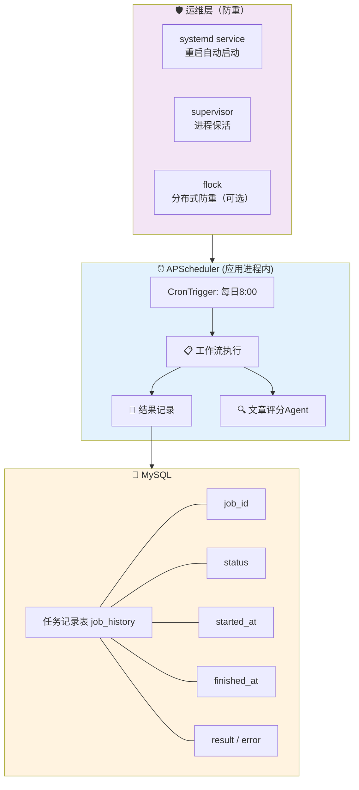
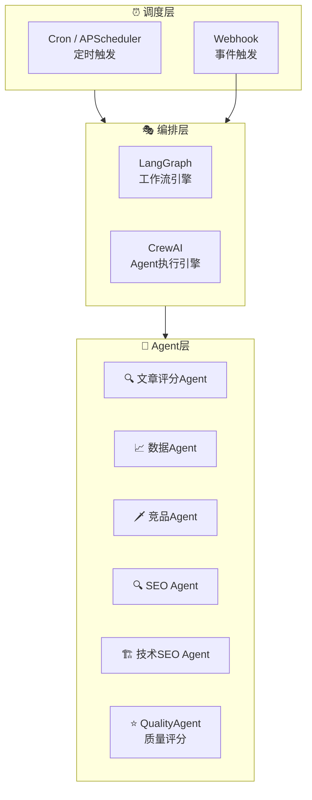

# 定时任务调度方案

## 4.0 调度器选型：系统 Cron 还是代码内置框架？

### 4.0.1 三种调度方案对比

| 维度 | 系统 Cron (crontab) | APScheduler (代码内置) | Celery Beat (分布式队列) |
|------|---------------------|------------------------|--------------------------|
| **定位** | 操作系统级调度 | Python进程内调度 | 独立任务队列调度 |
| **精度** | 分钟级 | 秒级 | 秒级 |
| **配置方式** | crontab 文件 / `/etc/cron.d/` | Python 代码 / YAML | Celery Beat 配置文件 |
| **任务状态追踪** | ❌ 无内置 | ✅ 可记录 | ✅ Redis 持久化 |
| **重试机制** | ❌ 无内置 | ⚠️ 需手动实现 | ✅ 内置重试 |
| **分布式部署** | ⚠️ 需防重机制 | ⚠️ 需防重机制 | ✅ 原生支持 |
| **人工干预** | ⚠️ 需写脚本 | ✅ API 灵活 | ✅ 可管理界面 |
| **依赖应用状态** | ❌ 独立运行 | ✅ 随应用启动 | ⚠️ 独立 worker |
| **配置分散度** | ❌ 分散（多处crontab） | ✅ 集中（代码/YAML） | ✅ 集中（celeryconfig.py） |
| **部署复杂度** | ⭐ 低 | ⭐ 低 | ⭐⭐⭐ 中 |
| **运维成本** | 低 | 低 | 中 |

### 4.0.2 为什么选择 APScheduler（而非系统 Cron）

**核心原因：与 Python 应用深度集成 + 状态追踪能力**

| 场景 | 系统 Cron | APScheduler | 推荐 |
|------|----------|-------------|------|
| 简单后台任务 | ✅ 适合 | ✅ 也适合 | 系统 Cron 更轻量 |
| 需要精确秒级调度 | ❌ 不支持 | ✅ 支持 | 必须用 APScheduler |
| 需要在代码中管理任务（增删改查） | ❌ 不支持 | ✅ 支持 | 必须用 APScheduler |
| 需要追踪任务执行状态 | ❌ 无 | ✅ 有 | 必须用 APScheduler |
| 需要与 Agent 工作流集成 | ❌ 割裂 | ✅ 紧密 | 必须用 APScheduler |
| 定时触发 Agent 工作流 | ⚠️ 需调用 API | ✅ 直接调用 | 必须用 APScheduler |

**系统 Cron 的局限：**

```bash
# 系统 Cron 的问题：配置分散，状态不透明
# 1. crontab 里写的是 shell 命令，不是 Python 函数
0 8 * * * /usr/bin/python3 /opt/agent/tasks/run_topic.py >> /var/log/topic.log 2>&1

# 问题：
# - 如果 Python 代码改了 import 路径，crontab 要改
# - 任务跑没跑？不知道
# - 任务失败了？不知道
# - 想动态调整参数？得改 crontab 文件
# - 多台服务器部署？每台都要配 crontab
```

**APScheduler 的优势：**

```python
# APScheduler：配置集中，状态可追踪
scheduler = AsyncIOScheduler()

# 1. 直接调用 Python 函数，不是 shell
scheduler.add_job(
    func=run_topic_workflow,  # 直接是 Python 函数
    trigger=CronTrigger(hour=8, minute=0),
    kwargs={'auto_approve': True}  # 自主运营
)

# 2. 内置任务状态追踪
job = scheduler.get_job('daily_topic')
print(job.next_run_time)  # 下次执行时间
print(job.pending)  # 是否等待执行

# 3. 可以动态管理
scheduler.resume_job('daily_topic')  # 恢复任务
scheduler.pause_job('daily_topic')   # 暂停任务
scheduler.modify_job('daily_topic', kwargs={'auto_approve': True})  # 修改参数

# 4. 与日志、监控集成
@job.listener
def on_job_executed(event):
    logger.info(f"Task {event.job_id} executed, next run: {event.scheduled_run_time}")
```

### 4.0.3 为什么不用 Celery（分布式方案）

**Celery 的优势：**
- 分布式任务队列，适合大规模部署
- 内置重试、限流、死信队列
- 多 worker 并行执行

**对于本项目，Celery 暂时过度：**

| 考量 | 说明 |
|------|------|
| **部署复杂度** | 需要 Redis + Celery worker + Celery Beat，至少3个进程 |
| **成本** | 多台服务器才发挥价值，单机用反而增加复杂度 |
| **本项目规模** | 初期文章产量有限，不需要分布式处理 |
| **CrewAI 限制** | Agent 是内存中运行，Celery 的任务序列化可能有问题 |

**结论：** 初期用 APScheduler 足够，等规模扩大再迁移到 Celery。

### 4.0.4 推荐方案：APScheduler + 运维防重

**架构设计：**



**Docker Compose 部署：**

```yaml
# docker-compose.yml (调度器部分)
services:
  agent-scheduler:
    build: .
    command: python scheduler/scheduler.py
    volumes:
      - ./config:/app/config
      - ./logs:/app/logs
    restart: unless-stopped
    environment:
      - PYTHONUNBUFFERED=1
    # 注意：单机部署，不需要额外的防重机制
```

**结论：** 对于中小规模的多Agent网站运营，**APScheduler 是最佳选择**：
- 与 Python/CrewAI/LangGraph 无缝集成
- 配置集中，状态可追踪
- 部署简单，运维成本低
- 必要时可迁移到 Celery

## 4.1 定时任务概述

### 4.1.1 任务调度策略

| 任务类型 | 执行频率 | 执行时间 | 说明 |
|---------|---------|---------|------|
| **每日选题** | 每日1次 | 08:00 | 自动选题研究 |
| **每日数据采集** | 每日1次 | 20:00 | 采集当日流量和排名数据 |
| **每周竞品分析** | 每周1次 | 周一 09:00 | 竞品动态分析 |
| **每周数据报告** | 每周1次 | 周一 10:00 | 生成运营周报 |
| **每月质量回顾** | 每月1次 | 每月1日 10:00 | 回顾上月表现、检查 QualityAgent 评分趋势 |
| **技术SEO检查** | 每周1次 | 周三 02:00 | 技术SEO全面检查 |
| **文章质量评分** | 按需 | WriterAgent 生成后触发 | QualityAgent 评估写作质量，触发重写或通过 |

### 4.1.2 定时任务调度器架构



## 4.2 APScheduler 实现方案

> 详见: [[scheduler/scheduler.py]]

```python
"""
多Agent自动运营网站 - 定时任务调度器
使用 APScheduler 实现精确的定时调度
"""
from apscheduler.schedulers.asyncio import AsyncIOScheduler
from apscheduler.triggers.cron import CronTrigger
from apscheduler.triggers.date import DateTrigger
from apscheduler.jobstores.memory import MemoryJobStore
from apscheduler.executors.asyncio import AsyncIOExecutor
from datetime import datetime, timedelta
import asyncio
import logging

logger = logging.getLogger(__name__)


class AgentScheduler:
    """Agent定时任务调度器"""
    
    def __init__(self):
        self.scheduler = AsyncIOScheduler(
            jobstores={
                'default': MemoryJobStore()
            },
            executors={
                'default': AsyncIOExecutor()
            },
            job_defaults={
                'coalesce': False,
                'max_instances': 1,
                'misfire_grace_time': 60 * 60  # 1小时内错过的任务仍会执行
            }
        )
        self._register_jobs()
    
    def _register_jobs(self):
        """注册所有定时任务"""
        
        # === 每日任务 ===
        
        # 每日选题 - 每天早上8点
        self.scheduler.add_job(
            func=self.run_topic_agent,
            trigger=CronTrigger(hour=8, minute=0, timezone="Asia/Shanghai"),
            id='daily_topic',
            name='每日选题研究',
            kwargs={'auto_approve': True}  # 默认自主运营，无需人工审批
        )
        
        # 每日数据采集 - 每天晚上8点
        self.scheduler.add_job(
            func=self.run_data_agent,
            trigger=CronTrigger(hour=20, minute=0, timezone="Asia/Shanghai"),
            id='daily_data_collection',
            name='每日数据采集',
            kwargs={'report_type': 'daily'}
        )
        
        # === 每周任务 ===
        
        # 每周竞品分析 - 每周一早上9点
        self.scheduler.add_job(
            func=self.run_competitor_agent,
            trigger=CronTrigger(hour=9, minute=0, day_of_week='mon', timezone="Asia/Shanghai"),
            id='weekly_competitor',
            name='每周竞品分析'
        )
        
        # 每周数据报告 - 每周一早上10点
        self.scheduler.add_job(
            func=self.run_data_agent,
            trigger=CronTrigger(hour=10, minute=0, day_of_week='mon', timezone="Asia/ShShanghai"),
            id='weekly_report',
            name='每周运营报告',
            kwargs={'report_type': 'weekly'}
        )
        
        # 技术SEO检查 - 每周三凌晨2点
        self.scheduler.add_job(
            func=self.run_tech_seo_agent,
            trigger=CronTrigger(hour=2, minute=0, day_of_week='wed', timezone="Asia/Shanghai"),
            id='weekly_tech_seo',
            name='每周技术SEO检查'
        )
        
        # === 每月任务 ===
        
        # 每月质量回顾 - 每月1号早上10点
        self.scheduler.add_job(
            func=self.run_monthly_review,
            trigger=CronTrigger(hour=10, minute=0, day=1, timezone="Asia/Shanghai"),
            id='monthly_review',
            name='每月质量回顾'
        )
        
        # === 事件触发任务 ===
        
        # CMS发布失败自动重试（10分钟后）
        # 在CMS Agent中调用
        
        # 排名下降自动优化（立即触发）
        # 在Data Agent中调用
    
    async def run_topic_agent(self, auto_approve: bool = True):  # 默认自主运营
        """执行文章评分Agent"""
        logger.info("🚀 开始执行每日选题任务")
        try:
            from workflows.crewai_workflow import run_topic_workflow
            result = await run_topic_workflow(auto_approve=auto_approve)
            logger.info(f"✅ 选题任务完成: {result}")
            return result
        except Exception as e:
            logger.error(f"❌ 选题任务失败: {e}")
            await self.notify_error("文章评分Agent失败", str(e))
            raise
    
    async def run_data_agent(self, report_type: str = 'daily'):
        """执行数据Agent"""
        logger.info(f"🚀 开始执行{report_type}数据采集任务")
        try:
            from workflows.crewai_workflow import run_data_workflow
            result = await run_data_workflow(report_type=report_type)
            logger.info(f"✅ 数据采集任务完成: {result}")
            return result
        except Exception as e:
            logger.error(f"❌ 数据采集任务失败: {e}")
            await self.notify_error("数据Agent失败", str(e))
            raise
    
    async def run_competitor_agent(self):
        """执行竞品Agent"""
        logger.info("🚀 开始执行每周竞品分析")
        try:
            from workflows.crewai_workflow import run_competitor_workflow
            result = await run_competitor_workflow()
            logger.info(f"✅ 竞品分析完成: {result}")
            return result
        except Exception as e:
            logger.error(f"❌ 竞品分析失败: {e}")
            await self.notify_error("竞品Agent失败", str(e))
            raise
    
    async def run_tech_seo_agent(self):
        """执行技术SEO Agent"""
        logger.info("🚀 开始执行技术SEO检查")
        try:
            from workflows.crewai_workflow import run_tech_seo_workflow
            result = await run_tech_seo_workflow()
            logger.info(f"✅ 技术SEO检查完成: {result}")
            return result
        except Exception as e:
            logger.error(f"❌ 技术SEO检查失败: {e}")
            await self.notify_error("技术SEO Agent失败", str(e))
            raise
    
    async def run_monthly_review(self):
        """执行月度质量回顾"""
        logger.info("🚀 开始执行每月质量回顾")
        try:
            from workflows.crewai_workflow import run_monthly_review_workflow
            result = await run_monthly_review_workflow()
            logger.info(f"✅ 月度回顾完成: {result}")
            return result
        except Exception as e:
            logger.error(f"❌ 月度回顾失败: {e}")
            await self.notify_error("月度回顾失败", str(e))
            raise
    
    async def notify_error(self, title: str, message: str):
        """发送错误通知"""
        # TODO: 实现通知逻辑（邮件/微信/钉钉等）
        logger.warning(f"📢 通知: {title} - {message}")
    
    def trigger_job(self, job_id: str, **kwargs):
        """手动触发任务"""
        job = self.scheduler.get_job(job_id)
        if job:
            job.modify(kwargs=kwargs)
            job.func(**job.kwargs)
        else:
            logger.error(f"任务 {job_id} 不存在")
    
    def start(self):
        """启动调度器"""
        self.scheduler.start()
        logger.info("✅ 定时任务调度器已启动")
    
    def shutdown(self):
        """关闭调度器"""
        self.scheduler.shutdown()
        logger.info("🛑 定时任务调度器已关闭")


# === 单例模式 ===
_scheduler = None

def get_scheduler() -> AgentScheduler:
    """获取调度器单例"""
    global _scheduler
    if _scheduler is None:
        _scheduler = AgentScheduler()
    return _scheduler
```

## 4.3 Cron 配置方案

> 详见: [[scheduler/cron_tasks.yaml]]

```yaml
# 多Agent自动运营网站 - Cron定时任务配置
# 使用 APScheduler CronTrigger 实现精确调度

version: "1.0"

# === 每日任务 ===
daily:
  topic:
    name: "每日选题研究"
    schedule: "0 8 * * *"  # 每天早上8点
    timezone: "Asia/Shanghai"
    agent: "topic_agent"
    params:
      auto_approve: true  # 默认自主运营，Agent全流程执行
      keyword_pool: "config/keywords.yaml"
      min_kd: 0
      max_kd: 30
      min_search_volume: 100
    enabled: true
  
  data_collection:
    name: "每日数据采集"
    schedule: "0 20 * * *"  # 每天晚上8点
    timezone: "Asia/Shanghai"
    agent: "data_agent"
    params:
      report_type: "daily"
      metrics:
        - "pageviews"
        - "visitors"
        - "bounce_rate"
        - "avg_time_on_page"
        - "keyword_rankings"
    enabled: true

# === 每周任务 ===
weekly:
  competitor:
    name: "每周竞品分析"
    schedule: "0 9 * * 1"  # 每周一早上9点
    timezone: "Asia/Shanghai"
    agent: "competitor_agent"
    params:
      competitors:
        - "竞品A"
        - "竞品B"
        - "竞品C"
      keywords: "config/monitor_keywords.yaml"
    enabled: true
  
  report:
    name: "每周运营报告"
    schedule: "0 10 * * 1"  # 每周一早上10点
    timezone: "Asia/Shanghai"
    agent: "data_agent"
    params:
      report_type: "weekly"
      recipients:
        - "运营团队"
    enabled: true
  
  tech_seo:
    name: "每周技术SEO检查"
    schedule: "0 2 * * 3"  # 每周三凌晨2点
    timezone: "Asia/Shanghai"
    agent: "tech_seo_agent"
    params:
      checks:
        - "page_speed"
        - "mobile_friendly"
        - "broken_links"
        - "sitemap"
        - "robots"
        - "structured_data"
    enabled: true

# === 每月任务 ===
monthly:
  quality_review:
    name: "每月质量回顾"
    schedule: "0 10 1 * *"  # 每月1号早上10点
    timezone: "Asia/Shanghai"
    agent: "all_agents"
    params:
      review_period: "last_month"
      agents:
        - "topic_agent"
        - "writer_agent"
        - "quality_agent"
        - "editor_agent"
        - "seo_agent"
    enabled: true

# === 事件触发任务 ===
event_triggered:
  cms_retry:
    name: "CMS发布失败重试"
    delay_minutes: 10
    max_retries: 3
    agent: "cms_agent"
  
  ranking_alert:
    name: "排名下降自动优化"
    threshold:
      ranking_drop: 5  # 排名下降超过5位
      days: 2  # 持续2天
    agent: "seo_agent"
  
  competitor_alert:
    name: "竞品发布预警"
    priority: "high"
    agent: "topic_agent"
```

## 4.4 Celery 异步任务方案（可选）

对于更复杂的后台任务，可以使用 Celery 进行异步队列处理：

> 详见: [[scheduler/celery_tasks.py]]

```python
"""
多Agent自动运营网站 - Celery 异步任务
适用于：长时间运行的Agent任务、分布式部署
"""
from celery import Celery
from celery.schedules import crontab

app = Celery('agent_tasks')

# Celery配置
app.conf.update(
    broker_url='redis://localhost:6379/0',
    result_backend='redis://localhost:6379/1',
    task_serializer='json',
    accept_content=['json'],
    result_serializer='json',
    timezone='Asia/Shanghai',
    enable_utc=True,
)

# === Celery Beat 定时任务 ===
app.conf.beat_schedule = {
    # 每日选题
    'daily-topic': {
        'task': 'tasks.run_topic_agent',
        'schedule': crontab(hour=8, minute=0),
        'kwargs': {'auto_approve': True},  # 自主运营，无需人工审批
    },
    # 每日数据采集
    'daily-data': {
        'task': 'tasks.run_data_agent',
        'schedule': crontab(hour=20, minute=0),
        'kwargs': {'report_type': 'daily'},
    },
    # 每周竞品分析
    'weekly-competitor': {
        'task': 'tasks.run_competitor_agent',
        'schedule': crontab(hour=9, minute=0, day_of_week=1),
    },
    # 每周报告
    'weekly-report': {
        'task': 'tasks.run_data_agent',
        'schedule': crontab(hour=10, minute=0, day_of_week=1),
        'kwargs': {'report_type': 'weekly'},
    },
    # 技术SEO检查
    'weekly-tech-seo': {
        'task': 'tasks.run_tech_seo_agent',
        'schedule': crontab(hour=2, minute=0, day_of_week=2),
    },
    # 每月回顾
    'monthly-review': {
        'task': 'tasks.run_monthly_review',
        'schedule': crontab(hour=10, minute=0, day_of_month=1),
    },
}


@app.task(bind=True, max_retries=3)
def run_topic_agent(self, **kwargs):
    """文章评分Agent异步任务"""
    try:
        from workflows.crewai_workflow import run_topic_workflow
        result = run_topic_workflow(**kwargs)
        return {'status': 'success', 'result': result}
    except Exception as e:
        self.retry(exc=e, countdown=60 * 10)  # 10分钟后重试


@app.task(bind=True, max_retries=3)
def run_data_agent(self, report_type='daily', **kwargs):
    """数据Agent异步任务"""
    try:
        from workflows.crewai_workflow import run_data_workflow
        result = run_data_workflow(report_type=report_type, **kwargs)
        return {'status': 'success', 'result': result}
    except Exception as e:
        self.retry(exc=e, countdown=60 * 10)


@app.task(bind=True, max_retries=3)
def run_competitor_agent(self, **kwargs):
    """竞品Agent异步任务"""
    try:
        from workflows.crewai_workflow import run_competitor_workflow
        result = run_competitor_workflow(**kwargs)
        return {'status': 'success', 'result': result}
    except Exception as e:
        self.retry(exc=e, countdown=60 * 10)


@app.task
def run_full_content_pipeline(topic_id: str, auto_approve: bool = True):  # 默认自主运营
    """完整内容生产流水线"""
    from workflows.langgraph_workflow import run_content_pipeline
    result = run_content_pipeline(topic_id=topic_id, auto_approve=auto_approve)
    return {'status': 'success', 'result': result}


@app.task
def notify_task_failure(task_name: str, error: str, recipients: list):
    """任务失败通知"""
    # TODO: 实现通知逻辑
    pass
```

## 4.5 任务执行监控

### 4.5.1 任务状态追踪

```python
class TaskTracker:
    """任务执行状态追踪器"""
    
    def __init__(self, db):
        self.db = db
    
    async def track(self, job_id: str, status: str, result=None, error=None):
        """记录任务执行状态"""
        record = {
            'job_id': job_id,
            'status': status,  # pending, running, success, failed
            'result': result,
            'error': error,
            'started_at': datetime.now(),
            'finished_at': datetime.now() if status in ['success', 'failed'] else None
        }
        await self.db.tasks.insert_one(record)
    
    async def get_history(self, job_id: str, limit: int = 10):
        """获取任务执行历史"""
        cursor = self.db.tasks.find({'job_id': job_id}).sort('started_at', -1).limit(limit)
        return await cursor.to_list(length=limit)
    
    async def get_failed_jobs(self, hours: int = 24):
        """获取最近失败的任务"""
        since = datetime.now() - timedelta(hours=hours)
        cursor = self.db.tasks.find({
            'status': 'failed',
            'started_at': {'$gte': since}
        })
        return await cursor.to_list(length=100)
```

### 4.5.2 执行日志记录

```python
import logging
from datetime import datetime

# 配置日志
logging.basicConfig(
    level=logging.INFO,
    format='%(asctime)s - %(name)s - %(levelname)s - %(message)s',
    handlers=[
        logging.FileHandler(f'logs/scheduler_{datetime.now().strftime("%Y%m")}.log'),
        logging.StreamHandler()
    ]
)

logger = logging.getLogger('scheduler')
```

---

*相关文档：[[00-方案概述]] | [[01-Agent架构图]] | [[03-工作流编排]] | [[scheduler/scheduler.py]] | [[scheduler/cron_tasks.yaml]]*
