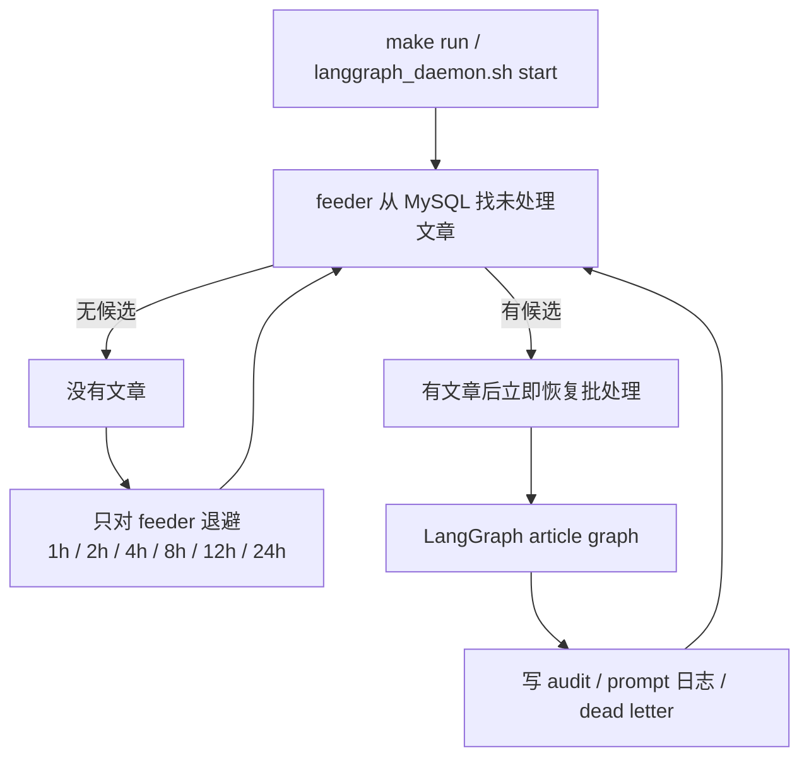

# 多Agent自动运营网站 - LangGraph 定时运行方案

**版本**: v2.0
**更新时间**: 2026-07-11
**状态**: 当前正式运行方案

本文档只描述当前 LangGraph 正式链路。旧队列 worker 版本已经删除，定时运行统一由 LangGraph batch runner 和 daemon 脚本负责。

## 1. 当前调度模型



特点：

| 能力 | 说明 |
| --- | --- |
| 常驻运行 | `make run` 后后台执行，不占终端 |
| 无文章退避 | 只暂停 feeder 检查，不影响已有文章处理 |
| 有文章恢复 | 发现新文章后立刻恢复正常批量运行 |
| 优雅停止 | 收到停止信号后尽量完成当前文章 |
| 可追溯 | 运行日志、prompt 日志、dead letter 分开保存 |

## 2. 推荐命令

后台启动：

```bash
make run
```

查看状态：

```bash
make status
```

查看实时日志：

```bash
make logs
```

停止：

```bash
make stop
```

前台跑一次：

```bash
python3 scripts/run_langgraph_batch.py --production --limit 10 --persist-audit
```

指定文章：

```bash
python3 scripts/run_langgraph_batch.py --ids 213 --limit 1 --persist-audit
```

## 3. 关键配置

| 配置 | 默认值 | 说明 |
| --- | --- | --- |
| `LANGGRAPH_BATCH_LIMIT` | `10` | 每轮最多处理多少篇 |
| `LANGGRAPH_FEED_LIMIT` | `100` | feeder 每次最多取多少候选 |
| `LANGGRAPH_FEED_FROM_ID` | 空 | 可选起始文章 id |
| `LANGGRAPH_FEED_STATE_PATH` | `output/langgraph_feeder_state.json` | feeder 游标文件 |
| `LANGGRAPH_FEED_IDLE_BACKOFF_HOURS` | `1,2,4,8,12,24` | 无文章时的检查退避 |
| `LANGGRAPH_MARK_USED` | `false` | 是否处理后标记 `if_used=true` |
| `LANGGRAPH_DEADLETTER_PATH` | `output/langgraph_deadletter.jsonl` | 失败文章记录 |
| `LANGGRAPH_LOG_FILE` | `logs/langgraph_batch.log` | 主运行日志 |
| `PROMPT_AUDIT_DIR` | `logs/prompt_audit` | prompt 和分数明细日志目录 |

## 4. 日志追踪

按文章追踪：

```bash
python3 scripts/trace_langgraph_article.py --article-id 213
```

直接过滤主日志：

```bash
grep "article_id=213" logs/langgraph_batch.log
```

prompt、分数明细、模型响应会进入 `logs/prompt_audit/*.jsonl`，适合排查某篇文章为什么低分、为什么重写、为什么图片或 CMS 被阻断。

## 5. 不再使用的方案

当前项目不再使用独立旧队列 worker、旧 stream 消费组或旧队列回滚入口。要扩大吞吐量时，优先调整 LangGraph runner 的批量大小、模型并发、图片/CMS 节点并发和 provider 限流，而不是再引入第二套调度系统。
