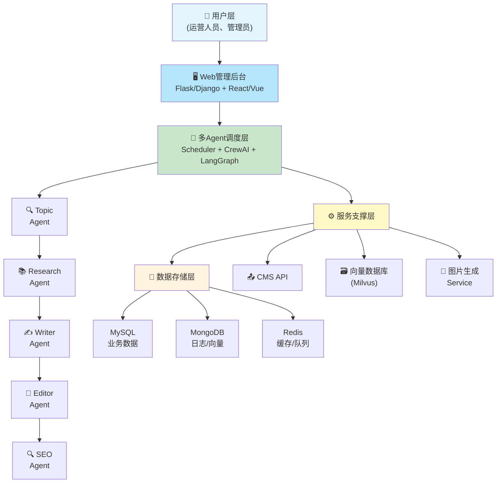
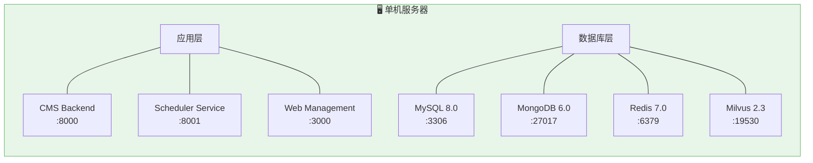

# 多Agent自动运营网站 - 部署方案

**版本**: v1.0
**创建时间**: 2026-05-13
**作者**: AI助手

---

## 目录

1. [部署架构概述](#1-部署架构概述)
2. [环境准备](#2-环境准备)
3. [组件部署顺序](#3-组件部署顺序)
4. [配置管理](#4-配置管理)
5. [监控与运维](#5-监控与运维)
6. [扩展方案](#6-扩展方案)

---

## 1. 部署架构概述

### 1.1 系统架构图



### 1.2 部署拓扑

**单机部署（初期）**



**分布式部署（成长期）**

```mermaid
flowchart LR
    subgraph APP_SERVERS["🖥️ 应用服务器集群"]
        S1["应用服务器1\nScheduler\nCrewAI Workers\nWeb Management"]
        S2["应用服务器2\nScheduler(Standby)\nCrewAI Workers\nWeb Management"]
    end

    subgraph DB_SERVERS["🗄️ 数据库服务器"]
        MYSQL_M["MySQL Master\n:3306"]
        MYSQL_S["MySQL Slave\n:3307"]
        REDIS_S["Redis\n:6379"]
    end

    subgraph VECTOR_SERVER["🗃️ 向量数据库"]
        MILVUS["Milvus\n:19530"]
    end

    subgraph MONGO_RS["📦 MongoDB副本集"]
        MP["Primary\n:27017"]
        MS["Secondary\n:27018"]
        MA["Arbiter\n:27019"]
    end

    S1 & S2 <--> DB_SERVERS & VECTOR_SERVER & MONGO_RS

    style APP_SERVERS fill:#b3e5fc
    style DB_SERVERS fill:#fff3e0
    style VECTOR_SERVER fill:#f3e5f5
    style MONGO_RS fill:#e8f5e9
```



---

## 2. 环境准备

### 2.1 硬件要求

| 组件 | 最低配置 | 推荐配置 | 说明 |
|------|----------|----------|------|
| **应用服务器** | 8核16G | 16核32G | 运行Agent和调度器 |
| **数据库服务器** | 8核32G 500G SSD | 16核64G 1T SSD | MySQL + MongoDB |
| **向量数据库** | 8核16G | 16核32G | Milvus（可选，用于RAG） |
| **Redis** | 4核8G | 8核16G | 缓存和消息队列 |

### 2.2 软件依赖

```bash
# Python环境
Python 3.10+
pip 23+

# 核心Python包
crewai==0.28.0
langchain==0.0.340
langgraph==0.0.32
openai==1.13.0
pymysql==1.1.0
pymongo==4.6.0
redis==5.0.0
flask==3.0.0  # 或 django==5.0.0

# 系统依赖
mysql-server 8.0
mongodb 6.0
redis 7.0
milvus 2.3  # 可选
nodejs 20+     # 前端
```

### 2.3 环境变量

```bash
# .env 文件示例

# LLM配置
OPENAI_API_KEY=sk-xxx
OPENAI_BASE_URL=https://api.openai.com/v1
DEEPSEEK_API_KEY=sk-xxx  # 备用

# 数据库配置
MYSQL_HOST=localhost
MYSQL_PORT=3306
MYSQL_USER=root
MYSQL_PASSWORD=xxx
MYSQL_DATABASE=content_pipeline

MONGODB_URI=mongodb://localhost:27017/
REDIS_URL=redis://localhost:6379/0

# CMS配置
CMS_API_URL=https://cms.example.com/api
CMS_API_KEY=xxx

# 调度器配置
SCHEDULER_PORT=8001
SCHEDULER_TIMEZONE=Asia/Shanghai

# 其他服务
IMAGE_GEN_API_KEY=xxx  # DALL-E或其他图片生成服务
SERPAPI_API_KEY=xxx   # SERP分析工具
```

---

## 3. 组件部署顺序

### 3.1 第一步：数据存储层

#### MySQL部署

```bash
# Ubuntu/Debian
sudo apt update
sudo apt install mysql-server 8.0

# 安全配置
sudo mysql_secure_installation

# 创建数据库和用户
mysql -u root -p
CREATE DATABASE content_pipeline CHARACTER SET utf8mb4 COLLATE utf8mb4_unicode_ci;
CREATE USER 'pipeline'@'localhost' IDENTIFIED BY 'strong_password';
GRANT ALL PRIVILEGES ON content_pipeline.* TO 'pipeline'@'localhost';
FLUSH PRIVILEGES;

# 导入初始表结构
mysql -u pipeline -p content_pipeline < docs/sql/init_schema.sql
```

#### MongoDB部署

```bash
# Ubuntu/Debian
wget -qO - https://www.mongodb.org/static/pgp/server-6.0.asc | sudo apt-key add -
echo "deb [ arch=amd64 ] https://repo.mongodb.org/apt/ubuntu jammy/mongodb-org/6.0 multiverse" | sudo tee /etc/apt/sources.list.d/mongodb-org-6.0.list
sudo apt update
sudo apt install -y mongodb-org

# 启动
sudo systemctl start mongod
sudo systemctl enable mongod

# 创建用户
mongosh
use content_pipeline
db.createUser({
  user: "pipeline",
  pwd: "strong_password",
  roles: [{ role: "readWrite", db: "content_pipeline" }]
})
```

#### Redis部署

```bash
# Ubuntu/Debian
sudo apt install redis-server

# 配置密码
sudo vim /etc/redis/redis.conf
# 取消注释 requirepass 并设置密码

# 启动
sudo systemctl start redis
sudo systemctl enable redis
```

### 3.2 第二步：服务支撑层

#### CMSBackend部署

```bash
# 假设使用FastAPI
cd cms_backend
python -m venv venv
source venv/bin/activate
pip install -r requirements.txt

# 配置
cp .env.example .env
vim .env  # 填写配置

# 启动
uvicorn main:app --host 0.0.0.0 --port 8000 --workers 4
```

#### 向量数据库部署（可选）

```bash
# Milvus部署（Docker方式）
docker run -d --name milvus \
  -p 19530:19530 \
  -p 9091:9091 \
  -v /path/to/milvus/data:/var/lib/milvus/data \
  milvusdb/milvus:v2.3.0
```

### 3.3 第三步：多Agent调度层

#### Scheduler Service部署

```bash
cd scheduler
python -m venv venv
source venv/bin/activate
pip install -r requirements.txt

# 配置
cp config/config.example.yaml config/config.yaml
vim config/config.yaml  # 填写配置

# 启动调度器
python scheduler.py

# 或使用systemd管理
sudo vim /etc/systemd/system/pipeline-scheduler.service
```

**systemd服务文件示例**：
```ini
[Unit]
Description=Multi-Agent Content Pipeline Scheduler
After=network.target mysql.service mongodb.service redis.service

[Service]
Type=simple
User=pipeline
WorkingDirectory=/opt/content-pipeline/scheduler
Environment="PATH=/opt/content-pipeline/scheduler/venv/bin"
ExecStart=/opt/content-pipeline/scheduler/venv/bin/python scheduler.py
Restart=always
RestartSec=10

[Install]
WantedBy=multi-user.target
```

#### CrewAI Workers部署

```bash
cd agents
python -m venv venv
source venv/bin/activate
pip install -r requirements.txt

# 测试单个Agent
python -m agents.topic_agent.main --test

# 启动Worker（监听Redis队列）
python -m workers.crewai_worker
```

### 3.4 第四步：Web管理后台部署

#### 后端API部署

```bash
cd web_backend
python -m venv venv
source venv/bin/activate
pip install -r requirements.txt

# 数据库迁移
flask db upgrade

# 启动
gunicorn -w 4 -b 0.0.0.0:8000 app:app
```

#### 前端部署

```bash
cd web_frontend
npm install
npm run build

# 使用nginx托管静态文件
sudo cp -r dist/* /var/www/html/pipeline/
```

**nginx配置示例**：
```nginx
server {
    listen 80;
    server_name pipeline.example.com;
    
    location / {
        root /var/www/html/pipeline;
        try_files $uri $uri/ /index.html;
    }
    
    location /api {
        proxy_pass http://localhost:8000;
        proxy_set_header Host $host;
        proxy_set_header X-Real-IP $remote_addr;
    }
}
```

---

## 4. 配置管理

### 4.1 配置文件结构

```
config/
├── config.yaml              # 主配置
├── agents/                 # Agent配置
│   ├── topic_agent.yaml
│   ├── writer_agent.yaml
│   └── ...
├── scheduler.yaml          # 调度器配置
├── cms.yaml               # CMS配置
└── keywords.yaml          # 关键词配置
```

### 4.2 配置热更新

```python
# config_manager.py
import yaml
import os
from watchdog.observers import Observer
from watchdog.events import FileSystemEventHandler

class ConfigManager:
    def __init__(self, config_dir: str):
        self.config_dir = config_dir
        self.config = {}
        self.load_all()
        
        # 启动文件监控
        self.observer = Observer()
        self.observer.schedule(
            ConfigFileHandler(self),
            path=config_dir,
            recursive=True
        )
        self.observer.start()
    
    def load_all(self):
        """加载所有配置"""
        for filename in os.listdir(self.config_dir):
            if filename.endswith('.yaml'):
                filepath = os.path.join(self.config_dir, filename)
                with open(filepath, 'r') as f:
                    name = filename.replace('.yaml', '')
                    self.config[name] = yaml.safe_load(f)
    
    def get(self, key: str, default=None):
        """获取配置值（支持点号路径）"""
        keys = key.split('.')
        value = self.config
        for k in keys:
            value = value.get(k, {})
            if value == {}:
                return default
        return value
```

---

## 5. 监控与运维

### 5.1 监控指标

| 类别 | 指标 | 告警阈值 | 说明 |
|------|------|----------|------|
| **系统** | CPU使用率 | >80% | 持续5分钟 |
| | 内存使用率 | >85% | 持续5分钟 |
| | 磁盘使用率 | >80% | - |
| **应用** | Agent执行成功率 | <95% | 持续10分钟 |
| | 任务队列长度 | >100 | - |
| | API响应时间 | >2000ms | P95 |
| **业务** | 文章发布成功率 | <90% | 持续1小时 |
| | 关键词排名下降 | >5位 | 单个关键词 |

### 5.2 日志管理

```python
# logging_config.py
import logging
import json
from datetime import datetime

class JSONFormatter(logging.Formatter):
    def format(self, record):
        log_record = {
            "timestamp": datetime.utcnow().isoformat(),
            "level": record.levelname,
            "agent": getattr(record, 'agent_name', 'system'),
            "message": record.getMessage(),
            "module": record.module,
            "line": record.lineno
        }
        return json.dumps(log_record, ensure_ascii=False)

# 配置
logging.basicConfig(
    level=logging.INFO,
    handlers=[
        logging.FileHandler("logs/pipeline.log"),
        logging.StreamHandler()
    ]
)

# 为每个Agent设置独立logger
for agent_name in ['topic', 'research', 'writer', 'editor', 'seo', 'image', 'cms']:
    logger = logging.getLogger(agent_name)
    handler = logging.FileHandler(f"logs/{agent_name}.log")
    handler.setFormatter(JSONFormatter())
    logger.addHandler(handler)
```

### 5.3 告警配置

```yaml
# alerts.yaml
alerts:
  - name: "Agent执行失败"
    condition: "agent_success_rate < 0.95"
    duration: "10m"
    notify:
      - type: "wechat"
        webhook: "${WECOM_ROBOT_WEBHOOK}"
      - type: "email"
        to: "admin@example.com"
  
  - name: "任务队列堆积"
    condition: "queue_length > 100"
    notify:
      - type: "wechat"
      
  - name: "CMS发布失败"
    condition: "cms_publish_failure_rate > 0.1"
    notify:
      - type: "email"
```

---

## 6. 扩展方案

### 6.1 水平扩展

当单机性能不足时，可以按以下顺序扩展：

1. **读写分离**：MySQL配置主从复制
2. **MongoDB分片**：按时间或关键词分片
3. **Redis集群**：使用Redis Cluster
4. **Agent水平扩展**：增加CrewAI Worker节点
5. **负载均衡**：使用Nginx或HAProxy

### 6.2 性能优化

| 优化点 | 方法 | 预期效果 |
|--------|------|----------|
| **数据库** | 添加索引、查询优化 | 查询速度提升50% |
| **缓存** | Redis缓存热点数据 | API响应时间降低70% |
| **异步任务** | Celery异步执行 | 用户体验提升 |
| **CDN** | 静态资源CDN加速 | 页面加载速度提升60% |

### 6.3 灾备方案

```bash
# 数据库备份脚本
#!/bin/bash
BACKUP_DIR="/data/backup"
DATE=$(date +%Y%m%d_%H%M%S)

# MySQL备份
mysqldump -u root -p content_pipeline | gzip > $BACKUP_DIR/mysql_$DATE.sql.gz

# MongoDB备份
mongodump --uri="mongodb://localhost:27017" --gzip --archive=$BACKUP_DIR/mongo_$DATE.archive

# 上传到云存储（可选）
aws s3 cp $BACKUP_DIR/mysql_$DATE.sql.gz s3://my-bucket/backup/
aws s3 cp $BACKUP_DIR/mongo_$DATE.archive s3://my-bucket/backup/

# 删除7天前的备份
find $BACKUP_DIR -name "*.gz" -mtime +7 -delete
find $BACKUP_DIR -name "*.archive" -mtime +7 -delete
```

**定时执行**：
```bash
# 每天凌晨2点执行备份
0 2 * * * /opt/scripts/backup.sh >> /var/log/backup.log 2>&1
```

---

## 附录A：完整部署检查清单

### 部署前检查

- [ ] 服务器资源满足最低配置
- [ ] 网络连通性正常
- [ ] 域名解析已配置
- [ ] SSL证书已申请（如需HTTPS）

### 部署中检查

- [ ] 数据库初始化成功
- [ ] 配置文件填写正确
- [ ] 每个组件能独立启动
- [ ] Agent测试运行通过

### 部署后检查

- [ ] 端到端流程测试通过
- [ ] 监控指标正常
- [ ] 日志输出正常
- [ ] 备份脚本配置完成

---

**文档版本历史**：

| 版本 | 日期 | 作者 | 变更说明 |
|------|------|------|----------|
| v1.0 | 2026-05-13 | AI助手 | 初始版本 |
