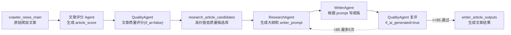

# ResearchAgent 说明

## 当前目标

ResearchAgent 位于「QualityAgent」和「WriterAgent」之间。

它不直接写成稿，而是阅读已经通过评分筛选的 crawler 文章，生成一份可交给 WriterAgent 使用的写作任务包。这个任务包包括原文要点、风险提醒、标题改写策略、字数调整策略、文章大纲，以及完整的 `writer_prompt`。

当前重点处理「选题价值分大于 75，但 QualityAgent 判断质量低于 70」的文章。这类文章通常事件本身值得做，但原文写作质量不足，需要进一步拆解、重组和提示写作方向。

## 工作位置



## 输入

ResearchAgent 主要接收两类信息：

| 输入 | 说明 |
| --- | --- |
| 原文信息 | 标题、正文/描述、原文链接、发布时间、学校、专业等 |
| 评分信息 | 文章评分 Agent 的综合分、标题分、重要程度分、是否通知、时效分，以及 QualityAgent 的字数质量分和扣分反馈 |

ResearchAgent 会根据文章评分结果和 QualityAgent 扣分反馈决定标题和字数提示：

| 条件 | 处理方式 |
| --- | --- |
| 文章总分 > 75 且质量分 < 70 | 进入改写候选池 |
| 非通知类成稿 | 在 prompt 中要求 WriterAgent 控制在 900-1200 字，目标约 1100 字 |
| 通知/公告类成稿 | 不强制扩成长文，建议 300-800 字 |
| 标题分 < 70 | 要求大幅重写标题 |
| 标题分 >= 70 | 只要求小幅优化标题 |
| 通知/公告类文章 | 近 2 个月内发布可以进入候选库，超过 2 个月默认不进入 |

## 输出

ResearchAgent 的核心输出是 `research_brief`，其中最重要的是 `writer_prompt`。

```json
{
  "research_brief": {
    "brief_type": "rewrite_candidate_research_brief",
    "source_snapshot": {},
    "source_highlights": [],
    "key_facts": [],
    "risk_points": [],
    "rewrite_constraints": [],
    "title_instruction": {},
    "word_count_instruction": {},
    "style_instruction": {},
    "writer_outline": {},
    "writer_prompt": {
      "prompt_type": "writer_prompt_from_research_brief",
      "prompt_text": "可直接交给 WriterAgent 的完整提示词"
    }
  }
}
```

字段说明：

| 字段 | 说明 |
| --- | --- |
| `source_snapshot` | 原文基础信息快照 |
| `source_highlights` | 原文中值得保留的亮点 |
| `key_facts` | 不允许写错或编造的核心事实 |
| `risk_points` | 写作时需要避开的风险 |
| `rewrite_constraints` | 改写约束，例如不得编造、不得扩大结论 |
| `title_instruction` | 标题大改/小改策略 |
| `word_count_instruction` | 是否需要扩写或压缩 |
| `style_instruction` | 降低 AI 感、提高真人稿件质感的写作要求 |
| `writer_outline` | 给 WriterAgent 使用的结构化大纲 |
| `writer_prompt` | 最终可直接复制给 WriterAgent 的完整提示词 |

## 大纲模板策略

ResearchAgent 内部维护多套大纲模板，并且每套模板有 2-3 个细分 variation，避免同类型文章生成结构过于同质化。

目前会根据文章类型优先匹配，而不是完全随机。

常见模板包括：

| 模板类型 | 适用文章 |
| --- | --- |
| 人物故事型 | 教授、学生、校友、团队经历、心路历程 |
| 科研成果型 | 科研突破、论文发表、技术进展 |
| 奖项荣誉型 | 获奖、入选榜单、重要表彰 |
| 实用指南型 | 招生流程、申请建议、备考路径 |
| 政策解读型 | 招生政策、培养方案、项目变化 |
| 项目介绍型 | 新项目、新专业、新平台、新合作 |
| 事件报道型 | 活动、论坛、会议、发布会 |
| 数据解读型 | 排名、就业数据、录取数据 |
| 对比分析型 | 项目对比、路径对比、选择建议 |
| 问题解决型 | 针对用户痛点给出解决方案 |
| 新闻短讯型 | 信息较短但有传播价值的新闻 |

模板选择逻辑：

1. 先读取标题、正文、关键词和评分信息。
2. 根据关键词判断文章类型。
3. 选择最匹配的主模板。
4. 在同一模板下选择一个 variation，减少结构重复。
5. 生成包含每一部分写作重点和注意事项的大纲。

## 降低 AI 感的提示策略

ResearchAgent 生成的 `writer_prompt` 会加入反 AI 感写作要求，目的是让 WriterAgent 不要产出过于工整、过于像模板的文章。

核心规则：

- 不要像逐条执行提示词一样写文章。
- 不要规律性使用「长段 + 单句短段 + 长段」的节奏。
- 减少标准转场句，例如「在这一背景下」「事实上」「可以说」。
- 避免机械对仗，例如「对于……对于……」「一方面……另一方面……」。
- 允许信息密度不均衡，重点细节多写，次要信息快速带过。
- 少解释学科，多写人、过程、现场、等待和变化。
- 结尾不要默认升华到「地图、灯塔、航程、星辰大海」等常见 AI 意象。
- 保留一点人类写作的颗粒感，不追求每一段都工整完美。

## 数据库设计

ResearchAgent 不直接修改原始爬虫表。评分后的候选文章会进入一个独立数据库：

```sql
research_article_data
```

核心表：

```sql
research_article_candidates
```

建表文件：

```text
sql/create_research_article_candidates.sql
```

核心字段：

| 字段 | 说明 |
| --- | --- |
| `source_article_id` | 原始 crawler 文章 ID |
| `original_url` | 原文链接 |
| `title` | 原标题 |
| `article_score` | 综合评分 |
| `title_style_score` | 标题分 |
| `content_importance_score` | 内容重要度分 |
| `word_count` | 原文字数；字数质量由 QualityAgent 负责 |
| `freshness_score` | 时效分 |
| `is_notice` | 是否通知/公告 |
| `score_payload` | 完整评分 JSON |
| `research_brief` | ResearchAgent 结构化输出 |
| `writer_prompt` | 给 WriterAgent 的完整提示词 |
| `research_status` | `pending/generated/failed/consumed` |

## 候选文章筛选

候选库只保留适合进入写作链路的文章。

当前筛选规则：

| 规则 | 说明 |
| --- | --- |
| `article_score > 75` 且 `quality_score < 70` | 只保留高选题价值但写作质量不足的文章 |
| 必须有 `original_url` | 后续写作和审核需要可追溯原文 |
| 通知类文章需近 2 个月内发布 | 近期通知有时仍有时效价值，过期通知默认过滤 |
| 行政类标题需近 2 个月内发布 | 例如通知、公告、公示、名单、值班、缴费等，近期保留，过期过滤 |

筛选工具：

```text
agents/research_agent/tools/research_candidate_writer.py
```

主要函数：

| 函数 | 作用 |
| --- | --- |
| `should_keep_research_candidate` | 判断文章是否进入候选库 |
| `build_research_candidate_payload` | 生成单篇文章写库 payload |
| `build_research_candidate_payloads` | 批量生成候选文章和跳过原因 |
| `write_research_candidates_to_db` | 将候选文章写入 MySQL |

## 使用方式

### 1. 创建候选数据库

```bash
mysql -u root -p < sql/create_research_article_candidates.sql
```

如果源库名就是 `crawler_ai`，可以参考 SQL 文件底部注释的初始化导入语句。新流程应先将 `article_score > 75` 的文章送入 QualityAgent，再把 `quality_score < 70` 的文章导入候选库。

### 2. 生成 ResearchAgent 输出

ResearchAgent 会读取候选文章，生成 `research_brief` 和 `writer_prompt`。

生成后的数据写回：

```text
research_article_candidates.research_brief
research_article_candidates.writer_prompt
research_article_candidates.research_status = generated
```

### 3. WriterAgent 调用

WriterAgent 后续只需要查询：

```sql
SELECT id, original_url, title, article_score, writer_prompt
FROM research_article_candidates
WHERE research_status = 'generated'
ORDER BY article_score DESC, id ASC;
```

然后把 `writer_prompt` 直接作为写作任务输入。

## 测试

相关测试：

| 文件 | 说明 |
| --- | --- |
| `tests/test_research_agent_contract.py` | ResearchAgent 输出结构、模板匹配、反 AI prompt 规则 |
| `tests/test_research_candidate_writer.py` | 候选库筛选、payload 生成、prompt 写入字段 |
| `tests/test_rewrite_task_persistence.py` | ResearchAgent 输出在工作流中的持久化 |

运行：

```bash
python3 -m unittest tests.test_research_candidate_writer tests.test_research_agent_contract tests.test_rewrite_task_persistence
```

## 相关文件

| 文件 | 说明 |
| --- | --- |
| `agents/research_agent/research_agent.py` | ResearchAgent 主逻辑 |
| `agents/research_agent/config.yaml` | 大纲模板和写作策略配置 |
| `agents/research_agent/prompt.md` | ResearchAgent 提示词说明 |
| `agents/research_agent/tools/research_candidate_writer.py` | 候选库写入工具 |
| `sql/create_research_article_candidates.sql` | Research 候选数据库建表 SQL |
| `examples/research_agent_outline_example.py` | ResearchAgent 大纲示例 |
