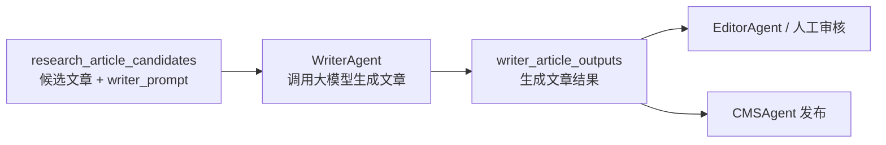

# WriterAgent 说明

## 当前目标

WriterAgent 位于 ResearchAgent 之后，负责把已经筛选好的 crawler 文章改写成可发布的新稿。

它的输入不是原始 crawler 表，而是 ResearchAgent 已经写入新库的候选文章。每篇候选文章都包含原文链接、文章评分、ResearchAgent 生成的大纲和完整 `writer_prompt`。WriterAgent 调用大模型后，会把生成结果写回同一个 MySQL 数据库中的输出表，方便后续 EditorAgent、SEOAgent 或人工审核继续处理。

## 工作位置



## 输入

WriterAgent 当前从 `research_article_data.research_article_candidates` 读取数据。

核心输入字段：

| 字段 | 说明 |
| --- | --- |
| `id` | Research 候选文章 ID |
| `source_article_id` | 原始 crawler 文章 ID |
| `original_url` | 原文链接 |
| `title` | 原标题 |
| `article_score` | 文章评分 |
| `research_brief` | ResearchAgent 结构化输出 |
| `writer_prompt` | ResearchAgent 生成的完整写作提示词 |
| `research_status` | 只有 `generated` 才会进入写作 |

WriterAgent 会把以下信息一起传给大模型：

```text
原文链接
原标题
文章分数
ResearchAgent 生成的 writer_prompt
```

其中 `writer_prompt` 已经包含标题策略、字数策略、大纲、事实约束和降低 AI 感的写作要求。

## 输出

WriterAgent 输出写入：

```sql
research_article_data.writer_article_outputs
```

建表文件：

```text
sql/create_writer_article_outputs.sql
```

核心字段：

| 字段 | 说明 |
| --- | --- |
| `candidate_id` | 对应 `research_article_candidates.id` |
| `source_article_id` | 原始 crawler 文章 ID |
| `original_url` | 原文链接 |
| `source_title` | 原标题 |
| `article_score` | 原文章评分 |
| `writer_prompt` | 本次调用使用的完整 prompt |
| `writer_model` | 使用的大模型 |
| `generation_status` | `pending/generated/failed` |
| `generated_title` | 生成后的标题 |
| `generated_meta_description` | 生成后的摘要 |
| `generated_content_md` | 生成后的 Markdown 正文 |
| `generated_article_json` | 大模型返回的完整 JSON |
| `quality_checks` | WriterAgent 或模型返回的质量检查 |
| `warnings` | 警告信息 |
| `error_message` | 失败原因 |
| `generated_at` | 成功生成时间 |

## 输出 JSON 要求

大模型必须输出纯 JSON，不要输出 Markdown 代码块、解释文字或前后缀。

标准结构：

```json
{
  "article": {
    "title": "...",
    "meta_description": "...",
    "content_md": "...",
    "title_options": []
  },
  "seo_analysis": {},
  "internal_links": [],
  "image_alt_texts": [],
  "statistics": {
    "word_count": 0,
    "reading_time_minutes": 0
  },
  "quality_checks": {},
  "warnings": []
}
```

如果 ResearchAgent 判断标题分低于 70，`writer_prompt` 会要求额外输出：

```json
{
  "article": {
    "title_options": ["备选标题1", "备选标题2", "备选标题3"]
  }
}
```

并把最终最适合发布的标题写入 `article.title`。

如果字数分低于阈值，`writer_prompt` 会要求重做篇幅规划，最终控制在 ResearchAgent 给出的字数范围内。

## 调用方式

### 1. 创建输出表

```bash
mysql -uroot < sql/create_writer_article_outputs.sql
```

### 2. 配置大模型 Key

推荐使用环境变量，不要把 Key 写进代码或 SQL 文件。

DeepSeek 示例：

```bash
export WRITER_AGENT_API_KEY="你的_deepseek_key"
export WRITER_AGENT_MODEL="deepseek-chat"
export WRITER_AGENT_BASE_URL="https://api.deepseek.com"
```

也可以放进本地 `.env`，但不要提交 `.env` 到 Git。

### 3. 跑一篇测试

```bash
python3 scripts/run_writer_agent_from_research_db.py --limit 1 --concurrency 1
```

### 4. 跑全库

当前候选库有 95 篇文章时，可以执行：

```bash
python3 scripts/run_writer_agent_from_research_db.py --limit 95 --concurrency 2 --regenerate
```

参数说明：

| 参数 | 说明 |
| --- | --- |
| `--limit` | 本次最多生成多少篇 |
| `--concurrency` | 并发调用数量，建议从 1-2 开始 |
| `--regenerate` | 即使已有结果也重新生成 |

## 查看结果

在 VSCode 的 MySQL 插件里执行：

```sql
SELECT
  candidate_id,
  source_title,
  article_score,
  generation_status,
  generated_title,
  LEFT(generated_content_md, 300) AS preview,
  error_message
FROM research_article_data.writer_article_outputs
ORDER BY article_score DESC
LIMIT 20;
```

只看成功生成的文章：

```sql
SELECT
  candidate_id,
  generated_title,
  generated_meta_description,
  generated_content_md
FROM research_article_data.writer_article_outputs
WHERE generation_status = 'generated'
ORDER BY article_score DESC
LIMIT 5;
```

只看失败原因：

```sql
SELECT
  candidate_id,
  source_title,
  error_message
FROM research_article_data.writer_article_outputs
WHERE generation_status = 'failed'
ORDER BY updated_at DESC;
```

## 当前实现文件

| 文件 | 说明 |
| --- | --- |
| `agents/writer_agent/tools/article_generation_writer.py` | 从候选库读取 prompt、调用大模型、写回结果 |
| `scripts/run_writer_agent_from_research_db.py` | 可直接运行的批量生成脚本 |
| `sql/create_writer_article_outputs.sql` | WriterAgent 输出表 |
| `tests/test_writer_article_generation_writer.py` | WriterAgent DB 写回工具测试 |
| `agents/writer_agent/prompt.md` | 通用 WriterAgent 提示词模板 |
| `agents/writer_agent/config.yaml` | WriterAgent 基础配置 |

## 当前注意事项

- WriterAgent 不重新设计 ResearchAgent 的大纲，默认使用数据库里已生成的 `writer_prompt`。
- 生成失败不会中断整批任务，会把失败原因写入 `error_message`。
- 当前脚本不会自动抓取原文网页正文，只使用候选库里已有的 `writer_prompt` 和 metadata。
- 如果需要更高质量，下一步应把完整原文正文存入候选库或在 WriterAgent 前增加正文抓取步骤。
