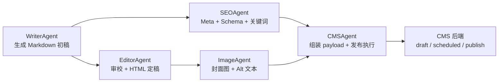

# CMSAgent 说明

## 当前目标

CMSAgent 位于内容生产流水线末端，负责把已经通过上游筛选、写作、编辑、SEO 和配图处理的文章整理成 CMS 后端可写入的发布 payload，并在发布开关明确打开时创建或更新 CMS 文章。

CMSAgent 当前只做发布执行，不负责判断内容值不值得做，也不负责文章质量评分、改写、SEO 生成或图片生成。它默认以 `dry_run=true` 运行，避免误发布。

## 工作位置



CMSAgent 是最后的执行节点。进入 CMSAgent 的内容应当已经被上游判定为可进入发布链路。

## 核心职责

| 职责 | 说明 |
|------|------|
| Payload 组装 | 从 `article`、`page_info`、`images` 中提取标题、正文、slug、分类、标签、封面图和 SEO 字段 |
| 字段映射 | 按 `config.yaml` 将分类、标签、SEO 字段映射为 CMS 后端需要的结构 |
| 发布前检查 | 检查标题、正文、分类、封面图和 slug 冲突 |
| Slug 策略 | slug 冲突时支持自动改写、更新已有文章或直接失败 |
| 发布控制 | 通过 `publishing.dry_run` 和 `CMS_ENABLE_REAL_PUBLISH` 双闸门控制真实发布 |
| 图片上传 | 真实发布时可将封面图上传到 CMS 媒体库 |
| 发布审计 | 返回 `checks`、`errors`、`payload`，并按配置保存发布历史 |

## 输入

CMSAgent 当前入口为：

```python
await CMSAgent().execute(
    article={...},
    page_info={...},
    images={...},
)
```

核心输入字段：

| 输入项 | 说明 | 来源 |
|--------|------|------|
| `article.title` | 文章标题，发布必需 | WriterAgent / EditorAgent |
| `article.content_html` | HTML 正文，优先写入 CMS | EditorAgent / SEOAgent |
| `article.content_md` | Markdown 源文，用于审计和保留原稿 | WriterAgent / EditorAgent |
| `article.meta` | SEO 标题、描述、Schema 等 | SEOAgent |
| `article.primary_keyword` | 主关键词 | TopicAgent / SEOAgent |
| `page_info.slug` | URL 别名；为空时由标题生成 | SEOAgent / CMSAgent |
| `page_info.category` | 分类；会按配置映射为 CMS 分类 | TopicAgent / SEOAgent |
| `page_info.tags` | 标签列表；可自动加入主关键词 | TopicAgent / SEOAgent |
| `page_info.topic_id` | 选题或内容 ID，用于追踪 | TopicAgent |
| `images.featured_image_url` | 封面图 URL | ImageAgent |
| `images.featured_alt` | 封面图 Alt 文本 | ImageAgent |

## 输出

标准输出字段：

| 字段 | 说明 |
|------|------|
| `article_id` | CMS 文章 ID；dry-run 或失败时为 `null` |
| `article_url` | CMS 文章 URL；dry-run 或失败时为 `null` |
| `status` | `dry_run` / `draft` / `scheduled` / `publish` / `failed` |
| `published_at` | 真实发布完成时间；dry-run 或失败时为 `null` |
| `checks` | 发布前检查结果 |
| `errors` | 错误码列表 |
| `payload` | dry-run 或失败时返回的待发布 payload |
| `details` | 发布失败时的后端响应或错误细节 |

dry-run 成功时的典型结构：

```json
{
  "article_id": null,
  "article_url": null,
  "status": "dry_run",
  "published_at": null,
  "checks": {
    "title_not_empty": true,
    "content_not_empty": true,
    "category_assigned": true,
    "featured_image_set": true,
    "slug_unique": true,
    "slug_checked": true,
    "slug_resolution": {}
  },
  "errors": [],
  "payload": {
    "title": "文章标题",
    "content_html": "<p>HTML 正文</p>",
    "content_md": "# Markdown 源文",
    "slug": "article-slug",
    "category": "emba-guide",
    "tags": ["EMBA"],
    "featured_image_url": "https://example.com/cover.webp",
    "meta_title": "SEO 标题",
    "meta_description": "SEO 描述",
    "primary_keyword": "EMBA",
    "topic_id": "topic-1"
  }
}
```

## 发布控制

真实发布必须同时满足：

```text
publishing.dry_run == false
CMS_ENABLE_REAL_PUBLISH=true
```

只要任一条件不满足，CMSAgent 返回 `status: "dry_run"`，不会创建或更新 CMS 文章，也不会上传图片。

当前实现中，dry-run 下仍可能执行认证或 slug 查询等读操作；如果需要严格的“完全不请求 CMS”试运行，应继续收口 `dry_run` 与远程检查开关。

## 发布前检查

当前检查项：

| 检查项 | 说明 |
|--------|------|
| `title_not_empty` | 标题不能为空；当前为代码内建必校验 |
| `content_not_empty` | 正文不能为空 |
| `category_assigned` | 分类不能为空 |
| `featured_image_set` | 配置要求封面图时，必须提供封面图 |
| `slug_unique` | slug 不能与 CMS 中已有文章冲突 |

其中 `content_not_empty`、`category_assigned`、`featured_image_set`、`slug_unique` 是否报错受 `publishing.pre_publish_check` 控制；`title_not_empty` 当前始终会作为基础必校验。

## Slug 冲突策略

配置位置：

```yaml
publishing:
  slug_conflict:
    strategy: "auto_rewrite"
    max_rewrite_attempts: 10
```

支持策略：

| 策略 | 行为 |
|------|------|
| `auto_rewrite` | 发现冲突后自动尝试 `slug-2`、`slug-3` 等新 slug |
| `overwrite_update` | 发现冲突后更新已有文章 |
| `fail` | 发现冲突后直接返回 `errors: ["slug_unique"]` |

当前仍需补强 `slug_not_empty` 校验和中文标题 slug 生成 fallback，避免纯中文标题被清洗为空 slug。

## Custom CMS Contract

custom CMS 请求体按 `config.yaml -> cms.custom.post_contract` 生成。

默认核心字段：

```json
{
  "title": "文章标题",
  "content_html": "<p>HTML正文</p>",
  "content_md": "# Markdown源文",
  "excerpt": "摘要",
  "slug": "article-slug",
  "category": "emba-guide",
  "tags": ["EMBA", "报考指南"],
  "featured_image": "https://cdn.example.com/cover.webp",
  "meta": {
    "seo_title": "SEO标题",
    "seo_description": "SEO描述",
    "focus_keyword": "主关键词",
    "schema_json": {}
  },
  "status": "draft",
  "publish_date": null,
  "topic_id": "topic-1"
}
```

当前 `post_contract.required_fields` 与代码中的发布前检查还不是同一套规则来源。后续应将 contract 必填字段映射到本地检查，避免等后端接口返回错误才发现缺字段。

## 发布模式

`publishing.mode` 决定真实发布时的 CMS 状态：

| mode | CMS 状态 |
|------|----------|
| `draft` | 保存为草稿 |
| `scheduled` | 定时发布 |
| `immediate` 或其他值 | 直接发布 |

定时发布时间由 `publishing.scheduled.default_time` 计算。当前默认按本地时间生成，并追加 `+08:00` 偏移。

## 图片处理

真实发布且 `images.upload_to_cms=true` 时，CMSAgent 会调用 `MediaUploader` 上传封面图，并把上传后的媒体 ID 或 URL 写入文章。

当前需要注意：

- dry-run 不上传图片，只保留原始 `featured_image_url`。
- 如果封面图上传失败，当前实现可能继续用原始 URL 发布；后续建议增加 `images.upload_failure_strategy`，明确失败时是阻断发布还是继续使用原图 URL。

## 当前待收口点

| 问题 | 建议 |
|------|------|
| dry-run 仍可能认证或查询 CMS | 明确 dry-run 是“无写入”还是“完全不请求 CMS”，并同步代码和文档 |
| slug 可能为空 | 增加 `slug_not_empty` 校验，并为中文标题提供稳定 fallback |
| contract 必填字段和本地校验分离 | 将 `required_fields` 映射到本地 pre-publish checks |
| 图片上传失败策略不明确 | 增加 `fail` / `use_original_url` 策略 |
| provider 分支过多 | custom CMS 是当前主路径，WordPress/Ghost/Strapi 分支应降低对主流程的影响 |
| CrewAI tool 可能绕过发布闸门 | 避免 LLM tool 直接调用 create/update/delete，统一走 CMSAgent.execute |

## 运行方式

```python
import asyncio
from agents.cms_agent import CMSAgent

agent = CMSAgent()

result = asyncio.run(agent.execute(
    article={
        "title": "EMBA 报考条件完整指南",
        "content_html": "<p>正文内容...</p>",
        "content_md": "正文内容...",
        "meta": {
            "seo_title": "EMBA 报考条件完整指南",
            "seo_description": "系统介绍 EMBA 报考条件、申请材料和注意事项。"
        },
        "primary_keyword": "EMBA报考条件"
    },
    page_info={
        "slug": "emba-application-requirements",
        "category": "emba",
        "tags": ["EMBA", "报考条件"],
        "topic_id": "topic-1"
    },
    images={
        "featured_image_url": "https://example.com/cover.webp",
        "featured_alt": "EMBA 报考条件指南封面图"
    }
))
```

默认配置下返回 `dry_run`。真实发布前必须显式设置：

```yaml
publishing:
  dry_run: false
```

并设置环境变量：

```bash
CMS_ENABLE_REAL_PUBLISH=true
```

## 相关文件

| 文件 | 说明 |
|------|------|
| `agents/cms_agent/cms_agent.py` | CMSAgent 主类，负责 payload、检查、发布控制和调用 client |
| `agents/cms_agent/config.yaml` | CMS 后端、发布模式、slug、图片、日志配置 |
| `agents/cms_agent/SKILL.md` | Agent 概述、输入输出和 dry-run 说明 |
| `agents/cms_agent/prompt.md` | CMS 发布员提示词和 contract 说明 |
| `agents/cms_agent/tools/cms_client.py` | CMS API 客户端，负责 create/update/slug 查询等 |
| `agents/cms_agent/tools/media_uploader.py` | 媒体上传工具 |
| `tests/test_cms_agent.py` | CMSAgent dry-run、slug、contract、更新路径单元测试 |
