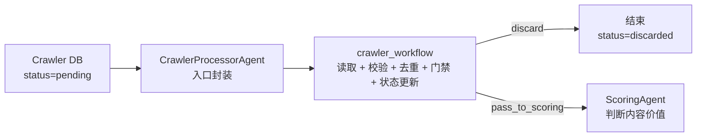

# CrawlerAgent 说明

## 当前目标

当前仓库中的 crawler 入口实际叫 `CrawlerProcessorAgent`。它不是正文生产 Agent，而是爬虫内容进入系统后的门禁处理层。

它的职责是把外部爬虫库里的原始内容读取出来，完成输入校验、去重、基础可用性判断和状态更新。通过门禁的素材只交给下一层 `ScoringAgent`，由评分层继续判断内容值不值得做；没有通过门禁的素材直接丢弃。

当前正式输出只保留两类：

| 决策 | 说明 |
|------|------|
| `discard` | 重复、来源异常、内容残缺、高噪声、不相关、不可用或有版权风险，不进入后续链路 |
| `pass_to_scoring` | 通过 crawler 门禁，生成标准化素材 payload，交给 `ScoringAgent` |

## 工作位置



`CrawlerProcessorAgent` 自身只负责调用 `run_crawler_workflow()`。真实状态机、门禁规则、payload 生成和落库更新都在 `yaojiayk/workflows/crawler_workflow.py` 中完成。

## 核心职责

| 职责 | 说明 |
|------|------|
| 读取待处理内容 | 从 MySQL 爬虫库读取 `status=pending` 的记录，或处理调用方传入的 `items` |
| 输入基础校验 | 检查 `title`、`content`、`source_url` 等配置要求的基础字段 |
| 去重检测 | 与已发布内容做标题和正文相似度检测 |
| 门禁评估 | 计算基础相关性、基础可用性、来源有效性、内容完整性、噪声比例、版权风险 |
| 分流决策 | 只输出 `discard` 或 `pass_to_scoring` |
| 状态更新 | `dry_run=false` 时把处理结果写回爬虫库状态字段 |
| 下游交接 | 为通过门禁的内容生成 `next_payload`，交给 `ScoringAgent` |

## 不属于 CrawlerAgent 的职责

- 不判断最终是否发布。
- 不判断内容重要性。
- 不判断通知属性或时效价值。
- 不决定 `publish / rewrite` 分流。
- 不生成正文。
- 不改写文章。
- 不做 SEO、配图或 CMS 发布。
- 不替代 `ScoringAgent`、`ResearchAgent`、`WriterAgent`、`QualityAgent` 或 `CMSAgent`。

## 输入

当前入口：

```python
from agents.crawler_processor_agent import CrawlerProcessorAgent

result = await CrawlerProcessorAgent().execute(
    limit=10,
    target_keywords=["MBA", "EMBA"],
    dry_run=True,
)
```

支持两种输入方式：

| 输入方式 | 说明 |
|----------|------|
| 读库模式 | `items=None` 时，根据 `agents/crawler_processor_agent/config.yaml` 连接爬虫库并读取 pending 记录 |
| 注入模式 | 传入 `items=[...]` 时跳过读库，直接处理给定素材，常用于测试、事件触发或 dry-run 验证 |

主要参数：

| 参数 | 说明 |
|------|------|
| `limit` | 每批读取数量，默认 10 |
| `min_id` / `max_id` | 按 ID 范围限制读取内容 |
| `target_keywords` | 目标关键词，用于基础相关性判断 |
| `dry_run` | 默认 `true`；为 `true` 时不写回数据库 |
| `items` | 可选的待处理素材列表 |
| `published_articles` | 可选的已发布文章列表，用于去重检测 |
| `config` | 可选的运行时配置覆盖 |

爬虫 item 标准字段：

| 字段 | 说明 |
|------|------|
| `id` | 爬虫库记录 ID |
| `title` | 原始标题 |
| `content` | 原始正文 |
| `source_url` | 来源 URL |
| `published_at` | 原文发布时间，可选 |
| `author` | 作者，可选 |
| `category` | 原始分类，可选 |
| `spider_name` | 爬虫名称，可选 |

## 输出

`execute()` 返回批处理结果：

```json
{
  "workflow": "crawler_ingest",
  "timestamp": "2026-06-27T10:00:00",
  "dry_run": true,
  "error": null,
  "counts": {
    "total": 2,
    "discard": 1,
    "pass_to_scoring": 1,
    "error": 0,
    "duplicate": 0
  },
  "items": []
}
```

单条处理结果包含：

| 字段 | 说明 |
|------|------|
| `record_id` | 原始爬虫记录 ID |
| `decision` | `discard` 或 `pass_to_scoring` |
| `status_to_update` | dry-run 关闭时要写回的状态 |
| `decision_reason` | 人可读决策摘要 |
| `reason_codes` | 机器可读原因码 |
| `scores` | 质量、相关性、SEO 潜力、字数、重复等快照 |
| `next_agent` | 通过门禁时为 `ScoringAgent`，丢弃时为 `null` |
| `next_payload` | 通过门禁时生成的标准化素材 |
| `dedup` | 去重检测结果 |
| `evaluation` | 门禁评估结果 |

通过门禁时的 `next_payload` 示例：

```json
{
  "title": "原文标题",
  "content": "原文正文",
  "source_url": "https://example.com/article",
  "published_at": "2026-06-27",
  "target_keywords": ["MBA"],
  "topic_hint": "MBA报考",
  "source_title": "原文标题",
  "source_summary": "正文摘要...",
  "gate_result": "pass_to_scoring",
  "base_relevance_score": 0.78,
  "base_usability_score": 0.81,
  "source_ok": true,
  "content_complete": true,
  "noise_ratio": 0.08,
  "material_score": 68.5,
  "word_count": 1200,
  "meta": {
    "source": "crawler",
    "crawler_record_id": 123,
    "author": "作者",
    "category": "行业动态",
    "spider_name": "news_spider"
  }
}
```

## 门禁规则

当前门禁失败原因主要来自以下项：

| 原因码 | 含义 |
|--------|------|
| `missing_title/content/source_url` | 基础输入字段缺失 |
| `duplicate` | 与已发布内容重复 |
| `copyright_risk` | 命中版权或转载风险 |
| `invalid_source` | 来源 URL 为空或格式异常 |
| `content_incomplete` | 内容残缺或采集异常 |
| `empty_topic_hint` | 配置要求 topic hint，但未能生成 |
| `noise_too_high` | 免责声明、推荐列表、跳转提示等噪声占比过高 |
| `low_base_relevance` | 基础相关性低于阈值 |
| `low_base_usability` | 基础可用性低于阈值 |
| `evaluation_failed` | 评估工具异常 |
| `dedup_failed` | 去重工具异常 |

只要命中任一阻断原因，决策就是 `discard`。

## 状态语义

配置位置：`agents/crawler_processor_agent/config.yaml -> crawler_db`

| 状态 | 说明 |
|------|------|
| `pending` | 等待 crawler 处理 |
| `discarded` | 未通过门禁，结束 |
| `pass_to_scoring` | 已通过门禁，可进入 ScoringAgent |
| `pass_to_topic` | 历史兼容状态，不再作为目标链路 |

`dry_run=true` 时只返回决策结果，不更新数据库状态。
`dry_run=false` 且记录有 `id` 时，工作流会把 `status_to_update` 写回爬虫库。

## 配置重点

| 配置项 | 说明 |
|--------|------|
| `crawler_db` | 爬虫 MySQL 库连接、表名、状态字段和字段映射 |
| `published_content_db` | 已发布内容库配置，当前主要服务于去重方向 |
| `dedup.threshold` | 相似度阈值，默认 0.8 |
| `evaluation_criteria.input_required_fields` | crawler 输入必填字段 |
| `evaluation_criteria.require_source_ok` | 是否要求来源 URL 有效 |
| `evaluation_criteria.require_content_complete` | 是否要求内容完整 |
| `evaluation_criteria.min_base_relevance_score` | 基础相关性门槛 |
| `evaluation_criteria.min_base_usability_score` | 基础可用性门槛 |
| `evaluation_criteria.max_noise_ratio` | 噪声比例上限 |
| `execution.llm_decision_enabled` | 历史兼容字段；当前主链路默认不依赖 LLM 决策 |

## 工作流实现

当前有两套执行形态：

| 形态 | 说明 |
|------|------|
| LangGraph 状态机 | 安装 LangGraph 时使用，节点为 `init -> fetch_pending -> pick_next -> validate_input -> dedup -> evaluate -> decide -> update_status -> record` |
| 顺序 fallback | 未安装 LangGraph 时自动使用，便于本地测试和轻量部署 |

这两套形态的业务结果应保持一致。

## 与其他 Agent 的关系

| Agent | 关系 |
|-------|------|
| ScoringAgent | crawler 的正式下游，接收通过门禁的素材，继续判断内容价值 |
| TopicAgent | 当前仓库仍有相关历史链路，但不是 crawler 目标下游 |
| ResearchAgent / WriterAgent | 不直接接收 crawler 原始内容，应通过评分和后续生产链路进入 |
| CMSAgent | 与 crawler 不直接相连；CMS 只处理已经完成生产和发布准备的内容 |

## 运行示例

```python
import asyncio
from agents.crawler_processor_agent import CrawlerProcessorAgent


async def main():
    agent = CrawlerProcessorAgent()
    result = await agent.execute(
        limit=10,
        target_keywords=["MBA", "EMBA"],
        dry_run=True,
    )
    print(result["counts"])


asyncio.run(main())
```

注入测试素材：

```python
result = await CrawlerProcessorAgent().execute(
    dry_run=True,
    target_keywords=["MBA"],
    items=[
        {
            "id": 1,
            "title": "MBA报考政策更新",
            "content": "这里是采集到的正文内容...",
            "source_url": "https://example.com/news/1"
        }
    ],
    published_articles=[],
)
```

## 相关文件

| 文件 | 说明 |
|------|------|
| `agents/crawler_processor_agent/crawler_processor_agent.py` | Agent 入口封装 |
| `yaojiayk/workflows/crawler_workflow.py` | crawler 主工作流和状态机 |
| `agents/crawler_processor_agent/config.yaml` | 数据库、门禁、去重和状态配置 |
| `agents/crawler_processor_agent/prompt.md` | 门禁职责和历史兼容 prompt |
| `agents/crawler_processor_agent/tools/crawler_db_reader.py` | MySQL 待处理内容读取和状态更新 |
| `agents/crawler_processor_agent/tools/content_evaluator.py` | 规则化门禁评估 |
| `agents/crawler_processor_agent/tools/dedup_checker.py` | 去重检测 |
| `yaojiayk/tests/test_crawler_workflow_*.py` | crawler 工作流契约测试 |
