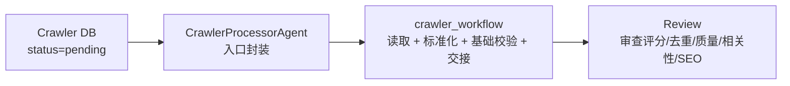

# CrawlerAgent 说明

## 定位

当前仓库中的 crawler 入口实际叫 `CrawlerProcessorAgent`。按照旧文档原始定义，它是**爬虫内容链路的入口节点**，不是去重、评分和分流决策层。

它的职责收口为：

- 从爬虫结果库读取待处理内容
- 做最小结构标准化
- 做基础字段校验
- 把标准化后的素材交给后续独立 `Review` 阶段

## 工作位置



`CrawlerProcessorAgent` 自身只负责调用 `run_crawler_workflow()`。真实批处理、状态更新和统一 payload 生成都在 `yaojiayk/workflows/crawler_workflow.py` 中完成。

## 核心职责

| 职责 | 说明 |
|------|------|
| 读取待处理内容 | 从 MySQL 爬虫库读取 `status=pending` 的记录，或处理调用方传入的 `items` |
| 结构标准化 | 清洗标题、正文、来源链接等基础字段，统一输入结构 |
| 输入基础校验 | 检查 `title`、`content`、`source_url` 等最低要求的字段 |
| 下游交接 | 为后续 `Review` 阶段生成统一 `next_payload` |
| 状态更新 | `dry_run=false` 时把 crawler 已处理状态写回数据库 |

## 不属于 CrawlerAgent 的职责

- 不做去重检测
- 不做质量评分
- 不做相关性判断
- 不做 SEO 判断
- 不做 `publish / rewrite / discard` 业务分流
- 不直接决定是否进入 `CMSAgent`

## 输入

```python
from agents.crawler_processor_agent import CrawlerProcessorAgent

result = await CrawlerProcessorAgent().execute(
    limit=10,
    target_keywords=["MBA", "EMBA"],
    dry_run=True,
)
```

支持两种输入方式：

| 输入方式 | 说明 |
|----------|------|
| 读库模式 | `items=None` 时，根据 `agents/crawler_processor_agent/config.yaml` 连接爬虫库并读取 pending 记录 |
| 注入模式 | 传入 `items=[...]` 时跳过读库，直接处理给定素材，常用于测试或 dry-run 验证 |

## 输出

`execute()` 返回批处理结果：

```json
{
  "workflow": "crawler_ingest",
  "timestamp": "2026-06-27T10:00:00",
  "dry_run": true,
  "error": null,
  "counts": {
    "total": 2,
    "handoff_to_review": 1,
    "error": 1
  },
  "items": []
}
```

单条处理结果包含：

| 字段 | 说明 |
|------|------|
| `record_id` | 原始爬虫记录 ID |
| `decision` | `handoff_to_review` 或 `error` |
| `status_to_update` | dry-run 关闭时要写回的状态 |
| `decision_reason` | 人可读处理摘要 |
| `reason_codes` | 机器可读原因码 |
| `next_agent` | 正常交接时为 `ReviewAgent` |
| `next_payload` | 交接给 Review 的标准化素材 |
| `validation` | 基础字段校验结果 |

## 状态语义

配置位置：`agents/crawler_processor_agent/config.yaml -> crawler_db`

| 状态 | 说明 |
|------|------|
| `pending` | 等待 crawler 处理 |
| `processed` | crawler 已完成入口处理，待后续 Review 消费 |
| `pass_to_topic` | 历史兼容状态；旧链路未切换时可作为 Review 交接过渡状态 |
| `error` | 基础字段异常或输入结构错误，无法安全交接 |

`dry_run=true` 时只返回处理结果，不更新数据库状态。  
`dry_run=false` 且记录有 `id` 时，工作流会把 `status_to_update` 写回爬虫库。

## 工作流实现

当前有两套执行形态：

| 形态 | 说明 |
|------|------|
| LangGraph 状态机 | 安装 LangGraph 时使用，节点为 `init -> fetch_pending -> pick_next -> validate_input -> decide -> update_status -> record` |
| 顺序 fallback | 未安装 LangGraph 时自动使用，便于本地测试和轻量部署 |

## 与其他 Agent 的关系

| Agent | 关系 |
|-------|------|
| Review | crawler 的正式下游，承担去重、评分和后续业务分流 |
| ScoringAgent | 不再是 crawler 的直接下游 |
| CMSAgent | 与 crawler 不直接相连 |

## 相关文件

| 文件 | 说明 |
|------|------|
| `agents/crawler_processor_agent/crawler_processor_agent.py` | Agent 入口封装 |
| `yaojiayk/workflows/crawler_workflow.py` | crawler 主工作流和状态机 |
| `agents/crawler_processor_agent/config.yaml` | 数据库、基础校验和状态配置 |
| `agents/crawler_processor_agent/prompt.md` | crawler 轻职责 Prompt |
| `agents/crawler_processor_agent/tools/crawler_db_reader.py` | MySQL 待处理内容读取和状态更新 |
