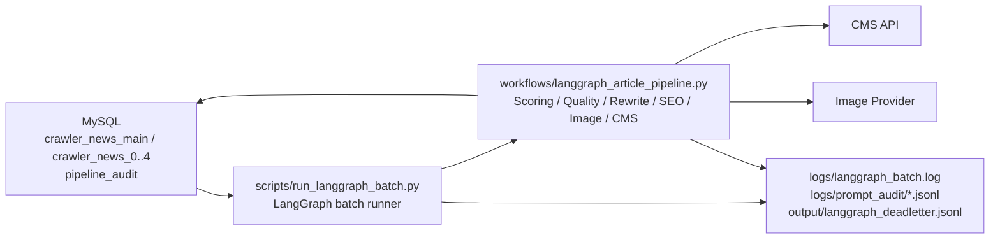

# 多Agent自动运营网站 - LangGraph 正式部署方案

**版本**: v2.0
**更新时间**: 2026-07-11
**状态**: 当前正式部署说明

本文档只描述当前 LangGraph 正式链路。旧队列 worker 版本已经从仓库删除，生产环境不要再启动旧调度器，避免重复消费同一批文章。

## 1. 部署架构



当前部署只依赖：

| 组件 | 作用 |
| --- | --- |
| MySQL | 读取爬虫文章、写审计结果、保存发布状态 |
| LangGraph runner | 批量取文章并执行文章状态图 |
| 本地状态文件 | 保存 feeder 游标，例如 `output/langgraph_feeder_state.json` |
| JSONL 日志 | 保存 prompt、分数明细、失败 dead letter |
| CMS / 图片服务 | 由对应 Agent 节点调用 |

## 2. 环境准备

```bash
python3 -m venv .venv
source .venv/bin/activate
pip install -r requirements.txt
cp .env.example .env
```

`.env` 至少需要配置：

```bash
OPENAI_API_KEY=...

MYSQL_HOST=127.0.0.1
MYSQL_PORT=3306
MYSQL_USER=root
MYSQL_PASSWORD=...
MYSQL_DATABASE=...

LANGGRAPH_FEED_STATE_PATH=output/langgraph_feeder_state.json
LANGGRAPH_DEADLETTER_PATH=output/langgraph_deadletter.jsonl
LANGGRAPH_LOG_FILE=logs/langgraph_batch.log
PROMPT_AUDIT_DIR=logs/prompt_audit
```

`MYSQL_DATABASE` 是 LangGraph 主链路使用的一个数据库/库名，不是单张表名。这个库里应包含爬虫文章表和 LangGraph 审计表。默认配置是：

```text
CRAWLER_MAIN_TABLE=crawler_news_main
CRAWLER_SHARD_PREFIX=crawler_news_
CRAWLER_SHARD_COUNT=5
PIPELINE_AUDIT_TABLE=pipeline_audit
```

测试环境建议使用独立库，例如 `multi_agent_cms`；如果复用现有 CMS 库，例如 `zyxw`，就把 `MYSQL_DATABASE=zyxw`，再按真实表名覆盖 `CRAWLER_*`。例如测试服当前是 `zyxw_college_news` + `zyxw_college_news_0..9`，就配置：

```bash
CRAWLER_MAIN_TABLE=zyxw_college_news
CRAWLER_SHARD_PREFIX=zyxw_college_news_
CRAWLER_SHARD_COUNT=10
CRAWLER_USAGE_STATUS_COLUMN=
```

`CRAWLER_USAGE_STATUS_COLUMN` 为空表示源表没有 used 标记列，LangGraph 不会在 SQL 里引用这个字段，也不会执行 mark-used 写回。

发布模式还需要配置 CMS、图片生成、OBS 等生产密钥。没有这些密钥时，可以先使用 dry-run 或只跑小批量审计。

## 3. 本地运行

后台运行：

```bash
make run
```

查看状态：

```bash
make status
```

实时看日志：

```bash
make logs
```

停止：

```bash
make stop
```

单次前台调试：

```bash
python3 scripts/run_langgraph_batch.py --production --limit 5 --persist-audit
```

指定文章调试：

```bash
python3 scripts/run_langgraph_batch.py --ids 213 --limit 1 --persist-audit
```

## 4. 生产运行

正式无人值守入口：

```bash
make run
```

等价脚本：

```bash
scripts/langgraph_daemon.sh start
```

默认行为：

| 行为 | 说明 |
| --- | --- |
| feeder 无文章 | 按 `LANGGRAPH_FEED_IDLE_BACKOFF_HOURS` 退避检查 |
| 有新文章 | 立即恢复正常批处理 |
| 收到停止信号 | 尽量完成当前文章后退出 |
| 单篇失败 | 写入 dead letter，继续处理后续文章 |
| prompt / 分数明细 | 写入 `logs/prompt_audit/*.jsonl` |

## 5. Docker 部署

启动 MySQL：

```bash
docker compose up -d mysql
```

运行 LangGraph pipeline：

```bash
docker compose up -d pipeline
```

查看日志：

```bash
docker compose logs -f pipeline
```

当前 `pipeline` entrypoint 只等待 MySQL，不等待任何旧队列服务。

## 6. 运维检查

常用命令：

```bash
tail -f logs/langgraph_batch.log
python3 scripts/trace_langgraph_article.py --article-id 213
python3 scripts/run_langgraph_batch.py --ids 213 --limit 1 --persist-audit
```

重点看：

| 文件 | 用途 |
| --- | --- |
| `logs/langgraph_batch.log` | 人类可读运行日志 |
| `logs/prompt_audit/*.jsonl` | prompt、模型响应、分数明细、阶段状态 |
| `output/langgraph_deadletter.jsonl` | 失败文章和异常原因 |
| `output/langgraph_feeder_state.json` | feeder 当前游标 |

## 7. 回滚说明

仓库不再保留旧队列 worker 回滚入口。需要回滚时只能从 Git 历史恢复旧实现，并且必须先停止当前 LangGraph runner，避免两套系统同时处理文章。
