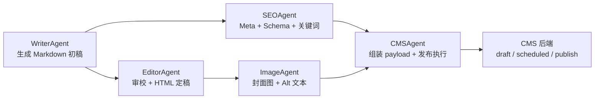

# CMSAgent 说明

## 当前目标

当前发布链路里有三个不同层次，它们不是同一个东西：

1. `CMSAgent`：发布流程编排层
2. `CMSClient / MediaUploader`：CMS 后端适配层
3. `CMS 后端`：真正接收、存储、更新、发布文章和媒体的系统

`CMSAgent` 位于内容生产流水线末端，负责把已经通过上游筛选、写作、编辑、SEO 和配图处理的文章整理成统一发布语义 payload，并在发布开关明确打开时调用 `CMSClient / MediaUploader` 执行发布。

`CMSAgent` 当前只做发布执行，不负责判断内容值不值得做，也不负责文章质量评分、改写、SEO 生成或图片生成。它默认以 `dry_run=true` 运行，避免误发布。
它的定位是“发布完整性检查 + 发布执行层”。

## 工作位置



CMSAgent 是最后的执行节点。进入 CMSAgent 的内容应当已经被上游判定为可进入发布链路。

## 三层职责边界

### CMSAgent

| 职责 | 说明 |
|------|------|
| 输入接收 | 接收 `article`、`page_info`、`images` |
| 统一语义 payload 组装 | 提取标题、正文、slug、分类、标签、封面图和 SEO 信息 |
| 发布前业务检查 | 检查标题、正文、分类、封面图、slug、发布状态等统一业务项 |
| 发布控制 | 通过 `publishing.dry_run` 和 `CMS_ENABLE_REAL_PUBLISH` 双闸门控制真实发布 |
| 发布决策执行 | 决定 create 还是 update，决定上传失败是否阻断发布 |
| 结果汇总 | 返回 `checks`、`errors`、`warnings`、`missing_fields`、`repair_hints`、`blocking`、`payload`、`article_id`、`article_url`、`status`、`slug`、`provider`、`payload_summary` 等 |

### CMSClient / MediaUploader

| 职责 | 说明 |
|------|------|
| 认证 | 负责认证、token、headers |
| provider 差异 | 处理 custom / wordpress / ghost / strapi 等分支差异 |
| request body 映射 | 解释 `content_field`、`meta_field`、`status_mapping` 等 contract |
| response 归一化 | 解析 `response_paths`，统一返回 `success/post_id/post_url/status/slug/error/details` |
| slug 查询 | 负责远程 slug 查重 |
| 图片上传 | 负责真实媒体上传与返回值归一化 |
| WordPress SEO 映射 | 负责 Yoast / RankMath 等 provider 专属 meta 映射 |

### CMS 后端

| 职责 | 说明 |
|------|------|
| HTTP 接收 | 接收文章和媒体请求 |
| 存储与发布 | 保存文章、更新文章、发布或定时发布 |
| 唯一性维护 | 维护 slug 唯一性 |
| 响应返回 | 返回文章 ID、URL、状态和错误信息 |

## 核心职责

| 职责 | 说明 |
|------|------|
| Payload 组装 | 从 `article`、`page_info`、`images` 中提取标题、正文、slug、分类、标签、封面图和 SEO 字段 |
| 统一语义映射 | 只在 Agent 层维护统一发布语义，不直接处理后端字段名差异 |
| 发布前检查 | 检查标题、正文、分类、封面图和 slug 冲突 |
| Slug 策略 | slug 冲突时支持自动改写、更新已有文章或直接失败 |
| 发布控制 | 通过 `publishing.dry_run` 和 `CMS_ENABLE_REAL_PUBLISH` 双闸门控制真实发布 |
| 图片上传 | 真实发布时可将封面图上传到 CMS 媒体库 |
| 发布审计 | 返回 `checks`、`errors`、`payload`，并按配置保存发布历史 |

## 输入

CMSAgent 当前入口为：

```python
await CMSAgent().execute(
    article={...},
    page_info={...},
    images={...},
)
```

核心输入字段：

| 输入项 | 说明 | 来源 |
|--------|------|------|
| `article.title` | 文章标题，发布必需 | WriterAgent / EditorAgent |
| `article.content_html` | HTML 正文，优先作为 CMS 正文字段 | EditorAgent / SEOAgent |
| `article.content_md` | Markdown 源文；`content_html` 缺失时可回退为正文 | WriterAgent / EditorAgent |
| `article.content` | 兼容字段；`content_md` 缺失时作为 Markdown/正文回退来源 | WriterAgent / 工作流适配层 |
| `article.meta` | SEO 标题、描述、Schema 等 | SEOAgent |
| `article.primary_keyword` | 主关键词 | TopicAgent / SEOAgent |
| `page_info.slug` | URL 别名；为空时由标题生成 | SEOAgent / CMSAgent |
| `page_info.category` | 分类；先转成统一业务语义，再由 client 适配 provider | TopicAgent / SEOAgent |
| `page_info.tags` | 标签列表；可自动加入主关键词 | TopicAgent / SEOAgent |
| `page_info.topic_id` | 选题或内容 ID，用于追踪 | TopicAgent |
| `images.featured_image_url` | 封面图 URL | ImageAgent |
| `images.featured_alt` | 封面图 Alt 文本 | ImageAgent |

兼容输入说明：

- `featured_image_url` 可以来自 `article.featured_image_url`，也可以来自 `images.featured_image_url / cover_url / cover_image_url`。
- `primary_keyword` 可以来自 `page_info.primary_keyword` 或 `article.primary_keyword`。
- `slug` 为空时，当前代码会根据 `topic_id / article.id / page_info.id / title / content` 生成稳定 slug。

## 输出

标准输出字段：

| 字段 | 说明 |
|------|------|
| `article_id` | CMS 文章 ID；dry-run 或失败时为 `null` |
| `article_url` | CMS 文章 URL；dry-run 或失败时为 `null` |
| `status` | `dry_run` / `published` / `draft` / `scheduled` / `publish_blocked` / `retry_pending` / `failed` |
| `published_at` | 真实发布完成时间；dry-run 或失败时为 `null` |
| `slug` | 最终使用的 slug，包含自动生成或冲突改写后的结果 |
| `provider` | CMS provider，如 `custom` / `wordpress` |
| `checks` | 发布前检查结果，只暴露统一业务项 |
| `errors` | 错误码列表 |
| `warnings` | 非阻断问题列表 |
| `missing_fields` | 当前缺失或阻断发布的字段 |
| `repair_hints` | 人工补齐或重试建议 |
| `blocking` | 是否为阻断型失败 |
| `source` / `candidate` | 从 `article` 或 `page_info` 透传的来源追踪字段 |
| `topic_id` | 当前内容的 topic/content 追踪 ID |
| `payload_summary` | 用于审计和列表展示的发布摘要 |
| `payload` | dry-run 或失败时返回的待发布 payload |
| `details` | 发布失败时的后端响应或错误细节 |

dry-run 成功时的典型结构：

```json
{
  "article_id": null,
  "article_url": null,
  "status": "dry_run",
  "published_at": null,
  "slug": "article-slug",
  "provider": "custom",
  "checks": {
    "title_not_empty": true,
    "content_not_empty": true,
    "slug_not_empty": true,
    "status_valid": true,
    "publish_mode_valid": true,
    "category_assigned": true,
    "featured_image_set": true,
    "slug_unique": true,
    "slug_checked": false,
    "slug_resolution": {}
  },
  "errors": [],
  "warnings": [],
  "missing_fields": [],
  "repair_hints": {},
  "blocking": false,
  "payload_summary": {
    "title": "文章标题",
    "slug": "article-slug",
    "category": "emba-guide",
    "topic_id": "topic-1",
    "action": "create",
    "tags_count": 1
  },
  "payload": {
    "title": "文章标题",
    "content_html": "<p>HTML 正文</p>",
    "content_md": "# Markdown 源文",
    "slug": "article-slug",
    "category": "emba-guide",
    "tags": ["EMBA"],
    "featured_image_url": "https://example.com/cover.webp",
    "meta_title": "SEO 标题",
    "meta_description": "SEO 描述",
    "primary_keyword": "EMBA",
    "topic_id": "topic-1",
    "status": "draft",
    "publish_date": null
  }
}
```

## 发布控制

真实发布必须同时满足：

```text
publishing.dry_run == false
CMS_ENABLE_REAL_PUBLISH=true
```

测试服/正式服如果希望所有真实发布都必须走定时排期，再加一层保险：

```text
CMS_REQUIRE_SCHEDULE_FOR_PUBLISH=true
CMS_SCHEDULE_ENABLED=true
```

只要任一条件不满足，CMSAgent 返回 `status: "dry_run"`，不会创建或更新 CMS 文章，也不会上传图片。
如果开启了 `CMS_REQUIRE_SCHEDULE_FOR_PUBLISH=true`，但没有开启 `CMS_SCHEDULE_ENABLED=true`，
LangGraph 会在启动前报错拦住真实发布，避免 `make run` 立刻把文章发出去。

当前语义已经明确：

- `dry_run=true` 默认不写入 CMS
- `dry_run=true` 默认不认证、不上传图片、不创建文章、不更新文章、不做远程 slug 检查
- 是否允许远程 slug 查询由 `publishing.slug_check_in_dry_run` 控制
- `CMSClient / MediaUploader` 不自己决定 dry-run，只执行 `CMSAgent` 发出的调用

## 发布状态分层

- `dry_run`：试运行通过，但未真实发布
- `published / draft / scheduled`：真实发布或保存成功
- `publish_blocked`：字段或物料缺失，不能发给 CMS 后端
- `retry_pending`：认证、网络、后端、图片上传等系统问题，可重试
- `failed`：不可恢复或未分类失败

检查失败的文章进入 `publish_blocked`，不删除。
系统/API 失败进入 `retry_pending`。
`warnings` 只提示优化，不阻断发布。

## 发布前检查

当前检查项：

| 检查项 | 说明 |
|--------|------|
| `title_not_empty` | 标题不能为空；当前为代码内建必校验 |
| `content_not_empty` | 正文不能为空 |
| `slug_not_empty` | slug 不能为空 |
| `status_valid` | 发布状态必须合法 |
| `category_assigned` | 分类不能为空 |
| `featured_image_set` | 配置要求封面图时，必须提供封面图 |
| `slug_unique` | slug 不能与 CMS 中已有文章冲突 |

其中 `title_not_empty` 是代码内建必校验。其他检查项来自 `publishing.pre_publish_check` 和 custom CMS contract 必填字段映射。
`required_fields` 等后端 contract 先由 `CMSClient.business_checks_from_contract()` 映射成统一业务检查项，再参与本地预检。

## Slug 冲突策略

配置位置：

```yaml
publishing:
  slug_conflict:
    strategy: "auto_rewrite"
    max_rewrite_attempts: 10
```

支持策略：

| 策略 | 行为 |
|------|------|
| `auto_rewrite` | 发现冲突后自动尝试 `slug-2`、`slug-3` 等新 slug |
| `overwrite_update` | 发现冲突后更新已有文章 |
| `fail` | 发现冲突后直接返回 `errors: ["slug_unique"]` |

## Custom CMS Contract

custom CMS 请求体仍按 `config.yaml -> cms.custom.post_contract` 生成，但生成和解释工作属于 `CMSClient / MediaUploader`，不是 `CMSAgent` 的主流程职责。

当前自研 CMS 对接的是 BFF HMAC 接口：

| 项 | 当前配置 |
|----|----------|
| 文章发布 | `POST /v2/article/publish` |
| 图片上传 | `POST /v2/article/upload-image` |
| 域名 | `.env -> CMS_API_URL`，测试站为 `https://api-zyxw.cymba.cn` |
| 认证 | `.env -> BFF_API_SECRET`，按文档生成 `x-timestamp / x-nonce / x-signature / x-signature-method` |
| 前台 URL | 必须由 BFF 发布响应返回，支持 `data.url / data.article_url / data.web_url / url / article_url / web_url` |
| 发布表 | 后端写入 `tbl_college_information` |

LangGraph 不再根据 `articleid` 自行拼接前台 URL。正式站域名和路由规则属于
BFF/前端，BFF 需要在 `/v2/article/publish` 响应里返回真实公开链接。

BFF 发布核心字段：

```json
{
  "title": "文章标题",
  "content": "<p>HTML正文</p>",
  "author": "编辑部",
  "source": "",
  "description": "摘要",
  "thumbimage": "https://cdn02.zyxw.cn/article/202607/02/cover.png",
  "tags": ["EMBA", "报考指南"],
  "keywords": "EMBA,报考指南",
  "seo_title": "SEO标题",
  "seo_description": "SEO描述",
  "category": "招生信息",
  "source_url": "https://example.com/original",
  "source_type": "转载",
  "college_id": 0,
  "college_name": "",
  "state": 1,
  "publictime": 1783760000
}
```

| `post_contract.required_fields` 会先映射成统一业务检查项，再由 `CMSAgent` 做本地预检；其中 `content_html/content` 统一映射到 `content_not_empty`，`status` 统一映射到 `status_valid`。不要让 `CMSAgent` 直接散落判断 `content_field/meta_field/status_mapping/response_paths`。

WordPress/Yoast/RankMath 的专属 meta 字段也属于 `CMSClient / MediaUploader` 的适配范围，`CMSAgent` 只传统一语义字段，如 `meta_title`、`meta_description`、`primary_keyword`。

## 发布模式

`publishing.mode` 决定真实发布时的 CMS 状态：

| mode | CMS 状态 |
|------|----------|
| `draft` | 保存为草稿 |
| `scheduled` | 定时发布 |
| `immediate` | 直接发布 |
| `publish` | 直接发布 |

其他值会被 `CMSAgent` 本地拦截为 `publish_blocked`，并返回 `publish_mode_valid`。

定时发布时间由 `publishing.scheduled.default_time` 计算。当前默认按本地时间生成，并追加 `+08:00` 偏移。

## 图片处理

真实发布且 `images.upload_to_cms=true` 时，CMSAgent 只负责决定“要不要上传”和“失败是否阻断发布”；真正的上传、provider 差异和返回值归一化由 `MediaUploader` 负责。

当前需要注意：

- dry-run 不上传图片，只保留原始 `featured_image_url`。
- BFF 真发布时会先调用 `/v2/article/upload-image`，把远程 URL、本地图片文件或 base64 图片转成 `cdn02.zyxw.cn` 地址，再写入发布接口的 `thumbimage`。
- `images.upload_failure_strategy` 控制上传失败时是 `fail` 还是 `use_original_url`。
- `featured_image.required=true` 且上传失败时，优先返回 `publish_blocked` 或 `retry_pending`，而不是普通 `failed`。

## Warnings

以下问题默认只进入 `warnings`，不阻断发布：

- `meta_title_not_empty`
- `meta_description_not_empty`
- `primary_keyword_not_empty`
- `tags_not_empty`
- `schema_valid`
- `featured_alt_not_empty`

## 当前待收口点

| 问题 | 建议 |
|------|------|
| provider 专属字段差异仍需留在 adapter 层 | 持续避免把 `content_field/meta_field/status_mapping/response_paths` 重新写回 `CMSAgent` |
| CrewAI tool 可能绕过发布闸门 | 避免 LLM tool 直接调用 create/update/delete，统一走 CMSAgent.execute |
| `batch_size/concurrency_limit/auto_publish/quality` 等配置块仍偏运营建议或历史兼容 | 不把这些字段写成当前已实现的批量调度或质量判定能力 |

## 运行方式

```python
import asyncio
from agents.cms_agent import CMSAgent

agent = CMSAgent()

result = asyncio.run(agent.execute(
    article={
        "title": "EMBA 报考条件完整指南",
        "content_html": "<p>正文内容...</p>",
        "content_md": "正文内容...",
        "meta": {
            "seo_title": "EMBA 报考条件完整指南",
            "seo_description": "系统介绍 EMBA 报考条件、申请材料和注意事项。"
        },
        "primary_keyword": "EMBA报考条件"
    },
    page_info={
        "slug": "emba-application-requirements",
        "category": "emba",
        "tags": ["EMBA", "报考条件"],
        "topic_id": "topic-1"
    },
    images={
        "featured_image_url": "https://example.com/cover.webp",
        "featured_alt": "EMBA 报考条件指南封面图"
    }
))
```

默认配置下返回 `dry_run`。真实发布前必须显式设置：

```yaml
publishing:
  dry_run: false
```

并设置环境变量：

```bash
CMS_ENABLE_REAL_PUBLISH=true
CMS_REQUIRE_SCHEDULE_FOR_PUBLISH=true
CMS_SCHEDULE_ENABLED=true
```

## 相关文件

| 文件 | 说明 |
|------|------|
| `agents/cms_agent/cms_agent.py` | CMSAgent 主类，负责 payload、检查、发布控制和调用 client |
| `agents/cms_agent/config.yaml` | CMS 后端、发布模式、slug、图片、日志配置 |
| `agents/cms_agent/SKILL.md` | Agent 概述、输入输出和 dry-run 说明 |
| `agents/cms_agent/prompt.md` | CMS 发布员提示词和 contract 说明 |
| `agents/cms_agent/tools/cms_client.py` | CMS API 客户端，负责 create/update/slug 查询等 |
| `agents/cms_agent/tools/media_uploader.py` | 媒体上传工具 |
| `tests/test_cms_agent.py` | CMSAgent dry-run、slug、contract、更新路径单元测试 |
