# 主动热点研究生产流方案

## 1. 目标

在保留现有爬虫文章生产流程的基础上，新增一条基于 LangGraph 的主动研究生产流。系统可以定时从互联网发现热点、筛选选题、查证资料、生成原创文章，并将合格文章写入现有 CMS 待发布队列。

本功能在独立分支 `codex/active-research-pipeline` 开发，默认关闭，不改变当前生产环境的爬虫流程。

## 2. 总体流程

```mermaid
flowchart LR
    START["定时触发"] --> DISCOVER["聚合互联网热点"]
    DISCOVER --> CLEAN["清洗与去重"]
    CLEAN --> SCORE["选题评分"]
    SCORE --> RESEARCH["ResearchAgent 联网查证"]
    RESEARCH --> WRITER["WriterAgent 生成原创稿"]
    WRITER --> QUALITY["QualityAgent 质量评分"]
    QUALITY --> EDITOR["EditorAgent 审校与安全检查"]
    EDITOR --> SEO["SEOAgent 生成搜索元数据"]
    SEO --> IMAGE["ImageAgent 生成封面"]
    IMAGE --> PENDING["写入 pipeline_audit，状态 pending"]
    PENDING --> CMS["现有 CMS 定时发布"]
```



主动研究流与现有爬虫流相互独立，只在 `pipeline_audit pending -> CMS` 阶段汇合。

## 3. 热点来源

第一版优先接入免费、稳定、容易审计的数据源：

- Google News RSS。
- 百度热搜或其他公开新闻榜单。
- 高校、商学院和教育机构的官方新闻页面或 RSS。
- 配置文件中的行业种子关键词。
- 已配置的可信行业媒体。

后续可以扩展知乎、微博、Google Trends、Semrush 等来源。

每条候选热点至少保存以下信息：

```json
{
  "title": "热点标题",
  "url": "https://example.com/article",
  "source_name": "来源名称",
  "source_type": "news_rss",
  "published_at": "2026-08-16T10:00:00+08:00",
  "summary": "热点摘要",
  "fetched_at": "2026-08-16T10:10:00+08:00"
}
```

系统不能只把热点标题交给 WriterAgent，必须保留原始链接、来源、时间和可核验正文或摘要。

## 4. 选题评分

每个热点候选计算独立的 `topic_score`，该分数不与现有爬虫文章的 `ai_score` 混用。

| 评分维度 | 默认权重 | 说明 |
| --- | ---: | --- |
| 时效性 | 25% | 发布时间越近，分数越高 |
| 业务相关性 | 25% | 与 MBA、教育、商业、科技等目标领域的相关程度 |
| 新闻价值 | 20% | 事件影响范围、重要性与传播价值 |
| 素材完整度 | 15% | 是否有足够事实支持一篇完整文章 |
| 搜索价值 | 10% | 用户搜索需求和关键词潜力 |
| 来源可信度 | 5% | 官方来源、主流媒体或可交叉验证来源优先 |

候选热点必须执行三层去重：

1. 热点候选之间去重。
2. 与爬虫数据库中的已有文章去重。
3. 与已经生成或发布的文章去重。

选题分数不足、素材不足或高度重复的热点直接淘汰，不调用 WriterAgent、QualityAgent 和 ImageAgent。

## 5. ResearchAgent 输出

选题通过后，ResearchAgent 搜索多个来源并生成结构化资料包：

```json
{
  "topic": "最终选题",
  "angle": "写作角度",
  "key_facts": [],
  "timeline": [],
  "sources": [],
  "conflicts": [],
  "outline": [],
  "writer_prompt": ""
}
```

ResearchAgent 必须遵守以下规则：

- 关键事实优先由两个独立来源交叉验证。
- 只有单一来源支持的事实必须明确标记。
- 不得自行补充数字、人物经历、机构结论或引语。
- 来源发生冲突时写入 `conflicts`，不得静默选择其中一个版本。
- 缺少可靠资料时设置 `stop_reason=research_sources_insufficient`。

## 6. 写作与审核

主动生成文章必须经过完整质量链路：

1. WriterAgent 只能依据 ResearchAgent 提供的资料包写作。
2. QualityAgent 对生成稿评分，低于阈值时最多重写一次。
3. EditorAgent 执行语法处理、敏感词触发和 LLM 语境安全审查。
4. SEOAgent 生成关键词、Meta Title、Meta Description 和结构化数据。
5. ImageAgent 根据最终标题和正文生成封面及图片 Prompt。
6. 合格文章写入 `pipeline_audit`，初始状态为 `pending`。
7. CMSAgent 仍由现有定时发布机制触发，不在文章生成完成后立即发布。

以下情况必须阻断：

- 资料来源不足。
- 关键事实存在未解决冲突。
- 文章质量复评仍未达到阈值。
- EditorAgent 政治或内容安全审查失败。
- 文章与现有内容高度重复。
- CMS 发布必要字段缺失。

## 7. 数据设计

主动研究候选不写入爬虫文章表，建议新增以下数据表。

### 7.1 `active_research_topics`

保存热点候选、选题评分、去重结果和处理状态。

主要字段建议：

- `id`
- `title`
- `primary_keyword`
- `topic_score`
- `score_breakdown`
- `status`
- `source_count`
- `dedup_key`
- `stop_reason`
- `created_at`
- `updated_at`

### 7.2 `active_research_sources`

保存候选选题对应的互联网来源和查证信息。

主要字段建议：

- `id`
- `topic_id`
- `source_name`
- `source_url`
- `source_type`
- `published_at`
- `title`
- `summary`
- `content_snapshot`
- `authority_score`
- `fetched_at`

### 7.3 与现有审计表汇合

最终成稿继续写入现有 `pipeline_audit`，并增加来源标识：

```text
content_origin=active_research
topic_id=<active_research_topics.id>
cms_status=pending
```

来源类型统一为：

- `crawler`：来自爬虫文章。
- `active_research`：系统主动寻找热点并生成。
- `manual`：人工指定主题。

## 8. 环境变量

新功能默认关闭，全部运行参数通过 `.env` 配置：

```dotenv
# 主动热点研究总开关。默认关闭，不影响现有爬虫流程。
ACTIVE_RESEARCH_ENABLED=false

# 按 CMS_SCHEDULE_TIMEZONE_OFFSET 所表示的时区运行。
ACTIVE_RESEARCH_RUN_TIMES=00:30,12:30,18:30

# 每轮最多进入评分的热点数量。
ACTIVE_RESEARCH_TOPICS_PER_RUN=20

# 每轮最多生成的文章数量。
ACTIVE_RESEARCH_ARTICLES_PER_RUN=5

# 每日最多生成的文章数量。
ACTIVE_RESEARCH_MAX_DAILY_ARTICLES=10

# 热点进入 ResearchAgent 的最低选题分数。
ACTIVE_RESEARCH_MIN_TOPIC_SCORE=75

# 只读取最近多少小时内发布的热点。
ACTIVE_RESEARCH_LOOKBACK_HOURS=48

# 关键事实是否必须至少有两个来源支持。
ACTIVE_RESEARCH_REQUIRE_TWO_SOURCES=true

# 合格稿件是否自动写入现有 pending 队列。
ACTIVE_RESEARCH_AUTO_PENDING=true

# 无热点时的检查退避时间，单位为小时。
ACTIVE_RESEARCH_IDLE_BACKOFF_HOURS=1,2,4,8,12,24
```

## 9. 无人值守与成本控制

- 热点搜索、Research、Writer、Quality、SEO 和图片生成优先安排在 DeepSeek 低价时段。
- 高峰时段只允许 CMS 发布已经准备好的 `pending`，不开始新的高成本生成任务。
- 选题去重和规则评分应在 LLM 调用前完成。
- 每个选题的模型调用次数、Token 用量、Prompt 和输出必须写入现有审计日志。
- 无热点或无合格选题时使用退避机制，不能每分钟反复请求和刷日志。
- 失败任务保留状态和重试次数，进程重启后不能从头重复消费。

## 10. 独立运行入口

新增独立命令，不修改当前 `make run` 的默认行为：

```bash
# 只发现和评分热点，不生成文章。
python3 scripts/run_active_research.py --discover-only --limit 20

# 生成三篇测试稿，不发布，不写入正式 pending。
python3 scripts/run_active_research.py --dry-run --limit 3

# 将合格稿件写入 pending，但仍不立即发布。
python3 scripts/run_active_research.py --production --limit 5
```

待单独验证稳定后，再增加守护进程入口，例如：

```bash
make active-research-run
make active-research-status
make active-research-logs
make active-research-stop
```

## 11. 实施顺序

1. 从 Git 历史恢复 TopicAgent 中有价值的关键词、趋势和排序逻辑。
2. 重写为 `ActiveResearchAgent`，避免与当前 ScoringAgent 混淆。
3. 新建独立 LangGraph 和 `scripts/run_active_research.py`。
4. 新建候选主题表、来源表、去重与处理状态。
5. 接入现有 Writer、Quality、Editor、SEO、Image 和 CMS Agent。
6. 使用 `--discover-only` 验证热点来源和评分。
7. 使用 `--dry-run --limit 3` 验证完整生成链路。
8. 人工检查来源真实性、重复率、文章质量和成本。
9. 开启自动写入 `pending`。
10. 稳定运行后再加入无人值守调度。

## 12. 第一阶段上线建议

第一阶段建议采用以下保守参数：

```dotenv
ACTIVE_RESEARCH_TOPICS_PER_RUN=20
ACTIVE_RESEARCH_ARTICLES_PER_RUN=5
ACTIVE_RESEARCH_MAX_DAILY_ARTICLES=5
ACTIVE_RESEARCH_MIN_TOPIC_SCORE=80
ACTIVE_RESEARCH_AUTO_PENDING=false
```

连续观察至少三天，重点检查：

- 来源真实性和可追溯性。
- 热点与历史文章的重复率。
- 事实错误和模型编造比例。
- QualityAgent 与人工评价的一致程度。
- 每篇文章的 DeepSeek 和图片成本。
- 敏感内容能否被 EditorAgent 正确拦截。

确认稳定后，再逐步提高每日生成量并开启 `ACTIVE_RESEARCH_AUTO_PENDING=true`。
