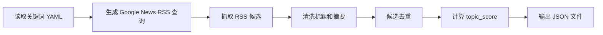

# 主动热点研究第一阶段工作报告

## 1. 本阶段目标

本阶段目标是在不影响现有 LangGraph 爬虫生产流的前提下，恢复“主动上网寻找热点并生成文章”的第一步能力。当前只实现热点发现、清洗、去重和规则评分，不调用 WriterAgent、ImageAgent、CMSAgent，也不写入 `pipeline_audit`。

## 2. 已完成内容

新增独立分支功能入口：

```bash
make active-research-discover
```

该命令会读取 `config/active_research_keywords.yaml` 中配置的关键词，通过 Google News RSS 搜索候选热点，并输出到：

```text
output/active_research_candidates.json
```

新增核心文件：

| 文件 | 作用 |
| --- | --- |
| `config/active_research_keywords.yaml` | 主动热点关键词配置，第一版人工维护 |
| `agents/active_research_agent/active_research_agent.py` | ActiveResearchAgent 主实现 |
| `scripts/run_active_research.py` | 独立运行入口 |
| `tests/test_active_research_agent.py` | 单元测试 |

## 3. 当前业务流程



当前阶段不会继续进入 ResearchAgent、WriterAgent、QualityAgent、EditorAgent、SEOAgent、ImageAgent 或 CMSAgent。

## 4. 评分逻辑

`topic_score` 是候选热点分，不等于现有爬虫文章的 `ai_score`。评分维度包括：

| 维度 | 权重 | 说明 |
| --- | ---: | --- |
| 时效性 | 25% | 越新的新闻分越高 |
| 业务相关性 | 25% | 是否命中 MBA、EMBA、考研、商学院等业务范围 |
| 新闻价值 | 20% | 是否包含发布、启动、政策、改革、合作等新闻信号 |
| 素材完整度 | 15% | RSS 标题和摘要是否足够支撑下一步研究 |
| 搜索价值 | 10% | 是否包含报名、条件、申请、政策等搜索意图 |
| 来源可信度 | 5% | 官方、院校、主流媒体优先 |

## 5. 已修复问题

1. Google News RSS 标题会带来源尾巴，例如 `标题 - news.sjtu.edu.cn`，已清洗为干净标题。
2. RSS `<source url="...">` 原本没有保留，已新增 `source_url` 字段，方便追溯来源。
3. 运行日志已压低第三方请求日志，只保留关键结果摘要。
4. 不依赖 `feedparser`，改用 Python 标准库解析 RSS，降低部署依赖风险。

## 6. 验证结果

已执行以下验证：

```bash
.venv/bin/python -m unittest tests.test_active_research_agent
.venv/bin/python -m py_compile agents/active_research_agent/active_research_agent.py scripts/run_active_research.py
git diff --check
make active-research-discover
```

验证结果：单元测试通过、语法检查通过、diff 检查通过、真实 RSS 抓取可用。

## 7. 当前风险

当前输出中的 `url` 仍可能是 Google News 中转链接，不一定是原始文章 URL。第一阶段用于人工观察候选质量没有问题，但正式进入 ResearchAgent 前，需要增加原文链接解析或二次搜索官方原文的能力。

另一个风险是当前只做本轮内去重，还没有和爬虫库、历史生成文章做跨库去重。后续接入文章生成前必须补齐。

## 8. 下一步建议

下一步建议做“原文解析与 ResearchAgent 资料包”：

1. 解析 Google News 中转链接，尽量拿到真实原文 URL。
2. 如果解析失败，用标题和 `source_url` 二次搜索官方来源。
3. 抓取原文标题、发布时间、正文摘要和来源信息。
4. 与爬虫库和 `pipeline_audit` 做去重。
5. 输出 ResearchAgent 可消费的结构化资料包。
6. 资料不足时直接停止该候选，不调用 WriterAgent。

完成这一步后，再进入 WriterAgent 生成测试稿会更稳，事实风险和 token 浪费都会低很多。
