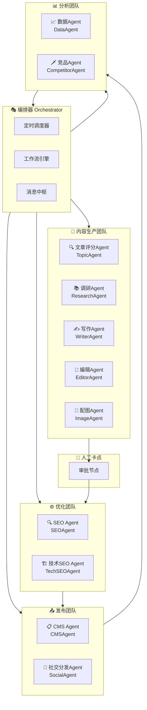
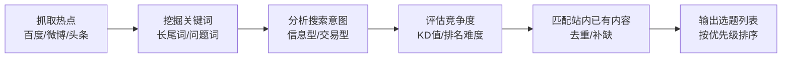
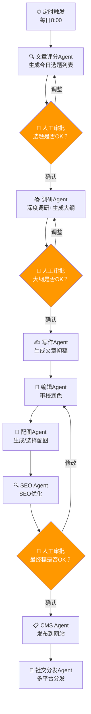
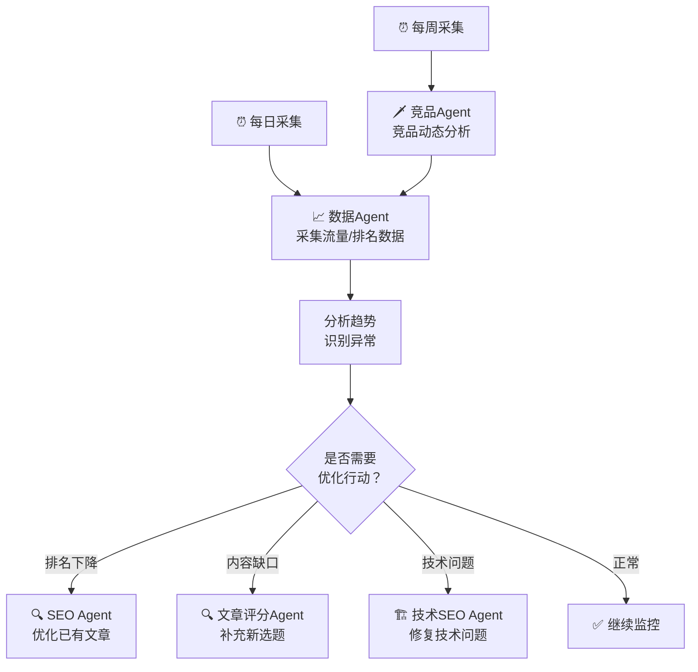
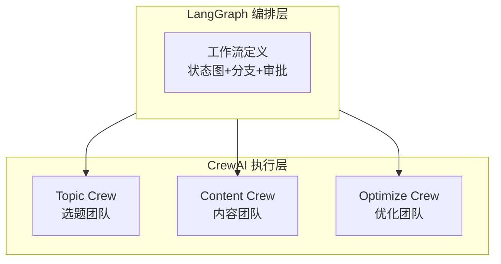
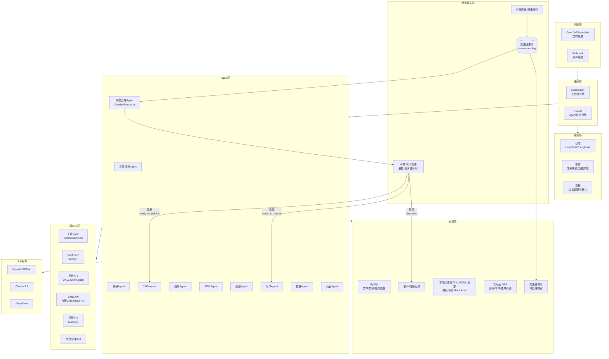
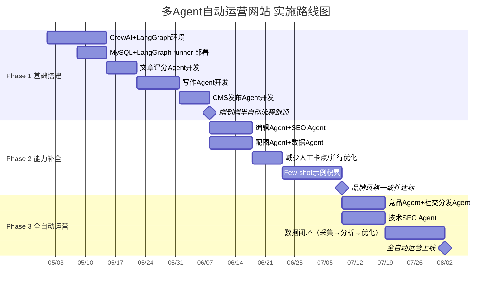
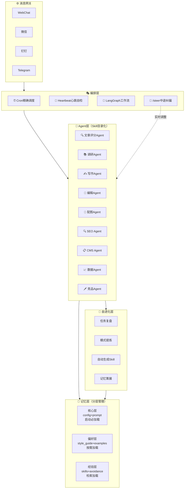
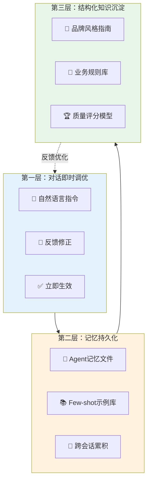
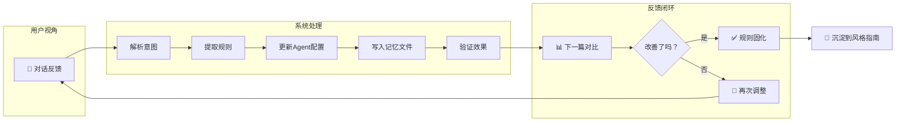

# 多Agent自动运营网站方案

> **编制日期：** 2026-04-30
> **编制人：** 小龙女 🦞
> **文档版本：** v1.3
> **状态：** 初稿，待讨论

---

## 一、背景与愿景

### 1.1 为什么要用多Agent自动运营网站

传统网站运营模式是**人驱动**的：运营人员选题→写稿→排版→发布→看数据→优化，每个环节都需要人力介入。随着大模型能力提升，我们可以让**多个AI Agent各司其职**，组成一个"虚拟运营团队"，实现网站从内容生产到数据分析的全链路自动化。

```
传统模式：人 → 选题 → 写稿 → 排版 → 发布 → 看数据 → 优化
                     ↑ 大量重复性工作，效率低

Agent模式：编排器 → 文章评分Agent → 写作Agent → SEO Agent → 发布Agent → 数据Agent
                     ↑ 各Agent专注擅长领域，7×24运转
```

### 1.2 设计原则

| 原则 | 说明 |
|------|------|
| **AI执行，人决策** | Agent负责干活，关键节点人确认（事件驱动+人工卡点） |
| **每个Agent职责单一** | 一个Agent只做一件事，做到专业 |
| **可编排可组合** | Agent通过消息协作，流程可灵活调整 |
| **可观测可追溯** | 每个Agent的输出有日志，人可审计 |
| **渐进式自动化** | 先半自动（人审批），再全自动 |

---

## 二、Agent角色设计

### 2.1 总体架构



### 2.2 各Agent职责详述

#### 🔍 文章评分Agent（TopicAgent）

| 项目 | 说明 |
|------|------|
| **职责** | 发现热点、挖掘长尾关键词、生成选题列表 |
| **输入** | 行业关键词、历史文章数据、竞品动态、热点趋势 |
| **输出** | 选题建议列表（含关键词、预估搜索量、竞争度、推荐理由） |
| **运行频率** | 每日1次，或被事件触发 |

**工作流程：**



**核心能力：**
- 关键词挖掘（长尾词、问题词、LSI词）
- 热点趋势检测（百度指数、微博热搜、Google Trends）
- 搜索意图分析（信息型、导航型、交易型）
- 竞争度评估（关键词难度KD值、SERP分析）
- 与站内已有内容去重、查缺补漏

---

#### 📚 调研Agent（ResearchAgent）

| 项目 | 说明 |
|------|------|
| **职责** | 围绕选题进行深度调研，收集素材、生成大纲 |
| **输入** | 选题列表（来自TopicAgent） |
| **输出** | 调研素材包 + 文章大纲 |
| **运行频率** | 按需，每个选题触发一次 |

**工作流程：**
1. 解构选题关键词，生成搜索查询
2. 搜索引擎获取Top10结果
3. 抓取并提取关键内容
4. 整合素材，标注来源
5. 生成结构化大纲（H2/H3层级、核心观点、数据引用）

---

#### ✍️ 写作Agent（WriterAgent）

| 项目 | 说明 |
|------|------|
| **职责** | 根据大纲生成高质量原创文章 |
| **输入** | 大纲 + 调研素材 + 品牌风格指南 |
| **输出** | Markdown格式文章 |
| **运行频率** | 按需，每个大纲触发一次 |

**质量要求：**
- 原创度 > 95%（通过查重工具验证）
- 符合E-E-A-T原则（经验、专业、权威、信任）
- 段落结构清晰，H2/H3标题合理
- 包含数据引用和来源标注
- 匹配品牌调性和写作风格

**品牌风格注入：**
```
系统提示词示例：
"你是一位资深行业分析师，写作风格专业但不枯燥。
善用数据说话，每段有核心观点。
避免：空洞的废话、过度营销的措辞、未经证实的数据。
长度：2000-3000字。"
```

---

#### 🔧 编辑Agent（EditorAgent）

| 项目 | 说明 |
|------|------|
| **职责** | 审校文章质量、润色、排版 |
| **输入** | WriterAgent产出的Markdown文章 |
| **输出** | 审校后的最终版文章 + 质量评分 |
| **运行频率** | 每篇文章触发一次 |

**审校维度：**

| 维度 | 检查项 |
|------|--------|
| 事实核查 | 数据来源是否可靠？引用是否准确？ |
| 逻辑连贯 | 段落间是否有逻辑跳跃？论证是否完整？ |
| 语言质量 | 是否有语病？用词是否准确？是否有冗余？ |
| SEO合规 | 关键词密度是否合理？标题是否包含关键词？ |
| 可读性 | 句子是否过长？段落是否过密？ |
| 品牌一致 | 是否符合品牌调性？是否用了禁用词？ |

---

#### 🎨 配图Agent（ImageAgent）

| 项目 | 说明 |
|------|------|
| **职责** | 为文章生成/选择配图 |
| **输入** | 文章内容 + 配图需求 |
| **输出** | 文章配图（头图+文中插图） |
| **运行频率** | 每篇文章触发一次 |

**配图策略：**

| 方式 | 技术 | 适用场景 |
|------|------|---------|
| AI生成 | DALL-E 3 / Midjourney / Stable Diffusion | 概念图、创意封面 |
| 图库搜索 | Unsplash API / Pexels API | 通用配图 |
| 数据可视化 | Matplotlib / ECharts | 数据图表 |
| 截图工具 | Playwright | 网站/工具截图 |

---

#### 🔍 SEO Agent（SEOAgent）

| 项目 | 说明 |
|------|------|
| **职责** | 优化文章的SEO要素，确保搜索引擎友好 |
| **输入** | 审校后的文章 + 目标关键词 |
| **输出** | SEO优化后的文章 + TDK元数据 + 内链建议 |
| **运行频率** | 每篇文章触发一次 |

**优化项：**

| 优化项 | 说明 |
|-------|------|
| **TDK** | Title / Description / Keywords 优化 |
| **标题优化** | H1包含核心关键词，H2/H3包含长尾词 |
| **关键词布局** | 首段、尾段、小标题自然出现关键词 |
| **内链建设** | 自动推荐站内相关文章链接 |
| **外链建议** | 推荐可引用的权威来源 |
| **Schema标记** | 生成Article/FAQ/HowTo结构化数据 |
| **URL优化** | 生成SEO友好的URL slug |

---

#### 🏗️ 技术SEO Agent（TechSEOAgent）

| 项目 | 说明 |
|------|------|
| **职责** | 网站技术层面的SEO优化 |
| **输入** | 网站URL + 站点地图 |
| **输出** | 技术SEO报告 + 修复建议 |
| **运行频率** | 每周1次 |

**检查项：**
- 页面加载速度（Core Web Vitals：LCP/FID/CLS）
- 移动端适配
- 死链检测（404页面）
- Sitemap生成与提交
- Robots.txt配置
- 结构化数据校验
- 索引覆盖率监控

---

#### 📋 CMS Agent（CMSAgent）

| 项目 | 说明 |
|------|------|
| **职责** | 将文章发布到CMS系统 |
| **输入** | SEO优化后的文章 + TDK + 配图 |
| **输出** | 发布确认 + 文章URL |
| **运行频率** | 每篇文章触发一次 |

**对接策略：**

本项目CMS为**内部自研系统**，需与开发团队协作对接API。以下是推荐的自研CMS API对接规范：

| 对接项 | 推荐方案 | 说明 |
|--------|---------|------|
| 认证方式 | OAuth2.0 / API Key + IP白名单 | 与自研系统安全策略对齐 |
| 数据格式 | JSON | RESTful API标准 |
| 文章发布 | POST /api/v1/articles | 含标题、正文、分类、标签、TDK |
| 文章更新 | PUT /api/v1/articles/{id} | 支持草稿→发布状态切换 |
| 图片上传 | POST /api/v1/media/upload | 支持图片上传并返回media_id |
| 分类标签 | GET /api/v1/categories | 拉取现有分类体系 |
| 草稿管理 | POST后status=draft | 先存草稿，人工确认后PUT改status=published |
| 回调通知 | Webhook | 发布成功/失败通知 |

> 💡 **建议：** 与自研CMS团队确认以下事项：
> 1. API文档（接口路径、请求/响应格式、鉴权方式）
> 2. 富文本格式要求（HTML / Markdown / 自定义标记）
> 3. 图片上传限制（大小、格式、CDN地址）
> 4. 分类/标签体系（是否支持层级分类、标签是否需预创建）
> 5. 自定义字段支持（SEO TDK、Schema标记等是否可扩展）

**自研CMS发布示例：**

```python
import requests

class CMSClient:
    """自研CMS API客户端"""
    
    def __init__(self, base_url: str, api_key: str):
        self.base_url = base_url.rstrip("/")
        self.headers = {
            "Authorization": f"Bearer {api_key}",
            "Content-Type": "application/json"
        }
    
    def upload_image(self, image_path: str) -> dict:
        """上传图片，返回media_id和CDN地址"""
        with open(image_path, "rb") as f:
            files = {"file": f}
            resp = requests.post(
                f"{self.base_url}/api/v1/media/upload",
                files=files,
                headers={"Authorization": self.headers["Authorization"]}
            )
        return resp.json()  # {"media_id": 123, "url": "https://cdn..."}
    
    def get_categories(self) -> list:
        """获取分类列表"""
        resp = requests.get(
            f"{self.base_url}/api/v1/categories",
            headers=self.headers
        )
        return resp.json()
    
    def create_article(self, article: dict, tdk: dict, images: dict) -> dict:
        """创建文章（先存草稿）"""
        payload = {
            "title": tdk["title"],
            "content": article["html_content"],
            "status": "draft",  # 先存草稿，人工确认后发布
            "slug": tdk["slug"],
            "category_id": article["category_id"],
            "tag_ids": article["tag_ids"],
            "featured_image_id": images["featured_image_id"],
            "meta": {
                "description": tdk["description"],
                "keywords": tdk["focus_keyword"],
                "schema_markup": tdk.get("schema", ""),
            }
        }
        resp = requests.post(
            f"{self.base_url}/api/v1/articles",
            json=payload,
            headers=self.headers
        )
        return resp.json()  # {"article_id": 456, "url": "..."}
    
    def publish_article(self, article_id: int) -> dict:
        """将草稿文章发布上线"""
        resp = requests.put(
            f"{self.base_url}/api/v1/articles/{article_id}",
            json={"status": "published"},
            headers=self.headers
        )
        return resp.json()

# 使用示例
cms = CMSClient(base_url="https://your-cms.com", api_key="your-api-key")
result = cms.create_article(article, tdk, images)
```

---

#### 📢 社交分发Agent（SocialAgent）

| 项目 | 说明 |
|------|------|
| **职责** | 将文章分发到社交媒体平台 |
| **输入** | 已发布文章URL + 摘要 |
| **输出** | 各平台发布状态 |
| **运行频率** | 文章发布后触发 |

**分发渠道：**

| 平台 | 对接方式 | 内容格式 |
|------|---------|---------|
| 微信公众号 | 第三方API / 手动 | 微信格式文章 |
| 微博 | 微博开放API | 短文+链接 |
| 知乎 | 知乎API | 专栏文章 |
| LinkedIn | Share API | 英文内容 |
| Twitter/X | X API v2 | 推文+链接 |

---

#### 📈 数据Agent（DataAgent）

| 项目 | 说明 |
|------|------|
| **职责** | 采集网站运营数据，生成分析报告和优化建议 |
| **输入** | 网站访问数据 + 搜索排名数据 |
| **输出** | 运营周报 + 优化建议 |
| **运行频率** | 每日采集，每周出报告 |

**数据采集维度：**

| 维度 | 数据源 | 指标 |
|------|--------|------|
| 流量 | Google Analytics / 百度统计 | UV、PV、跳出率、停留时长 |
| 排名 | Google Search Console / 站长工具 | 关键词排名、展现量、点击率 |
| 索引 | Google Search Console | 索引页面数、抓取错误 |
| 转化 | 自有数据 | 注册量、咨询量、下单量 |
| 内容 | CMS数据 | 文章阅读量、分享量、评论量 |

---

#### 🗡️ 竞品Agent（CompetitorAgent）

| 项目 | 说明 |
|------|------|
| **职责** | 监控竞品网站动态，提供竞争分析 |
| **输入** | 竞品网站列表 + 监控关键词 |
| **输出** | 竞品动态报告 + 差异化建议 |
| **运行频率** | 每周1次 |

**监控维度：**
- 竞品新发布文章（标题、关键词、发布频率）
- 竞品排名变化（核心关键词SERP对比）
- 竞品内容策略（内容类型、长度、更新频率）
- 内容差距分析（竞品有我们没有的关键词/话题）

---

## 三、工作流编排

### 3.1 日常内容生产流（主流程）



### 3.2 数据驱动优化流



### 3.3 渐进自动化策略

| 阶段 | 自动化程度 | 说明 |
|------|-----------|------|
| **Phase 1** | 半自动 | AI选题→人确认→AI写稿→人审→手动发布 |
| **Phase 2** | 大部分自动 | AI选题→人确认→AI写稿+审校→人终审→AI自动发布 |
| **Phase 3** | 全自动 | AI自主选题→AI写稿→AI审校→AI发布→AI分析→AI优化，人只需看周报 |

---

## 四、技术选型与实现

### 4.1 多Agent框架对比

| 维度 | CrewAI | LangGraph | AutoGen / MAF | OpenAI Agents SDK |
|------|--------|-----------|---------------|-------------------|
| **语言** | Python | Python | Python/C# | Python |
| **核心理念** | 角色化团队协作 | 状态图驱动工作流 | 对话式多Agent | 函数调用+交接 |
| **学习曲线** | ⭐ 低 | ⭐⭐⭐ 高 | ⭐⭐ 中 | ⭐⭐ 中 |
| **控制粒度** | 中（流程/层级） | 高（图/分支/循环） | 中（对话轮次） | 中（函数交接） |
| **可视化** | 有 | 有（LangGraph Studio） | 有 | 无 |
| **生产就绪** | ✅ 企业级 | ✅ 生产级 | ✅ 微软背书 | ✅ OpenAI官方 |
| **适用场景** | 内容创作、研究分析 | 复杂工作流、长流程 | 对话式协作、代码生成 | OpenAI生态深度集成 |
| **模型依赖** | 任意LLM | 任意LLM | 任意LLM | 仅OpenAI |

### 4.2 推荐方案

**推荐采用 CrewAI + LangGraph 混合架构：**

- **CrewAI**：定义各Agent的角色、工具和协作关系（定义"谁做什么"）
- **LangGraph**：编排整体工作流，处理分支、循环、人工审批等复杂逻辑（定义"怎么做"）

**理由：**
1. CrewAI的角色化设计天然适合网站运营团队的分工模式
2. LangGraph的状态图能精确控制"人工卡点"等复杂流程
3. 两者可互补：CrewAI做执行层，LangGraph做编排层



### 4.3 各Agent技术实现

#### 4.3.1 文章评分Agent 技术实现

```python
from crewai import Agent, Task, Crew
from langchain.tools import Tool

# 工具定义
keyword_research_tool = Tool(
    name="keyword_research",
    description="使用关键词研究API挖掘长尾词",
    func=lambda kw: call_keyword_api(kw)  # 对接百度关键词/Ahrefs/Semrush
)

trend_detection_tool = Tool(
    name="trend_detection", 
    description="检测热点趋势",
    func=lambda topic: get_trends(topic)  # 对接百度指数/Google Trends API
)

serp_analysis_tool = Tool(
    name="serp_analysis",
    description="分析搜索结果页竞争情况",
    func=lambda kw: analyze_serp(kw)  # 对接SerpAPI/百度SERP
)

# Agent定义
topic_agent = Agent(
    role="选题策划师",
    goal="发现高价值选题，优先选择搜索量大、竞争度低的关键词",
    backstory="你是一位资深的SEO选题专家，擅长挖掘长尾关键词和热点话题",
    tools=[keyword_research_tool, trend_detection_tool, serp_analysis_tool],
    llm="gpt-4o",
    verbose=True
)

topic_task = Task(
    description="基于行业关键词'{keywords}'进行选题研究，输出5-10个选题建议",
    agent=topic_agent,
    expected_output="选题列表，每项含：关键词、月搜索量、KD竞争度、搜索意图、推荐理由"
)
```

**关键技术栈：**

| 组件 | 技术选型 | 说明 |
|------|---------|------|
| 关键词挖掘 | Ahrefs API / Semrush API / 百度关键词规划师 | 搜索量+KD值 |
| 热点检测 | 百度指数API / Google Trends / 微博热搜API | 趋势数据 |
| SERP分析 | SerpAPI / DataForSEO / 自建爬虫 | 竞争分析 |
| LLM | GPT-4o / Claude 3.5 / DeepSeek | 意图分析+选题判断 |

---

#### 4.3.2 写作Agent 技术实现

```python
writer_agent = Agent(
    role="高级内容撰稿人",
    goal="根据大纲和调研素材撰写高质量原创文章",
    backstory="""你是一位拥有10年经验的专业撰稿人。
    写作风格：专业但不枯燥，数据驱动，逻辑清晰。
    每篇文章2000-3000字，包含数据引用和来源标注。
    严格遵循E-E-A-T原则。""",
    tools=[plagiarism_check_tool, readability_tool],
    llm="gpt-4o",
    verbose=True
)

writer_task = Task(
    description="""根据以下大纲撰写文章：
    标题：{title}
    大纲：{outline}
    调研素材：{research_materials}
    品牌风格指南：{brand_guide}
    
    要求：
    1. 原创度 > 95%
    2. 符合SEO最佳实践
    3. 包含数据引用
    4. Markdown格式输出""",
    agent=writer_agent,
    expected_output="Markdown格式的完整文章"
)
```

**关键技术栈：**

| 组件 | 技术选型 | 说明 |
|------|---------|------|
| 文章生成 | GPT-4o / Claude 3.5 Sonnet | 主力写作模型 |
| 查重检测 | Copyscape API / 自建simhash | 原创度验证 |
| 可读性分析 | textstat / 自定义评分 | Flesch分数等 |
| 品牌风格 | Few-shot examples / Fine-tuned model | 风格一致性 |

---

#### 4.3.3 SEO Agent 技术实现

```python
seo_agent = Agent(
    role="SEO优化专家",
    goal="优化文章的搜索引擎可见性",
    backstory="你是一位精通Google和百度算法的SEO专家，擅长TDK优化、内链建设、结构化数据",
    tools=[seo_audit_tool, internal_link_tool, schema_tool],
    llm="gpt-4o",
    verbose=True
)

seo_task = Task(
    description="""对以下文章进行SEO优化：
    文章：{article}
    目标关键词：{keyword}
    
    优化项：
    1. 生成Title（60字符内，包含关键词）
    2. 生成Meta Description（160字符内，包含关键词）
    3. 优化URL slug
    4. 推荐内链（从站内文章库匹配相关文章）
    5. 生成Schema.org结构化数据
    6. 检查关键词密度（1-2%为佳）""",
    agent=seo_agent,
    expected_output="SEO优化后的文章 + TDK + Schema标记 + 内链列表"
)
```

**关键技术栈：**

| 组件 | 技术选型 | 说明 |
|------|---------|------|
| 关键词分析 | Ahrefs / Semrush / 百度站长工具 | 搜索量/难度 |
| 内链推荐 | MySQL标签/关键词/分类匹配 | 当前先按站内文章元数据推荐，语义检索后续可选扩展 |
| Schema生成 | schema.org Python库 | 结构化数据 |
| 索引监控 | Google Search Console API / 百度站长API | 索引状态 |

---

#### 4.3.4 配图Agent 技术实现

```python
image_agent = Agent(
    role="视觉设计师",
    goal="为文章生成或选择高质量配图",
    backstory="你是一位视觉设计专家，擅长为文章选择或生成合适的配图",
    tools=[dalle_tool, unsplash_tool, chart_tool],
    llm="gpt-4o",
    verbose=True
)

# 配图工具实现
def generate_ai_image(prompt: str) -> str:
    """使用DALL-E 3生成AI配图"""
    from openai import OpenAI
    client = OpenAI()
    response = client.images.generate(
        model="dall-e-3",
        prompt=f"Professional blog illustration, minimal style: {prompt}",
        size="1792x1024",
        quality="hd"
    )
    return response.data[0].url

def search_stock_image(query: str) -> list:
    """从Unsplash搜索免费图库"""
    import requests
    url = f"https://api.unsplash.com/search/photos?query={query}&per_page=5"
    headers = {"Authorization": f"Client-ID {UNSPLASH_KEY}"}
    return requests.get(url, headers=headers).json()["results"]

def generate_chart(data: dict, chart_type: str) -> str:
    """使用matplotlib生成数据图表"""
    import matplotlib.pyplot as plt
    # ... 根据chart_type生成对应图表
    return chart_image_path
```

**关键技术栈：**

| 组件 | 技术选型 | 说明 |
|------|---------|------|
| AI生图 | DALL-E 3 API / Stable Diffusion WebUI | 创意配图 |
| 图库搜索 | Unsplash API / Pexels API | 免费商用图 |
| 数据图表 | Matplotlib / Plotly / ECharts | 数据可视化 |
| 图片优化 | Pillow / Sharp | 压缩+WebP转换 |

---

#### 4.3.5 CMS Agent 技术实现

> 本项目使用**自研CMS**，通过自定义API对接。CMS Agent需封装自研API客户端。

```python
from crewai import Agent, Task
from crewai.tools import tool

# 自研CMS API工具封装
@tool
def cms_upload_image(image_path: str) -> str:
    """上传图片到自研CMS，返回media_id"""
    cms = CMSClient(base_url=CMS_BASE_URL, api_key=CMS_API_KEY)
    result = cms.upload_image(image_path)
    return str(result["media_id"])

@tool
def cms_create_article(title: str, content: str, category_id: int, 
                        tag_ids: str, tdk_json: str) -> str:
    """创建文章到自研CMS（草稿状态），返回article_id"""
    import json
    cms = CMSClient(base_url=CMS_BASE_URL, api_key=CMS_API_KEY)
    tdk = json.loads(tdk_json)
    tag_id_list = json.loads(tag_ids)
    result = cms.create_article(
        article={"html_content": content, "category_id": category_id, "tag_ids": tag_id_list},
        tdk=tdk,
        images={"featured_image_id": None}
    )
    return str(result["article_id"])

@tool
def cms_publish_article(article_id: str) -> str:
    """将草稿文章发布上线"""
    cms = CMSClient(base_url=CMS_BASE_URL, api_key=CMS_API_KEY)
    result = cms.publish_article(int(article_id))
    return result.get("url", "发布成功")

@tool
def cms_get_categories() -> str:
    """获取自研CMS的分类列表"""
    cms = CMSClient(base_url=CMS_BASE_URL, api_key=CMS_API_KEY)
    categories = cms.get_categories()
    return str(categories)

cms_agent = Agent(
    role="CMS发布专员",
    goal="将文章准确无误地发布到自研CMS系统",
    backstory="你是一位细心的CMS操作员，熟悉自研CMS的API接口，确保文章格式正确、分类标签无误",
    tools=[cms_upload_image, cms_create_article, cms_publish_article, cms_get_categories],
    llm="gpt-4o",
    verbose=True
)
```

---

#### 4.3.6 数据Agent 技术实现

```python
data_agent = Agent(
    role="数据分析师",
    goal="采集网站数据，生成运营分析报告",
    backstory="你是一位数据驱动的运营分析师，擅长从数据中发现问题和机会",
    tools=[ga_tool, gsc_tool, rank_tracker_tool],
    llm="gpt-4o",
    verbose=True
)

# Google Analytics 数据采集
def fetch_ga_data(property_id, date_range):
    from google.analytics.data_v1beta import BetaAnalyticsDataClient
    client = BetaAnalyticsDataClient()
    
    request = RunReportRequest(
        property=f"properties/{property_id}",
        date_ranges=[DateRange(start_date=date_range[0], end_date=date_range[1])],
        dimensions=[
            Dimension(name="pagePath"),
            Dimension(name="date"),
        ],
        metrics=[
            Metric(name="screenPageViews"),
            Metric(name="averageSessionDuration"),
            Metric(name="bounceRate"),
        ],
    )
    return client.run_report(request)

# Google Search Console 排名数据
def fetch_gsc_data(site_url, date_range):
    from googleapiclient.discovery import build
    # ... 调用Search Console API
    pass
```

---

### 4.4 完整CrewAI编排示例

```python
from crewai import Agent, Task, Crew, Process
from langchain_openai import ChatOpenAI

# === 定义所有Agent ===
topic_agent = Agent(role="选题策划师", goal="发现高价值选题", ...)
research_agent = Agent(role="调研分析师", goal="深度调研生成大纲", ...)
writer_agent = Agent(role="高级撰稿人", goal="撰写高质量原创文章", ...)
editor_agent = Agent(role="审校编辑", goal="审校润色文章", ...)
seo_agent = Agent(role="SEO优化专家", goal="优化搜索引擎可见性", ...)
image_agent = Agent(role="视觉设计师", goal="生成或选择配图", ...)
cms_agent = Agent(role="CMS发布员", goal="准确发布到网站", ...)

# === 定义任务链 ===
topic_task = Task(
    description="基于行业关键词进行选题研究",
    agent=topic_agent,
    expected_output="选题列表"
)

research_task = Task(
    description="根据选定选题进行深度调研",
    agent=research_agent,
    expected_output="调研素材+文章大纲",
    context=[topic_task]  # 依赖选题任务结果
)

writing_task = Task(
    description="根据大纲撰写文章",
    agent=writer_agent,
    expected_output="Markdown格式文章",
    context=[research_task]
)

editing_task = Task(
    description="审校文章",
    agent=editor_agent,
    expected_output="审校后文章+质量评分",
    context=[writing_task]
)

seo_task = Task(
    description="SEO优化",
    agent=seo_agent,
    expected_output="优化后文章+TDK+Schema",
    context=[editing_task]
)

image_task = Task(
    description="生成配图",
    agent=image_agent,
    expected_output="文章配图",
    context=[editing_task]  # 和SEO并行
)

publish_task = Task(
    description="发布到CMS",
    agent=cms_agent,
    expected_output="文章URL",
    context=[seo_task, image_task]
)

# === 组建团队并执行 ===
content_crew = Crew(
    agents=[topic_agent, research_agent, writer_agent, 
            editor_agent, seo_agent, image_agent, cms_agent],
    tasks=[topic_task, research_task, writing_task,
           editing_task, seo_task, image_task, publish_task],
    process=Process.sequential,  # 顺序执行
    verbose=True
)

# 执行
result = content_crew.kickoff(inputs={"keywords": "EMBA 商学院 高管教育"})
```

---

### 4.5 LangGraph 人工卡点编排

CrewAI本身不支持人工审批卡点，需要用LangGraph来编排：

```python
from langgraph.graph import StateGraph, END
from typing import TypedDict, Annotated
import operator

class WorkflowState(TypedDict):
    keywords: str
    topics: list
    approved_topics: list
    outline: dict
    approved_outline: bool
    article: str
    approved_article: bool
    seo_article: str
    published_url: str

def topic_node(state):
    """文章评分Agent执行"""
    topics = topic_agent.execute(state["keywords"])
    return {"topics": topics}

def human_approve_topic_node(state):
    """人工审批选题 - 等待外部输入"""
    # 在实际部署中，这里会暂停工作流，等待人工审批
    # 可以通过API/消息通知运营人员
    return state  # 由外部回调更新approved_topics

def research_node(state):
    """调研Agent执行"""
    outline = research_agent.execute(state["approved_topics"])
    return {"outline": outline}

def write_node(state):
    """写作Agent执行"""
    article = writer_agent.execute(state["outline"])
    return {"article": article}

def edit_seo_node(state):
    """编辑+SEO Agent并行执行"""
    edited = editor_agent.execute(state["article"])
    seo_result = seo_agent.execute(edited)
    return {"seo_article": seo_result}

def publish_node(state):
    """CMS发布"""
    url = cms_agent.execute(state["seo_article"])
    return {"published_url": url}

# 构建工作流图
workflow = StateGraph(WorkflowState)

workflow.add_node("topic", topic_node)
workflow.add_node("approve_topic", human_approve_topic_node)
workflow.add_node("research", research_node)
workflow.add_node("approve_outline", human_approve_topic_node)
workflow.add_node("write", write_node)
workflow.add_node("approve_article", human_approve_topic_node)
workflow.add_node("edit_seo", edit_seo_node)
workflow.add_node("publish", publish_node)

workflow.add_edge("topic", "approve_topic")
workflow.add_conditional_edges("approve_topic", 
    lambda s: "research" if s.get("approved_topics") else "topic")
workflow.add_edge("research", "approve_outline")
workflow.add_conditional_edges("approve_outline",
    lambda s: "write" if s.get("approved_outline") else "research")
workflow.add_edge("write", "approve_article")
workflow.add_conditional_edges("approve_article",
    lambda s: "edit_seo" if s.get("approved_article") else "write")
workflow.add_edge("edit_seo", "publish")
workflow.add_edge("publish", END)

workflow.set_entry_point("topic")
app = workflow.compile()
```

---

## 五、部署架构

### 5.1 系统架构图



### 5.2 技术栈总览

| 层级 | 技术选型 | 说明 |
|------|---------|------|
| **语言** | Python 3.11+ | AI生态最成熟 |
| **Agent框架** | CrewAI + LangGraph | 角色化+状态图 |
| **LLM** | GPT-4o（主力）/ DeepSeek（备选） | 写作用GPT-4o，日常用DeepSeek降本 |
| **调度**      | LangGraph batch runner + daemon | 后台常驻批处理、feeder 退避、状态图分支       |
| **数据库** | MySQL | 文章、文稿、爬虫结果、任务、评分、日志、配置数据 |
| **语义检索** | 暂不接入独立向量数据库 | 后续如需RAG或语义内链，再作为可选扩展 |
| **状态与日志** | 本地状态文件 + JSONL 日志        | feeder 游标、prompt 审计、dead letter        |
| **对象存储** | 华为云 OBS | 图片、附件、生成资源存储 |
| **CMS** | 自研CMS（自定义API对接） | 内容发布 |
| **监控** | LangSmith / LangFuse | Agent执行追踪 |
| **部署** | Docker + K8s | 容器化部署 |

### 5.3 成本估算

| 项目 | 月费用（估算） | 说明 |
|------|-------------|------|
| LLM API | ¥3,000-8,000 | GPT-4o约$2.5/1M tokens，日均10篇约1M tokens |
| 关键词API | ¥1,000-3,000 | Ahrefs/Semrush订阅 |
| 图片API | ¥500-1,000 | DALL-E 3约$0.04/张 |
| 服务器 | ¥1,000-2,000 | 4C8G云服务器 |
| 监控 | ¥0-500 | LangSmith免费版/自建LangFuse |
| **合计** | **¥5,500-14,500/月** | 根据文章产量和API用量浮动 |

---

## 六、已有开源项目参考

| 项目 | 地址 | 特点 |
|------|------|------|
| **Alwrity (AI-Writer)** | github.com/BuwadsMod/AI-Writer | 关键词研究+SEO文章自动生成+多CMS发布，Python实现 |
| **TideFlow AIGC SEO** | jiasou.com | 全链路AI SEO：建站→内容→发布→监控（SaaS产品） |
| **BlogBuster** | blogbuster.ai | AI驱动的博客内容平台，5分钟生成SEO优化文章 |
| **ai-seo.cc** | ai-seo.cc | AI批量生成文章+多CMS分发+智能挖词 |
| **WordPress AI Agent** | wordpress.com | WordPress官方AI智能体，可自动创建/发布/管理内容 |

---

## 七、实施路线图



---

## 八、从 OpenClaw 和 Hermes Agent 中能学到什么

这两个框架是2026年最火的开源Agent项目，虽然它们是"个人助理"定位，但架构设计上有很多值得多Agent运营系统借鉴的地方。

### 8.1 OpenClaw 可借鉴的核心设计

#### ① Skill技能插件体系

OpenClaw的**Skill系统**是最值得借鉴的设计——每个能力单元是一个独立的Skill目录，包含SKILL.md（说明文档）+ 脚本/代码，Agent按需加载，不用的不加载。

**对多Agent运营系统的启示：**

```
当前方案：每个Agent是Python代码里硬编码的
         ↓ 借鉴Skill思路 ↓
改进方案：每个Agent = 一个Skill目录

agent_skills/
├── topic_agent/
│   ├── SKILL.md           # Agent说明：职责、输入、输出
│   ├── config.yaml        # 可调参数（关键词偏好、KD阈值等）
│   ├── prompt.md          # 系统提示词模板
│   ├── examples/          # Few-shot示例
│   │   ├── good/          # 好的选题示例
│   │   └── bad/           # 差的选题示例
│   └── tools/             # 专属工具脚本
│       ├── keyword_research.py
│       └── trend_detect.py
├── writer_agent/
│   ├── SKILL.md
│   ├── config.yaml        # 字数范围、风格参数
│   ├── prompt.md
│   ├── examples/
│   └── tools/
├── seo_agent/
│   ├── SKILL.md
│   ├── config.yaml        # 关键词密度、TDK规则
│   ├── prompt.md
│   └── tools/
└── ...
```

**好处：**
- 换个Agent只需换目录，不影响其他Agent
- 自然语言调优 = 编辑SKILL.md和config.yaml，不改代码
- 新增Agent = 新建目录，插拔式

#### ② Sub-Agent子代理机制（sessions_spawn）

OpenClaw的`sessions_spawn`允许主Agent生成子Agent执行任务，子Agent完成后结果自动回传，主Agent继续处理。

**对多Agent运营系统的启示：**

```
传统流程：选题→调研→写作→编辑→SEO→发布 串行执行
         ↓ 借鉴sessions_spawn ↓
改进流程：主Orchestrator spawn子Agent，并行+串行混合

# 选题完成后，并行spawn调研+竞品分析
spawn_research = sessions_spawn(task="深度调研选题", mode="run")
spawn_compete = sessions_spawn(task="竞品分析", mode="run")

# 两个子Agent并行执行，结果汇总后继续写作
research_result = await spawn_research
compete_result = await spawn_compete

# 写作完成后，并行spawn编辑+SEO+配图
spawn_edit = sessions_spawn(task="审校文章", mode="run")
spawn_seo = sessions_spawn(task="SEO优化", mode="run") 
spawn_image = sessions_spawn(task="生成配图", mode="run")
```

**好处：**
- 原本串行的7步流程，可压缩为3个阶段（选题→并行调研→并行优化发布）
- 单篇文章从2小时压缩到30分钟

#### ③ LCM无损上下文管理

OpenClaw的LCM（Lossless Context Management）解决了"对话太长上下文溢出"的问题——把历史对话压缩为摘要（sum_xxx），需要细节时再展开。

**对多Agent运营系统的启示：**

每个Agent的工作历史会越来越长。比如文章评分Agent积累了3个月的选题记录，不可能每次都全量加载。

```
LCM思路应用：

1. 压缩：每轮任务结束后，Agent自动将过程压缩为摘要
   - 文章评分Agent："4月30日选题5个，通过3个，拒绝原因：2个太泛"
   - 写作Agent："4月30日写3篇，平均质量分7.2，用户修改2篇"

2. 检索：下次启动时，只加载摘要+最近3天的详情
   - 用lcm_grep按关键词搜索历史
   - 用lcm_expand按需展开某个摘要的细节

3. 持久化：摘要永久保留在本地文件，不占上下文窗口
```

#### ④ Heartbeat心跳机制

OpenClaw的Heartbeat让Agent定时"醒来"检查有没有事要做，而不是被动等指令。

**对多Agent运营系统的启示：**

```
被动模式：人触发→Agent执行→等下次触发
         ↓ 借鉴Heartbeat ↓
主动模式：Agent定时自检+主动行动

# 心跳检查清单（类似HEARTBEAT.md）
- 每日8:00 → 文章评分Agent自动检查今日热点
- 每日20:00 → 数据Agent自动采集今日数据
- 每周一9:00 → 竞品Agent自动出周报
- 每月1日 → 所有Agent自动回顾上月表现，生成改进建议

# 发现异常时主动行动
- 排名突然下降 → 数据Agent主动通知+触发SEO优化
- 竞品发布重磅内容 → 竞品Agent主动推送应对建议
- CMS发布失败 → 发布Agent自动重试+告警
```

#### ⑤ Cron定时任务

OpenClaw的Cron系统支持精确的定时调度，可以创建一次性或周期性任务。

**对多Agent运营系统的启示：**

```python
# 利用cron实现精确的运营节奏

# 每日选题
cron.add(
    name="daily_topic",
    schedule={"kind": "cron", "expr": "0 8 * * *", "tz": "Asia/Shanghai"},
    payload={"kind": "agentTurn", "message": "执行今日选题研究"}
)

# 每周竞品分析
cron.add(
    name="weekly_competitor",
    schedule={"kind": "cron", "expr": "0 9 * * 1", "tz": "Asia/Shanghai"},
    payload={"kind": "agentTurn", "message": "执行本周竞品分析报告"}
)

# 每月质量回顾
cron.add(
    name="monthly_review",
    schedule={"kind": "cron", "expr": "0 10 1 * *", "tz": "Asia/Shanghai"},
    payload={"kind": "agentTurn", "message": "回顾上月所有Agent表现，生成改进建议"}
)
```

---

### 8.2 Hermes Agent 可借鉴的核心设计

#### ① 自进化学习闭环

这是Hermes最核心的创新——完成任务后，**自动将过程写成可复用的Skill**，下次遇到类似任务直接调用，越用越强。

```
自进化闭环流程：

1. 执行任务 → 遇到新问题
2. 解决问题 → 记录解决过程  
3. 自动提炼 → 生成Skill文档
4. 下次遇到 → 直接调用Skill
5. 使用中发现不足 → 更新Skill
```

**对多Agent运营系统的启示：**

```python
class SelfEvolvingAgent:
    """借鉴Hermes自进化机制的Agent基类"""
    
    def __init__(self, agent_name: str):
        self.agent_name = agent_name
        self.skill_dir = f"agent_skills/{agent_name}"
        
    def after_task_complete(self, task, result, user_feedback=None):
        """任务完成后自动复盘"""
        
        # 1. 如果用户给了好评价，记录为正面Skill
        if user_feedback and user_feedback.rating >= 4:
            self._save_as_skill(
                name=f"good_{task.type}_{date}",
                template=self._extract_pattern(task, result),
                tags=[task.type, "high_quality"]
            )
        
        # 2. 如果用户给了差评价，记录为反面Skill（避坑）
        elif user_feedback and user_feedback.rating <= 2:
            self._save_avoidance_rule(
                pattern=self._extract_bad_pattern(task, result, user_feedback),
                reason=user_feedback.comment
            )
        
        # 3. 自动检查是否有可泛化的模式
        pattern = self._detect_pattern(task, result)
        if pattern:
            self._save_as_skill(
                name=f"auto_{pattern.type}",
                template=pattern.template,
                tags=["auto_generated"]
            )
    
    def _extract_pattern(self, task, result):
        """从成功案例中提取可复用模式"""
        prompt = f"""
        任务：{task.description}
        执行过程：{task.execution_log}
        结果：{result.summary}
        
        请提取可复用的模式：
        1. 这个任务的关键步骤是什么？
        2. 哪些参数/配置是关键的？
        3. 有什么通用的策略可以复用？
        """
        return llm.call(prompt)
```

**实际场景举例：**

```
写作Agent第1次写EMBA选题文章 → 用户退回：太学术了
写作Agent自动记录避坑Skill：
  "EMBA选题不要用学术论文风格，要商业案例风格"

写作Agent第5次写EMBA选题 → 自动调用避坑Skill，用商业风格
→ 用户给5分！
写作Agent自动记录正面Skill：
  "EMBA选题最佳模板：开头用数据/排名→中间3个真实案例→结尾给行动清单"

写作Agent第10次写EMBA选题 → 直接调用正面Skill模板
→ 质量稳定在4.5分以上
```

#### ② 分层持久记忆系统

Hermes的五层记忆架构是它的"大脑"，从冻结的核心记忆到可检索的历史会话，层层分级。

```
Hermes五层记忆架构：

层级1：冻结系统提示记忆（MEMORY.md + USER.md）
  → Agent的核心认知，启动时加载，永不压缩
  → 我们的对应：Agent的config.yaml + prompt.md

层级2：会话检索层（SQLite FTS5全文索引）
  → 历史会话压缩为摘要，按需检索
  → 我们的对应：LCM压缩摘要 + lcm_grep检索

层级3：用户画像层（结构化偏好数据）
  → 用户的偏好、习惯、风格
  → 我们的对应：Agent记忆文件（style_guide.md等）

层级4：技能文档层（自动生成的Skill）
  → 从经验中提炼的可复用模式
  → 我们的对应：agent_skills/目录下的Skill文件

层级5：工作记忆层（当前会话上下文）
  → 当前任务的临时状态
  → 我们的对应：Agent运行时的内存状态
```

**对我们的关键启示——记忆分层管理：**

| 层级 | 存什么 | 怎么用 | 容量控制 |
|------|--------|--------|----------|
| 核心（启动必加载） | Agent身份+关键规则 | 每次会话注入系统提示 | <2000字符 |
| 偏好（按需加载） | 用户风格偏好 | 写作/编辑时加载 | <5000字符 |
| 经验（检索加载） | 历史案例+避坑规则 | 按关键词检索相关条目 | 无硬上限 |
| 实时（当前会话） | 任务执行状态 | 运行时内存 | 由LLM上下文窗口决定 |

#### ③ /steer 中途纠偏

Hermes的`/steer`命令允许在Agent执行任务的过程中，**实时介入调整方向**，而不是等任务完成后才反馈。

**对多Agent运营系统的启示：**

```
传统方式：Agent写完文章 → 人看完 → "不行重写" → Agent重写
         ↓ 借鉴/steer ↓
改进方式：Agent写到一半 → 人说"换个角度" → Agent立即调整方向

# 实现机制：流式输出 + 中途指令

写作Agent正在写第3段...
👤 "这里别写理论了，直接给3个案例"
🤖 收到，跳过理论段落，直接进入案例分析

SEO Agent正在优化TDK...
👤 "Title太长了，要控制在30字以内"
🤖 收到，重新生成更短的Title

# 技术实现
agent.steer(
    agent_name="writer_agent",
    message="这里别写理论了，直接给3个案例",
    immediate=True  # 立即生效，不等当前步骤完成
)
```

这比"写完再改"效率高很多，尤其适合长文章写作场景。

#### ④ 认知经济性原则

Hermes的记忆系统遵循"认知经济性"——**只记住对未来行为有价值的信息**，通过严格的记忆审查与精炼机制，将有限资源集中于高价值记忆。

**对多Agent运营系统的启示：**

```python
class MemoryCurator:
    """记忆策展人 - 借鉴Hermes的认知经济性"""
    
    def review_and_compress(self, agent_name: str):
        """定期审查记忆，只保留高价值信息"""
        memory = self.load_all_memory(agent_name)
        
        for entry in memory:
            value_score = self._assess_value(entry)
            # 价值评估维度：
            # 1. 引用频率（这条记忆被调用过多少次？）
            # 2. 影响力度（使用这条记忆后，质量提升多少？）
            # 3. 时效性（这条记忆还在适用吗？）
            # 4. 不可替代性（丢了这条会怎样？）
            
            if value_score < 0.3:
                self.archive(entry)      # 低价值：归档
            elif value_score < 0.7:
                self.compress(entry)     # 中价值：压缩保留要点
            else:
                self.keep_full(entry)   # 高价值：完整保留
    
    def _assess_value(self, entry):
        """评估记忆价值"""
        score = 0
        
        # 引用频率
        if entry.reference_count > 10: score += 0.3
        elif entry.reference_count > 3: score += 0.15
        
        # 影响力度
        if entry.quality_impact > 1.0: score += 0.3  # 使用后质量显著提升
        
        # 时效性
        if entry.age_days > 90 and not entry.is_evergreen: score -= 0.2
        
        # 不可替代性
        if entry.is_unique_insight: score += 0.2
        
        return max(0, min(1, score))
```

---

### 8.3 综合借鉴对照表

| 能力需求 | 当前方案 | OpenClaw借鉴 | Hermes借鉴 | 综合建议 |
|---------|---------|-------------|-----------|--------|
| **Agent定义** | Python代码硬编码 | Skill目录（SKILL.md+脚本） | 自动生成Skill | 采用Skill目录结构 + 支持自动生成Skill |
| **Agent编排** | CrewAI串行 | sessions_spawn并行子代理 | - | 串行+并行混合，长流程拆为子任务 |
| **上下文管理** | 无特殊处理 | LCM压缩+按需展开 | 五层记忆分级 | 三层记忆（核心/偏好/经验）+ LCM压缩 |
| **定时调度** | APScheduler | Cron精确调度 + Heartbeat自检 | - | Cron精确调度 + Heartbeat主动检查 |
| **自然语言调优** | 对话→更新配置 | Skill文件可编辑 | /steer中途纠偏 | 对话调优 + /steer实时纠偏 |
| **自我进化** | 无 | - | 自进化学习闭环 | 任务复盘→自动提炼Skill→避坑积累 |
| **记忆管理** | 记忆文件无上限 | LCM自动压缩 | 认知经济性+容量控制 | 定期审查+价值评估+压缩归档 |
| **多平台接入** | 单一入口 | 多渠道网关 | 7大消息平台 | 消息网关统一接入 |

---

### 8.4 改进后的架构图

融合OpenClaw和Hermes的精华后，整体架构升级为：



---

## 九、通过自然语言对话调优Agent

系统开发完毕后，最关键的不是代码能力，而是**让每个Agent真正理解你的业务场景和工作习惯**。以下是渐进式的调优方案，从最简单的对话调整，到系统化的能力进化。

### 8.1 三层调优架构



---

### 8.2 第一层：对话即时调优（最简单，马上能用）

**核心思路：** 就像带新人一样，通过对话告诉Agent"这样做不对，应该那样做"。

#### 场景示例

**场景1：文章评分Agent挑的话题太泛**
```
👤 你：文章评分Agent，你选的这些话题太泛了，"数字化转型"这种词根本排不上去。
       我需要的是长尾词，比如"商学院数字化转型案例"这种具体的话题。
       而且优先选KD<30的词，不要选KD>50的。

🤖 文章评分Agent：明白了，我会调整选题标准：
       1. 关键词长度 ≥ 4个词（长尾词）
       2. KD竞争度 < 30
       3. 月搜索量 > 100
       已更新我的选题规则，下次生效。
```

**场景2：写作Agent文章太长/太短**
```
👤 你：写作Agent，你最近写的文章都太长了，动不动4000字。我需要1500-2000字的实用型文章，
       不要铺垫太多，直接给干货。每段控制在100字以内，多用列表和表格。

🤖 写作Agent：收到，更新写作风格：
       - 目标长度：1500-2000字
       - 风格：实用干货型，少铺垫
       - 段落：≤100字
       - 多用列表和表格
       已更新，下一篇即生效。
```

**场景3：SEO Agent关键词堆砌**
```
👤 你：SEO Agent，你把关键词塞得太生硬了，读起来像机器人写的。
       关键词要自然融入，一篇文章出现3-5次就行，不要强行塞到每个小标题里。

🤖 SEO Agent：理解了，调整关键词策略：
       - 关键词密度：0.5%-1%（而非之前的1-2%）
       - 自然融入正文，不强塞标题
       - 全文出现3-5次即可
       已更新。
```

#### 实现机制

```python
# 每个Agent维护一个"调优指令"文件
class AgentTuner:
    """Agent调优器 - 解析自然语言反馈并更新Agent配置"""
    
    def __init__(self, agent_name: str):
        self.agent_name = agent_name
        self.tuning_file = f"agent_tuning/{agent_name}_tuning.md"
        self.tuning_rules = self._load_tuning_rules()
    
    def process_feedback(self, feedback: str) -> dict:
        """解析用户反馈，提取调优指令"""
        prompt = f"""
        用户对{self.agent_name}的反馈：{feedback}
        
        请提取可执行的调优规则，格式：
        - 规则类型（选题标准/写作风格/SEO策略/发布规则等）
        - 具体参数（如字数范围、KD阈值、关键词密度等）
        - 优先级（高/中/低）
        
        输出JSON格式。
        """
        rules = llm.call(prompt)
        self.tuning_rules.update(rules)
        self._save_tuning_rules()
        return rules
    
    def get_system_prompt_extension(self) -> str:
        """生成追加到Agent系统提示词的调优指令"""
        if not self.tuning_rules:
            return ""
        
        extension = "\n\n--- 以下为用户调优指令（必须遵守）---\n"
        for rule in self.tuning_rules:
            extension += f"- {rule['description']}\n"
        return extension
```

---

### 8.3 第二层：记忆持久化（跨会话记住你的偏好）

**核心思路：** Agent每次对话后把你的反馈和偏好写入"记忆文件"，下次启动自动加载，不会忘记。

#### Agent记忆文件结构

```
agent_memory/
├── topic_agent/
│   ├── preferences.md      # 用户偏好（选题风格、关键词偏好）
│   ├── blacklist.md        # 黑名单（不要选的话题类型）
│   └── examples.md         # 优秀选题示例
├── writer_agent/
│   ├── style_guide.md      # 写作风格指南
│   ├── tone_examples.md    # 语调示例
│   └── forbidden_words.md  # 禁用词/表述
├── seo_agent/
│   ├── keyword_rules.md    # 关键词策略
│   └── link_rules.md       # 内链规则
├── editor_agent/
│   ├── quality_checklist.md # 审校清单
│   └── common_issues.md    # 常见问题记录
└── cms_agent/
    ├── formatting_rules.md  # 排版规则
    └── category_mapping.md  # 分类映射
```

#### 记忆文件示例

**`writer_agent/style_guide.md`：**
```markdown
# 写作风格指南（用户调优累积）

## 基本风格
- 实用干货型，不搞空洞的铺垫
- 数据说话，每个观点配数据或案例
- 段落≤100字，多用列表和表格
- 目标长度：1500-2000字

## 语调
- 专业但不学究
- 可以适度幽默，但不要网络梗
- 禁用"众所周知""不言而喻"等废话开头

## 禁用表述
- ❌ "在当今快速发展的时代..."
- ❌ "众所周知..."
- ❌ "值得注意的是..."
- ❌ 过度使用"赋能""抓手""闭环"等互联网黑话

## 结构偏好
- 开头：直接亮观点/数据（2-3句话）
- 中间：3-5个分论点，每点配案例
- 结尾：实操建议/行动项（不要空洞总结）

## 好文章示例
- 《EMBA招生3大趋势：2026年数据解读》— 用户评价5星
- 《商学院数字化转型：5个真实案例》— 用户评价5星

## 坏文章示例（避免）
- 《论数字化转型的意义》— 太学术，无数据 — 用户退回
```

#### 记忆更新机制

```python
class AgentMemory:
    """Agent记忆管理器 - 持久化用户偏好和反馈"""
    
    def __init__(self, agent_name: str):
        self.memory_dir = f"agent_memory/{agent_name}"
        os.makedirs(self.memory_dir, exist_ok=True)
    
    def record_feedback(self, feedback: str, action_taken: str):
        """记录用户反馈和对应调整"""
        entry = {
            "timestamp": datetime.now().isoformat(),
            "feedback": feedback,
            "action": action_taken,
            "category": self._classify_feedback(feedback)
        }
        
        # 写入对应分类文件
        file_map = {
            "style": "style_guide.md",
            "tone": "tone_examples.md", 
            "forbidden": "forbidden_words.md",
            "quality": "common_issues.md",
            "preference": "preferences.md"
        }
        
        target_file = file_map.get(entry["category"], "preferences.md")
        self._append_to_file(target_file, entry)
    
    
    def record_example(self, article_title: str, rating: int, notes: str):
        """记录优秀/糟糕的文章示例"""
        if rating >= 4:
            self._append_to_file("examples.md", 
                f"- 《{article_title}》— 用户评价{rating}星\n  原因：{notes}\n")
        elif rating <= 2:
            self._append_to_file("examples.md",
                f"- 《{article_title}》— 用户退回\n  问题：{notes}\n")
    
    
    def load_memory(self) -> str:
        """加载所有记忆文件，作为Agent上下文"""
        context = ""
        for filename in os.listdir(self.memory_dir):
            if filename.endswith(".md"):
                filepath = os.path.join(self.memory_dir, filename)
                with open(filepath, "r") as f:
                    context += f"\n### {filename}\n{f.read()}\n"
        return context
```

---

### 8.4 第三层：结构化知识沉淀（让Agent越用越懂你）

**核心思路：** 把碎片化的对话反馈，沉淀为结构化的知识体系，让Agent从"听指令"进化到"懂你"。

#### 8.4.1 品牌风格指南自动生成

```python
class StyleGuideGenerator:
    """从用户反馈和文章评分中自动生成/更新品牌风格指南"""
    
    def generate(self, agent_name: str) -> dict:
        # 1. 收集该Agent所有记忆文件
        memory = AgentMemory(agent_name).load_memory()
        
        # 2. 收集评分数据（好文章 vs 差文章）
        good_examples = self._get_rated_articles(agent_name, min_rating=4)
        bad_examples = self._get_rated_articles(agent_name, max_rating=2)
        
        # 3. 让LLM提炼风格指南
        prompt = f"""
        基于以下信息，提炼一份结构化的品牌风格指南：
        
        用户反馈历史：
        {memory}
        
        高分文章特征：
        {good_examples}
        
        低分文章特征：
        {bad_examples}
        
        请输出：
        1. 核心风格定位（3-5个关键词）
        2. 语言规范（Dos and Don'ts）
        3. 结构模板（开头/中间/结尾的标准写法）
        4. 差异化要点（与竞品的风格差异）
        """
        
        guide = llm.call(prompt)
        self._save_guide(agent_name, guide)
        return guide
```

#### 8.4.2 质量评分模型自学习

```python
class QualityModel:
    """基于用户评分训练的质量评估模型"""
    
    def __init__(self):
        self.scoring_criteria = {
            "relevance": {"weight": 0.25, "description": "与选题的相关性"},
            "originality": {"weight": 0.20, "description": "原创度"},
            "depth": {"weight": 0.20, "description": "内容深度"},
            "readability": {"weight": 0.15, "description": "可读性"},
            "seo_score": {"weight": 0.10, "description": "SEO合规性"},
            "brand_fit": {"weight": 0.10, "description": "品牌风格匹配度"},
        }
    
    def score_article(self, article: str, context: dict) -> dict:
        """多维度评分"""
        scores = {}
        for dimension, config in self.scoring_criteria.items():
            prompt = f"""
            请对以下文章在"{config['description']}"维度打分（1-10分）：
            文章：{article[:2000]}...
            评分标准：{context.get('scoring_rubric', '通用标准')}
            """
            score = llm.call(prompt)
            scores[dimension] = float(score) * config["weight"]
        
        total = sum(scores.values())
        return {"total": total, "dimensions": scores}
    
    def learn_from_rating(self, article: str, user_rating: int, scores: dict):
        """根据用户评分调整权重"""
        if user_rating >= 4:  # 用户满意
            # 强化得分高的维度权重
            for dim, score in scores.items():
                if score > 7:
                    self.scoring_criteria[dim]["weight"] += 0.02
        else:  # 用户不满意
            # 弱化得分高但用户不认可的维度
            for dim, score in scores.items():
                if score > 7 and user_rating < 3:
                    self.scoring_criteria[dim]["weight"] -= 0.02
        
        # 归一化权重
        total_weight = sum(c["weight"] for c in self.scoring_criteria.values())
        for c in self.scoring_criteria.values():
            c["weight"] /= total_weight
```

#### 8.4.3 业务规则库

```python
class BusinessRuleEngine:
    """业务规则引擎 - 从对话中提取和沉淀业务规则"""
    
    def __init__(self):
        self.rules = self._load_rules()
    
    def extract_rule_from_dialog(self, dialog: str) -> list:
        """从对话中提取业务规则"""
        prompt = f"""
        从以下对话中提取可固化的业务规则：
        
        对话：
        {dialog}
        
        输出格式：
        - 规则名称
        - 适用Agent
        - 触发条件
        - 执行动作
        - 优先级
        """
        return llm.call(prompt)
    
    def apply_rules(self, agent_name: str, context: dict) -> list:
        """查询适用于当前Agent的规则"""
        applicable = []
        for rule in self.rules:
            if rule["agent"] == agent_name and self._check_condition(rule, context):
                applicable.append(rule)
        return applicable
```

**规则示例：**

| 规则名称 | 适用Agent | 触发条件 | 执行动作 |
|---------|----------|---------|--------|
| 避开竞品敏感期 | 文章评分Agent | 竞品有重大发布会3天内 | 不选择与竞品直接对比的选题 |
| 促销期加速 | 文章评分Agent | 节假日/促销季前2周 | 优先选择导购/优惠类选题 |
| 争议话题人工审 | 写作Agent | 文章涉及争议性话题 | 强制进入人工审批流程 |
| 新文章内链 | SEO Agent | 发布新文章时 | 自动关联3-5篇站内相关文章 |
| 竞品发文预警 | 竞品Agent | 竞品发布高质量文章 | 24h内生成应对选题建议 |

---

### 8.5 对话调优的交互设计

#### 推荐的对话模式



#### 具体对话指令示例

| 用户想调整... | 对话示例 | 系统行为 |
|-------------|---------|--------|
| 选题方向 | "最近多关注数字化转型的话题，少写营销类的" | 更新文章评分Agent的领域偏好权重 |
| 文章长度 | "文章控制在1500字以内" | 更新写作Agent的长度参数 |
| 写作风格 | "少用形容词，多给数据，像研报一样写" | 更新风格指南，增加示例 |
| SEO策略 | "百度比Google重要，优先优化百度SEO" | 更新SEO Agent的搜索引擎优先级 |
| 发布时间 | "文章在早上9点发布效果最好" | 更新CMS Agent的发布时间调度 |
| 内容类型 | "多出一些案例型文章，少出理论型" | 更新文章评分Agent的内容类型偏好 |
| 禁用词 | "不要出现'赋能'和'底层逻辑'" | 写入禁用词表 |
| 好文章参考 | "《XX》这篇写得好，以后按这个风格" | 记录为Few-shot正面示例 |
| 差文章教训 | "《XX》这篇太水了，以后别这样" | 记录为负面示例，避免重复 |

---

### 8.6 调优效果衡量

| 指标 | 衡量方式 | 目标 |
|------|---------|------|
| 人工修改率 | 发布前人工修改比例 | 从80% → 20%（3个月内） |
| 文章评分 | 用户对Agent产出文章的评分 | 从3.5 → 4.5（5分制） |
| 审批通过率 | 一次审批通过率 | 从30% → 80% |
| 退回原因收敛 | 同类退回原因是否减少 | 同类问题不再重复出现 |
| 风格一致性 | 不同时间段文章的风格波动 | 波动率<10% |
| 选题命中率 | 选题通过率 | 从50% → 85% |

---

## 十、风险与对策

| 风险 | 影响 | 对策 |
|------|------|------|
| AI内容质量不稳定 | 高 | 编辑Agent审校 + 人工终审，逐步放开自动发布 |
| 搜索引擎惩罚AI内容 | 高 | 确保原创度>95%，注入E-E-A-T，不纯粹搬运 |
| API成本超预期 | 中 | 分级模型策略（写作用GPT-4o，日常用DeepSeek） |
| 自研CMS API调整 | 中 | 封装CMSClient适配层，API变更只需改Client |
| 重复内容/自我抄袭 | 中 | MySQL标题/URL/关键词指纹查重，选题去重机制；语义查重后续可选扩展 |
| 品牌风格漂移 | 中 | 定期校准Few-shot，人工抽检 |

---

## 十一、参考资源

- [2026多Agent框架精选](https://blog.csdn.net/youmaob/article/details/157971799) — LangGraph/CrewAI/AutoGen等框架全面对比
- [WordPress.com AI智能体自动发布](https://so.html5.qq.com/page/real/search_news?docid=70000021_62269c0bde169952) — WordPress官方AI Agent功能
- [TideFlow AIGC SEO全链路自动化](https://www.sohu.com/a/894611548_122034052) — 从建站到排名监控的完整Agent方案
- [AI Agent搭建公众号全自动内容Pipeline](https://www.cnblogs.com/jarvis-ai-lab/p/19838203) — 事件驱动+人工卡点架构实战
- [CrewAI多Agent协作实战](https://www.cnblogs.com/czlws/p/19858139/crewai-multi-agent-collaboration-tutorial) — CrewAI完整代码示例
- [2026 AI Agent框架选型指南](https://blog.csdn.net/weixin_44137050/article/details/160208982) — LangGraph/CrewAI/AutoGen三强对比
- [Alwrity AI-Writer](https://github.com/BuwadsMod/AI-Writer) — 开源AI文章自动生成工具

---

*文档版本：v1.3*
*编制人：小龙女 🦞*
*状态：初稿，待讨论*
